# Repository Analysis: jennifer509/nunet-news-digest

> **AI-Powered News Digest on NuNet Decentralised Compute**
> Analyzed: 2026-04-08 | Repository: https://github.com/jennifer509/nunet-news-digest

---

## Table of Contents

1. [Executive Summary](#executive-summary)
2. [Feature Analysis](#feature-analysis)
3. [Design Architecture](#design-architecture)
4. [Workflow Analysis](#workflow-analysis)
5. [Security Analysis](#security-analysis)
6. [Reliability Analysis](#reliability-analysis)
7. [Recommendations](#recommendations)

---

## Executive Summary

**nunet-news-digest** is a single-file Python application (~460 lines) that automates AI-powered news aggregation. It fetches articles from 11 RSS feeds, scores them for relevance against 40+ keywords, synthesizes structured briefings via the Google Gemini API, and delivers results to Telegram. The entire system is containerized in a 6-line Dockerfile and deployed on NuNet's peer-to-peer decentralized compute infrastructure.

| Metric | Value |
|--------|-------|
| Language | Python 3.11 |
| Total Files | 6 |
| Main Script | ~460 lines |
| Dependencies | 1 (aiogram>=3.4) |
| RSS Sources | 11 feeds |
| Relevance Keywords | 40+ |
| Commits | 2 |
| Docker Image | jenb97/news-digest:latest |

---

## Feature Analysis

### Core Features

| # | Feature | Description | Implementation |
|---|---------|-------------|----------------|
| 1 | Multi-source RSS Aggregation | Fetches from 11 RSS/Atom feeds across AI, Crypto/DePIN, and Infrastructure categories | `fetch_feed()`, `fetch_all_feeds()` |
| 2 | Dual Format Parsing | Supports both RSS 2.0 and Atom feed formats with HTML stripping | XML ElementTree with namespace handling |
| 3 | Keyword Relevance Scoring | Scores articles against 40+ domain-specific keywords | `score_relevance()` with linear keyword matching |
| 4 | Title-based Deduplication | Removes duplicate articles by normalizing and comparing titles | First-50-chars alphanumeric key in `filter_and_rank()` |
| 5 | AI Synthesis via Gemini | Structured digest generation with Top Stories, Quick Hits, Content Opportunities, Market Signal | `synthesize_digest()` with REST API calls |
| 6 | Gemini Model Fallback | Cascading model attempts: gemini-2.5-flash -> gemini-2.0-flash -> gemini-1.5-flash | Loop over `models_to_try` list |
| 7 | Telegram Delivery | HTML-formatted messages with automatic chunk splitting (4000 char limit) | `send_to_telegram()` via aiogram |
| 8 | Telegram Topic Threading | Optional forum topic routing for organized group discussions | `TELEGRAM_TOPIC_ID` env var |
| 9 | Local Markdown Backup | Persists each digest as a dated markdown file with metadata | `digest-{date}.md` in output directory |
| 10 | Three Operation Modes | Single run, dry-run (no Telegram), and scheduled (daily cron-like) | CLI args: `--dry-run`, `--schedule`, `--hours` |
| 11 | Dockerized Deployment | Minimal 6-line Dockerfile on python:3.11-slim | Standard Python container pattern |
| 12 | NuNet Decentralized Deployment | YAML ensemble manifest + JSON sidecar for NuNet Appliance | Templated resource allocation |

### Feature Architecture Diagram

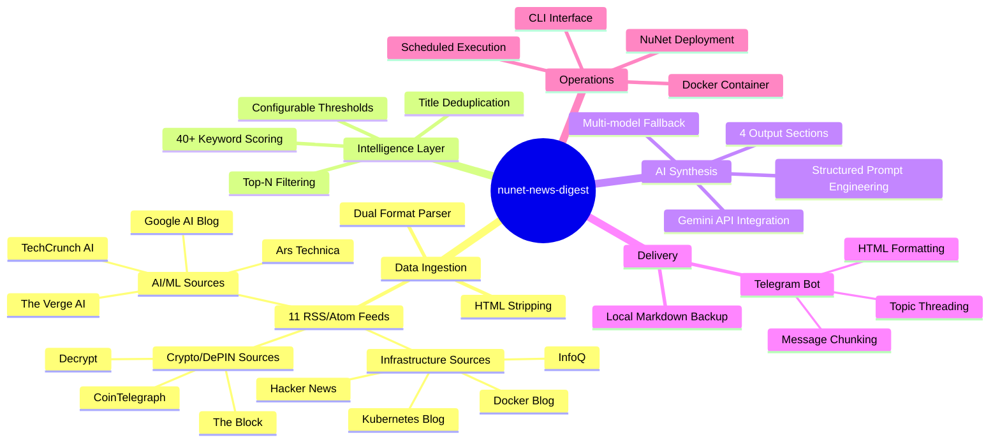

---

## Design Architecture

### System Architecture

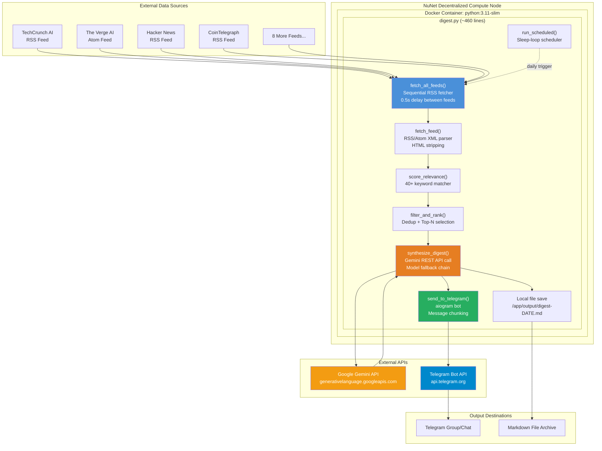

### Component Architecture

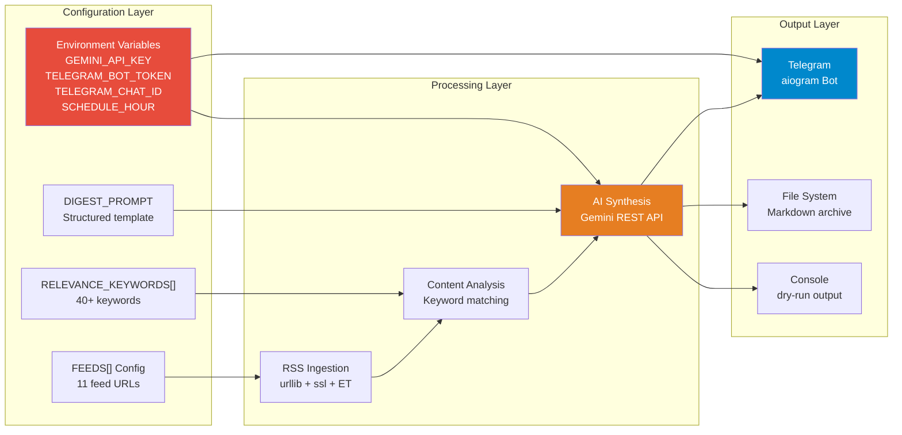

### Deployment Architecture

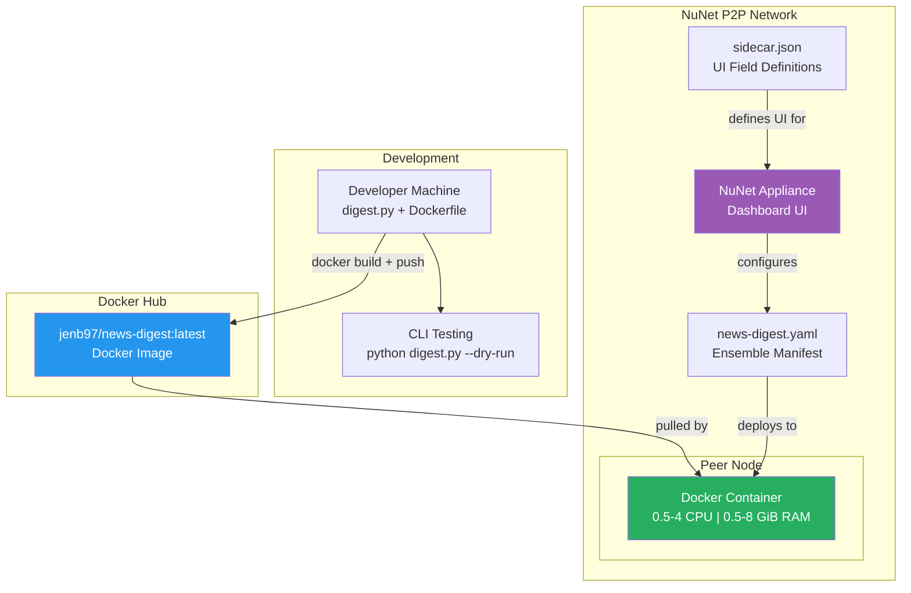

---

## Workflow Analysis

### Main Execution Pipeline

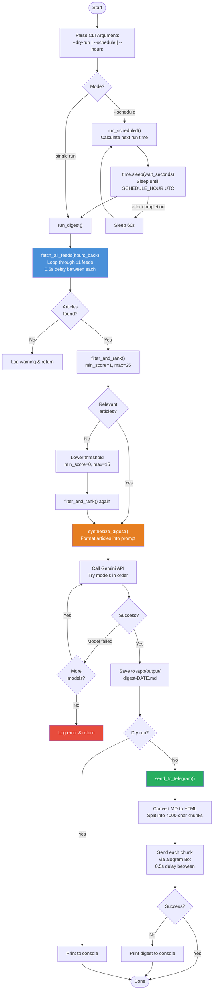

### RSS Feed Processing Detail

```mermaid
flowchart LR
    subgraph "Per Feed Processing"
        A["Create SSL Context<br/>(verification DISABLED)"] --> B["Build HTTP Request<br/>User-Agent: NuNet-News-Digest/1.0<br/>timeout=15s"]
        B --> C["Fetch & Decode UTF-8"]
        C --> D["Parse XML<br/>ElementTree"]
        D --> E{Format?}
        E -->|"RSS"| F["Extract from //item<br/>title, link, description, pubDate"]
        E -->|"Atom"| G["Extract from //atom:entry<br/>title, link, summary, updated"]
        F --> H["Truncate description<br/>to 500 chars"]
        G --> H
        H --> I["Return articles[]"]
    end

    subgraph "Scoring"
        I --> J["For each article:<br/>Concatenate title + desc"]
        J --> K["Match against<br/>40+ keywords"]
        K --> L["relevance_score = count"]
    end

    subgraph "Filtering"
        L --> M["Sort by score DESC"]
        M --> N["Deduplicate by<br/>normalized title[:50]"]
        N --> O["Take top 25"]
    end
```

### Data Flow Diagram

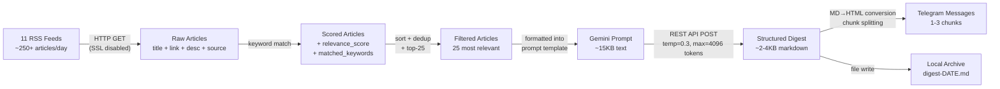

---

## Security Analysis

### Threat Model

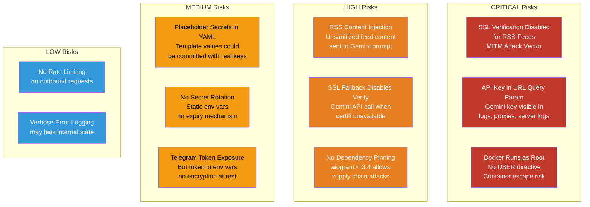

### Security Findings Detail

| # | Severity | Finding | Location | Description | Recommendation |
|---|----------|---------|----------|-------------|----------------|
| 1 | **CRITICAL** | SSL verification disabled for RSS feeds | `fetch_feed()` L97-98 | `ctx.check_hostname = False; ctx.verify_mode = ssl.CERT_NONE` allows MITM attacks on all 11 RSS feeds | Enable SSL verification; use `certifi` for CA bundle |
| 2 | **CRITICAL** | API key exposed in URL | `synthesize_digest()` L253 | `?key={GEMINI_API_KEY}` in query string; logged by proxies, server access logs, error messages | Use HTTP header auth (`x-goog-api-key`) instead |
| 3 | **CRITICAL** | Container runs as root | `Dockerfile` | No `USER` directive; process has full root privileges inside container | Add `RUN useradd -r appuser && USER appuser` |
| 4 | **HIGH** | Prompt injection via RSS content | `synthesize_digest()` L235-240 | Raw article titles/descriptions injected into Gemini prompt with no sanitization | Sanitize/escape feed content before prompt inclusion |
| 5 | **HIGH** | SSL fallback disables verification | `synthesize_digest()` L245-247 | When `certifi` not installed, falls back to `CERT_NONE` for Gemini API calls | Include `certifi` in requirements.txt |
| 6 | **HIGH** | Unpinned dependency | `requirements.txt` | `aiogram>=3.4` has no upper bound; malicious version could be installed | Pin exact version: `aiogram==3.4.1` |
| 7 | **MEDIUM** | Placeholder secrets in config | `news-digest.yaml` L18-20 | `GEMINI_API_KEY=YOUR_API_KEY` placeholders risk accidental real-key commits | Use NuNet secret injection, not YAML values |
| 8 | **MEDIUM** | No secret rotation | Architecture | Static environment variables with no expiry | Implement periodic key rotation strategy |

### Security Architecture Diagram

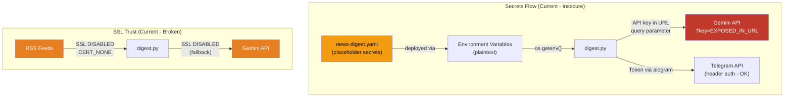

---

## Reliability Analysis

### Reliability Threat Matrix

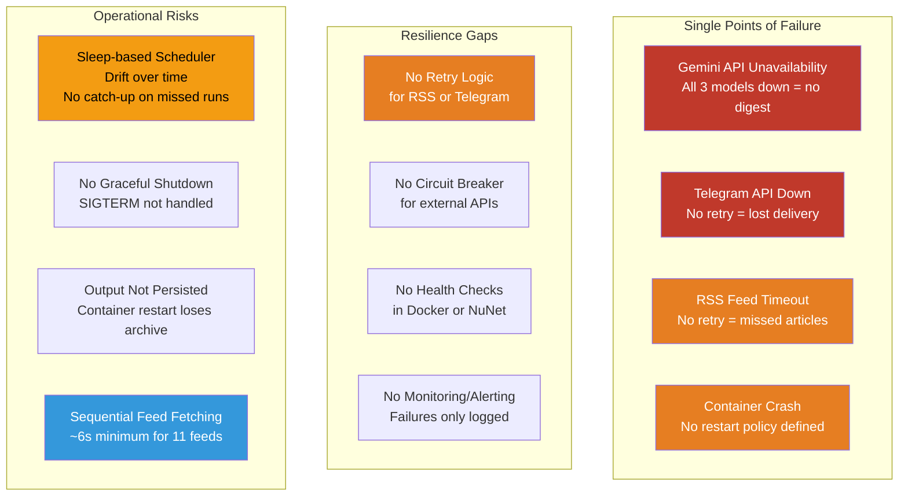

### Reliability Findings Detail

| # | Impact | Finding | Description | Recommendation |
|---|--------|---------|-------------|----------------|
| 1 | **HIGH** | No retry on RSS fetch | Each feed gets one attempt; network glitches lose articles | Add exponential backoff retry (3 attempts) |
| 2 | **HIGH** | No retry on Telegram delivery | Single attempt per message chunk; failure = no delivery | Add retry with backoff for `send_message()` |
| 3 | **HIGH** | No container restart policy | Docker/NuNet config has no `restart: always` | Add restart policy to deployment manifest |
| 4 | **HIGH** | No health checks | No way to detect if the container is alive/healthy | Add Docker HEALTHCHECK and NuNet liveness probe |
| 5 | **MEDIUM** | Sleep-based scheduler drifts | `time.sleep()` can accumulate drift; missed runs aren't caught up | Use APScheduler or cron-based scheduling |
| 6 | **MEDIUM** | Sequential feed processing | 11 feeds fetched one-by-one with 0.5s delays (~6s minimum) | Use `asyncio.gather()` or `ThreadPoolExecutor` for parallel fetching |
| 7 | **MEDIUM** | No graceful shutdown | SIGTERM during sleep/fetch causes immediate termination | Add signal handlers for clean shutdown |
| 8 | **MEDIUM** | Output directory not persisted | `/app/output` is inside container; restart loses archive | Mount a Docker volume or NuNet persistent storage |
| 9 | **LOW** | No monitoring/alerting | Failures are logged but no one is notified | Add error notification channel (separate Telegram alert) |
| 10 | **LOW** | No idempotency guard | Scheduled mode could theoretically run twice in edge cases | Add date-based lock file or dedup check |

### Resilience Pattern Analysis

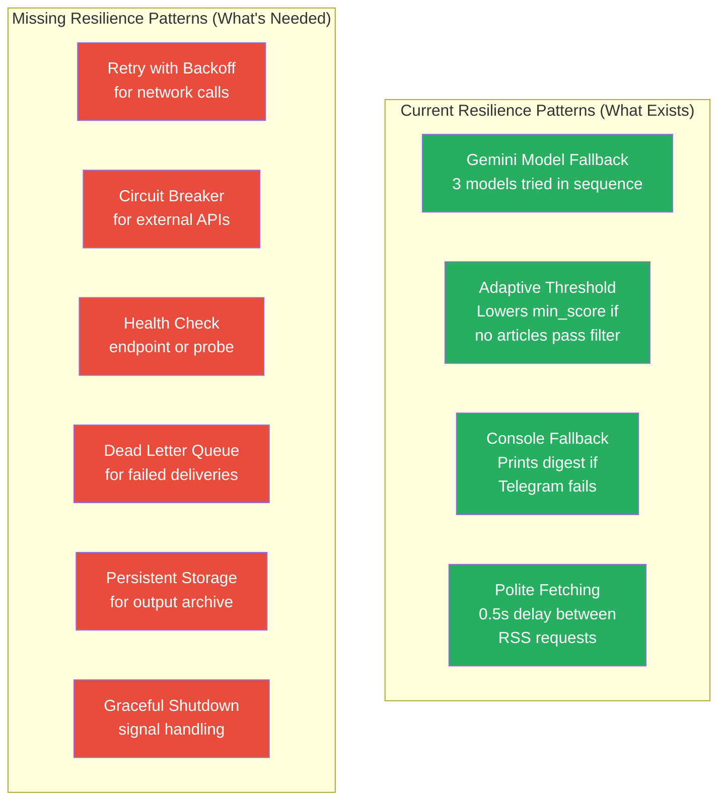

---

## Recommendations

### Priority Matrix

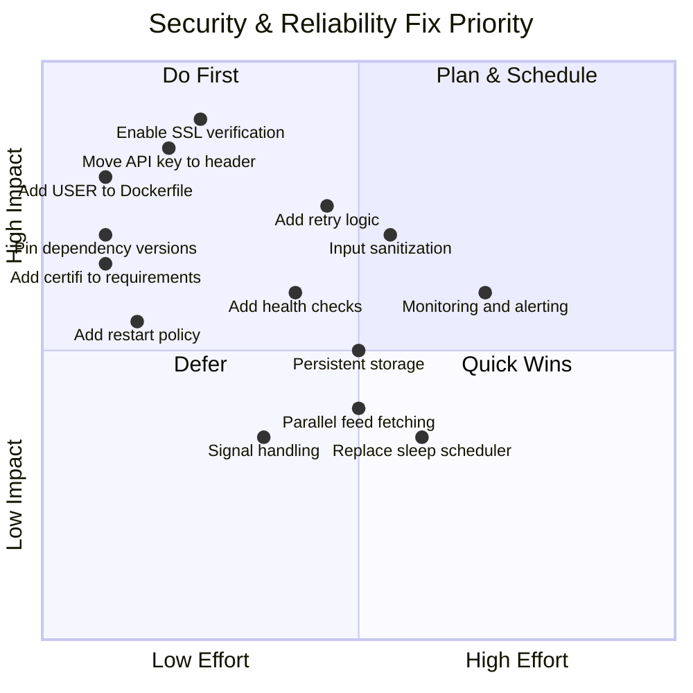

### Top 5 Immediate Actions

| Priority | Action | Category | Effort |
|----------|--------|----------|--------|
| 1 | Enable SSL verification for RSS feeds + add `certifi` to requirements | Security | Low |
| 2 | Move Gemini API key from URL param to `x-goog-api-key` header | Security | Low |
| 3 | Add `USER appuser` to Dockerfile | Security | Low |
| 4 | Pin `aiogram` to exact version in requirements.txt | Security | Low |
| 5 | Add retry logic with exponential backoff for RSS/Telegram/Gemini calls | Reliability | Medium |

---

## Summary Scorecard

| Dimension | Score | Assessment |
|-----------|-------|------------|
| **Features** | 8/10 | Excellent feature set for scope. Well-structured pipeline with smart defaults. |
| **Architecture** | 7/10 | Clean single-file design appropriate for complexity. Good separation of concerns within the file. |
| **Workflow** | 7/10 | Clear linear pipeline. Adaptive threshold fallback is clever. Sequential fetching is a bottleneck. |
| **Security** | 3/10 | Multiple critical issues: disabled SSL, exposed API keys, root container, no input sanitization. |
| **Reliability** | 4/10 | Gemini model fallback is good. Missing retries, health checks, persistent storage, and monitoring. |

> **Overall Assessment**: A well-conceived and cleanly implemented prototype that demonstrates excellent product thinking. The feature set and architecture are sound for an MVP. However, the security posture has critical gaps (disabled SSL, exposed API keys) that must be addressed before production use. Reliability improvements (retries, health checks, monitoring) would significantly increase operational confidence.

---

*Analysis performed by automated repository analysis pipeline*
*Repository: https://github.com/jennifer509/nunet-news-digest*
*Analysis date: 2026-04-08*
