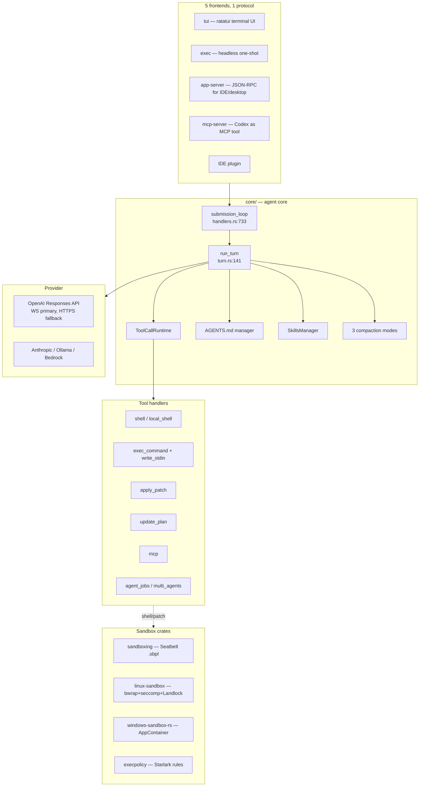
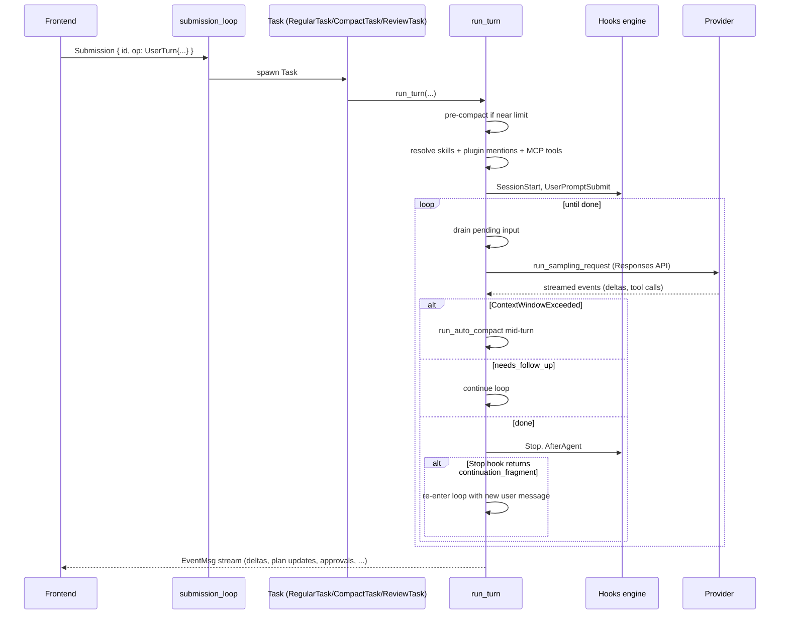
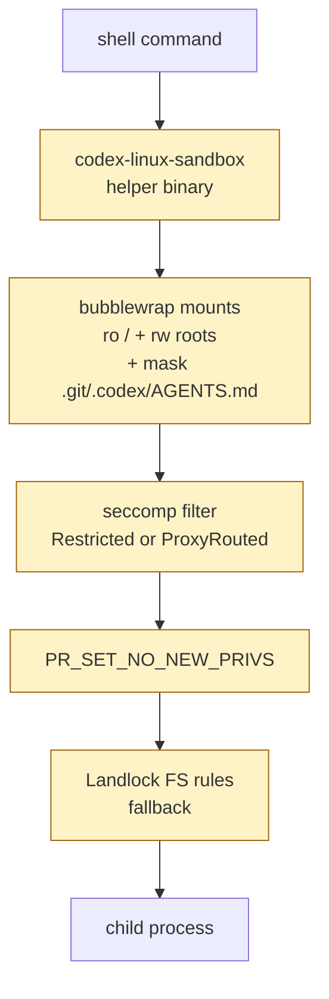
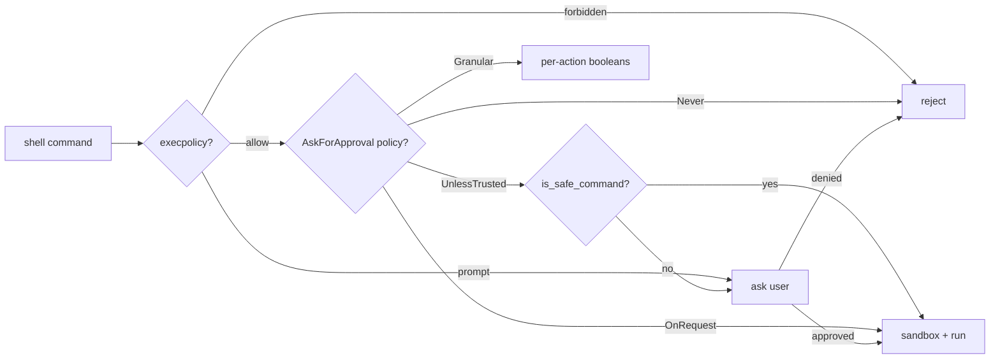
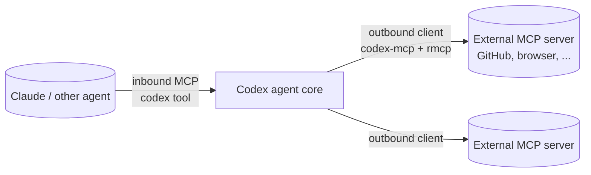

# OpenAI Codex CLI — One Protocol, Five Frontends, Three Sandboxes

> **Repository:** [openai/codex](https://github.com/openai/codex)
> **Language:** Rust (`codex-rs/` workspace, ~120 crates)
> **License:** Apache 2.0
> **Distribution:** `codex` binary (also legacy npm shim in `codex-cli/`)

---

## TL;DR

- **One protocol, five frontends.** A single `Op` / `EventMsg` submission protocol ([`protocol/src/protocol.rs:404`](https://github.com/openai/codex/blob/main/codex-rs/protocol/src/protocol.rs)) connects the TUI, headless `exec`, IDE plugin, JSON-RPC `app-server`, and an inbound MCP server to the same agent core via `submission_loop` ([`handlers.rs:733`](https://github.com/openai/codex/blob/main/codex-rs/core/src/session/handlers.rs)).
- **Sandboxing is the differentiator.** Three layers per platform — Seatbelt + execpolicy + approval (macOS), bubblewrap + seccomp + Landlock + execpolicy (Linux), AppContainer + Job objects (Windows). `.git`, `.codex`, and `AGENTS.md` are **read-only even inside writable roots**.
- **Claude-Code-compatible hooks.** The same 8 events (`PreToolUse`, `PostToolUse`, `PreCompact`, `PostCompact`, `SessionStart`, `UserPromptSubmit`, `Stop`, `PermissionRequest`) over JSON-over-stdio. The engine type is literally named [`ClaudeHooksEngine`](https://github.com/openai/codex/blob/main/codex-rs/hooks/src/engine.rs).

> **Analogy:** Codex CLI is the agent for people who want a real sandbox. Most agents say "trust the model"; Codex makes the OS say "I will not let the model do that".

---

## 1. The Workspace at a Glance



---

## 2. The Submission Loop

Every frontend speaks the same `Op` / `EventMsg` protocol:



The full `EventMsg` enum is at [`protocol/src/protocol.rs:1273`](https://github.com/openai/codex/blob/main/codex-rs/protocol/src/protocol.rs). Five distinct re-entry points in `run_turn` make the lifecycle subtle but powerful.

---

## 3. The Three-Layer Sandbox — The Distinguishing Feature

Codex sandboxes the **shell child**, not the agent process. Defense in depth on every platform.

### Linux — three independent enforcement layers



Seccomp modes ([`linux-sandbox/src/landlock.rs:42`](https://github.com/openai/codex/blob/main/codex-rs/linux-sandbox/src/landlock.rs)):
- **Restricted** — deny `connect/accept/bind/listen` for non-`AF_UNIX`; always deny `ptrace`, `process_vm_readv/writev`, `io_uring_*`
- **ProxyRouted** — invert: only `AF_INET`/`AF_INET6` allowed (child reaches in-namespace TCP proxy)

### macOS — Seatbelt + composed policy

```bash
# sandboxing/src/seatbelt.rs:602::create_seatbelt_command_args
/usr/bin/sandbox-exec \
  -p <policy> \
  -D READABLE_ROOT_0=/path/to/root \
  -- <command>
```

The hard-coded `/usr/bin/sandbox-exec` is a real defense-in-depth choice — if `$PATH` is compromised, the system binary still runs.

Final policy = `seatbelt_base_policy.sbpl` (closed-by-default) + per-root `(allow file-read* / file-write* (subpath ...))` + optional `seatbelt_network_policy.sbpl` + `restricted_read_only_platform_defaults.sbpl`.

### Across all platforms

**`PROTECTED_METADATA_PATH_NAMES`** in [`protocol/src/permissions.rs`](https://github.com/openai/codex/blob/main/codex-rs/protocol/src/permissions.rs) — `.git`, `.codex`, `.agents`, `AGENTS.md`, etc. are read-only even inside writable roots. **The agent can't rewrite its own rules.**

### Plus a separate execpolicy

Starlark-based command auto-approval (not the sandbox; the *decision* to ask):

```python
prefix_rule(
    pattern = ["git", ["status", "diff", "log"]],
    decision = "allow",
    justification = "read-only git operations",
)
host_executable(name = "git", paths = ["/opt/homebrew/bin/git", "/usr/bin/git"])
```

Decision precedence: `forbidden > prompt > allow`. Three lines of defense before a destructive command executes: execpolicy → user approval → sandbox.

---

## 4. Tool Calling

All built-in tools in [`core/src/tools/handlers/`](https://github.com/openai/codex/blob/main/codex-rs/core/src/tools/handlers):

| Tool | What it does |
|---|---|
| `shell` / `local_shell` | Runs commands under the platform sandbox |
| `exec_command` + `write_stdin` | "Unified exec" — long-running interactive sessions with stdin streaming |
| `apply_patch` | `*** Begin Patch / *** End Patch` envelope, parsed by [`apply-patch/src/parser.rs`](https://github.com/openai/codex/blob/main/codex-rs/apply-patch/src/parser.rs) |
| `update_plan` | Emits `PlanUpdate` event; **disabled in Plan mode** |
| `view_image` | Inject an image into the next turn |
| `request_permissions` | Model can ask for additional sandbox permissions |
| `request_user_input` | Structured Q&A back to the user |
| `tool_search` | Discover tools dynamically — interesting context-conservation trick |
| `mcp` | Dispatch into a connected MCP server |
| `agent_jobs` / `multi_agents*` | Sub-agent orchestration |

The tool router is built per-turn by `built_tools()` ([`turn.rs:1160`](https://github.com/openai/codex/blob/main/codex-rs/core/src/session/turn.rs)). Parallel dispatch happens in `tools/parallel.rs::ToolCallRuntime`.

### Approval Model



---

## 5. Context Management — Mid-Turn Provider-Aware Compaction

Compaction can fire **mid-turn** when the model emits `ContextWindowExceeded`, then the loop resumes. Three implementations cooperate:

| Mode | Where | When |
|---|---|---|
| **Inline local** | `core/src/compact.rs:69` | Default fallback |
| **Remote v1** | `compact_remote.rs` | When provider supports `/responses/compact` |
| **Remote v2** | `compact_remote_v2.rs` | Newer variant |

Selection: `should_use_remote_compact_task(provider)` ([`compact.rs:65`](https://github.com/openai/codex/blob/main/codex-rs/core/src/compact.rs)).

**Re-injection policy** (the leaky-but-pragmatic part):
- `InitialContextInjection::BeforeLastUserMessage` — mid-turn (keeps the model's training assumption that the compaction summary appears just before the last user message)
- `DoNotInject` — pre-turn / manual

The hand-tuning reflects that compaction outputs have to land where the trained model expects them.

---

## 6. AGENTS.md — Hierarchical Project Memory

Codex's memory model ([`core/src/agents_md.rs`](https://github.com/openai/codex/blob/main/codex-rs/core/src/agents_md.rs)):

```mermaid
flowchart TD
    cwd[cwd]
    parent1[parent dir]
    root[project root marker .git]
    glob[~/.codex/AGENTS.md]
    over[AGENTS.override.md takes precedence]

    cwd --> parent1 --> root
    cwd -.collect each AGENTS.md.- AssembleConcat
    glob --> AssembleConcat
    AssembleConcat["Concat root-first<br/>separator: --- project-doc ---<br/>inject into developer message"]
```

Behaviors:
- Walk up from cwd to project root (default marker `.git`)
- Collect every `AGENTS.md` along the path
- `AGENTS.override.md` takes precedence over `AGENTS.md` in the same dir
- Global `~/.codex/AGENTS.md` loaded by `AgentsMdManager::load_global_instructions`
- Sub-dir `AGENTS.md` discovery during the turn is **left to the model** (system prompt instructs it to scan when working outside CWD)

---

## 7. Skills

Defined at [`core-skills/src/model.rs::SkillMetadata`](https://github.com/openai/codex/blob/main/codex-rs/core-skills/src):

```rust
pub struct SkillMetadata {
    pub name: String,
    pub description: String,
    pub interface: Option<SkillInterface>,
    pub dependencies: Option<SkillDependencies>,
    pub policy: Option<SkillPolicy>,
    pub scope: SkillScope,  // User | Repo | System | Admin
    pub plugin_id: Option<String>,
    ...
}
```

Two invocation modes:
- **Explicit** — user mentions `@skill-creator` (`collect_explicit_skill_mentions` at `turn.rs:225`)
- **Implicit** — a tool call hitting a skill's `scripts/` dir triggers the skill, gated by `policy.allow_implicit_invocation`

Bundled samples via `include_dir!`: `skill-creator`, `plugin-creator`, `skill-installer`, `openai-docs`, `imagegen`.

Skills are injected as **contextual user fragments** — not as system messages — so they don't break prompt caching.

---

## 8. MCP — Both Directions



- **Outbound:** `codex-mcp` uses the `rmcp` crate. Tool names namespaced `mcp__<server>__<tool>`.
- **Inbound:** `mcp-server` exposes Codex as an MCP tool. The single tool is `codex`; exec/patch approvals route as MCP elicitations.

This makes Codex composable — Claude can spawn Codex as a sub-agent for terminal work and get streamed results back.

---

## 9. Hooks — Claude-Code-Compatible by Design

Engine type is literally named [`ClaudeHooksEngine`](https://github.com/openai/codex/blob/main/codex-rs/hooks/src/engine.rs). 8 events:

| Event | Fires |
|---|---|
| `PreToolUse` | Before a tool executes |
| `PostToolUse` | After a tool returns |
| `PermissionRequest` | When permission is needed |
| `PreCompact` / `PostCompact` | Around compaction |
| `SessionStart` | Once per session |
| `UserPromptSubmit` | After every user message |
| `Stop` | When the agent says it's done |

`Stop` hooks can demand continuation by returning `continuation_fragments` — letting hooks add custom looping/QA behavior on top of the model's "I'm done" signal. Brilliant primitive.

---

## 10. Sub-Agents — First-Class Coordination

```mermaid
flowchart LR
    Parent[Parent agent]
    Reg[Agent registry]
    Mailbox[Mailbox per agent]
    Goals[Goal state<br/>shared across turns]
    Awaiter[built-in: awaiter.toml]
    Explorer[built-in: explorer.toml]
    Delegate[codex_delegate]

    Parent -- agent_jobs / multi_agents --> Reg
    Reg --> Mailbox
    Parent -. goals.rs .- Goals
    Reg --> Awaiter
    Reg --> Explorer
    Parent -- delegate_to --> Delegate
```

More than "spawn another agent" — it's a coordination layer with mailboxes, `Op::InterAgentCommunication`, and persistent goal state.

---

## 11. Capabilities Matrix

| Capability | How Codex Does It | Code Reference |
|---|---|---|
| Harness | 5 frontends → 1 `Op`/`EventMsg` protocol | `core/src/session/handlers.rs:733` |
| Context mgmt | 3 compaction modes (local / remote v1 / remote v2), mid-turn capable | `core/src/compact.rs:50-94` |
| Tool calling | ~15 built-in handlers; parallel via `ToolCallRuntime` | `core/src/tools/handlers/` |
| Sandboxing | 3 layers per platform — strongest among coding-agent CLIs | `sandboxing/`, `linux-sandbox/`, `windows-sandbox-rs/` |
| Approval | `AskForApproval` enum w/ Granular variant; execpolicy gating | `protocol/src/protocol.rs:900` |
| Automations | Claude-Code-compatible hooks (8 events); built-in slash cmds | `hooks/src/engine.rs` |
| Skills | `SKILL.md` w/ explicit @ + implicit policy; injected as user fragments | `core-skills/`, `skills/` |
| Memory | AGENTS.md hierarchical + override + global + session rollouts | `core/src/agents_md.rs:43` |
| Sessions | JSONL rollouts under `~/.codex/sessions/`; `--resume <thread-id>` | `rollout/src/recorder.rs` |
| Planning | `update_plan` tool + Plan mode (tool disabled in Plan) | `core/src/tools/handlers/plan.rs` |
| Sub-agents | First-class — registry, mailboxes, goals, `multi_agents` parallel | `core/src/agent/` |
| MCP | Client (`codex-mcp/`) + Server (`mcp-server/`) | both dirs |
| Testing | ~86 integration tests + VT100 golden tests + insta snapshots | `core/tests/suite/`, `tui/tests/suite/` |

---

## 12. Testing

- **~86 integration test files** under `codex-rs/core/tests/suite/`
- **Sandbox integration tests** — `linux-sandbox/tests/suite/landlock.rs` actually spawns sandboxed children and asserts denials
- **TUI VT100 golden tests** — `tui/tests/suite/vt100_history.rs`, `vt100_live_commit.rs` (rendering correctness via terminal emulation)
- **Insta snapshots** — `core/src/session/snapshots/` captures prompt assembly so regressions in prompt construction surface in PR review
- **Mock infrastructure** — `core/tests/common/responses.rs` (mock Responses API)
- **What's missing** — no public evals/SWE-bench harness; assumed internal at OpenAI

---

## 13. Strengths & Tradeoffs

**Strengths**
- The strongest sandbox among coding-agent CLIs
- Claude-Code-compatible hooks → portable behavior
- One protocol, many frontends — TUI/exec/IDE/MCP all just clients
- First-class sub-agent infrastructure
- Mid-turn compaction with provider-aware re-injection
- Hard-coded `sandbox-exec` path → defense in depth even with PATH compromise

**Tradeoffs**
- `run_turn` is ~600 lines with 5 re-entry points — hard to reason about in isolation
- Sandbox spawn overhead per shell call
- Provider-aware compaction is leaky — assumptions tied to training data
- Rust workspace (~120 crates) has a real onboarding cost
- Memory crate (`memories/`) is in development; not yet a complete story

---

## 14. When to Choose Codex CLI

- You need a **real OS-enforced sandbox** for agent commands
- You want Claude-Code-compatible hooks (portable to/from Anthropic's CLI)
- You're integrating an agent into an IDE/desktop app and need a stable JSON-RPC server
- You want Codex to be callable **from** other agents (via inbound MCP)
- You're comfortable with a large Rust codebase

---

## 15. Key Takeaways

1. **The sandbox is the lesson.** Three independent enforcement layers + metadata masking is the strongest current take on "untrust the model".
2. **One protocol unlocks many frontends.** TUI, exec, app-server, MCP-in all speak `Op`/`EventMsg` to the same `submission_loop` — every UI is just a different mouth.
3. **Hooks as continuation triggers.** `Stop` hooks can demand the agent keep working — turns hooks into a QA gate, not just an audit log.
4. **Mid-turn compaction with model-aware re-injection.** A leaky abstraction but pragmatically necessary.
5. **Skills as user fragments, not system messages.** Preserves prompt cache while still adding capability.

---

## Further Reading

- [openai/codex](https://github.com/openai/codex)
- [Codex docs (developers.openai.com)](https://developers.openai.com/codex)
- [Cross-agent comparison](comparison.md)
