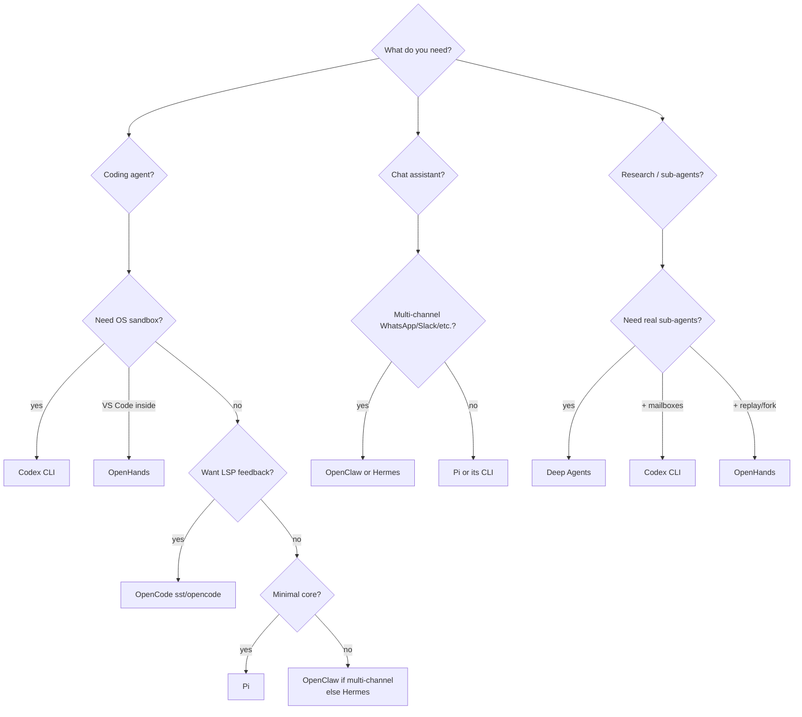

# Cross-Agent Comparison — How the Seven Agents Compare

A synthesis of the seven deep-dives in this series. Use this page to answer "which one should I pick?" or "how does X solve Y?"

The agents:

| Short | Full Name | Repo | Doc |
|---|---|---|---|
| **Pi** | Pi | [badlogic/pi-mono](https://github.com/badlogic/pi-mono) | [pi.md](pi.md) |
| **OC** | OpenClaw | [openclaw/openclaw](https://github.com/openclaw/openclaw) | [openclaw.md](openclaw.md) |
| **Her** | Hermes Agent | [NousResearch/hermes-agent](https://github.com/NousResearch/hermes-agent) | [hermes.md](hermes.md) |
| **OCo** | OpenCode | [sst/opencode](https://github.com/sst/opencode) | [opencode.md](opencode.md) |
| **DA** | Deep Agents | [langchain-ai/deepagents](https://github.com/langchain-ai/deepagents) | [deepagents.md](deepagents.md) |
| **Cx** | Codex CLI | [openai/codex](https://github.com/openai/codex) | [codex.md](codex.md) |
| **OH** | OpenHands | [All-Hands-AI/OpenHands](https://github.com/All-Hands-AI/OpenHands) + [agent-sdk](https://github.com/OpenHands/agent-sdk) | [openhands.md](openhands.md) |

---

## 1. Capability Matrix

| Capability | Pi | OpenClaw | Hermes | OpenCode | Deep Agents | Codex | OpenHands |
|---|---|---|---|---|---|---|---|
| **Language** | TypeScript | TypeScript | Python | TS (Bun) + Go TUI | Python | Rust | Python + TS |
| **Core loop SLOC** | ~few hundred | embeds Pi | 16,400 (`run_agent.py`) | ~600 (`prompt.ts:225-427`) | LangGraph runtime | ~600 (`run_turn` rs) | 1063 (`local_conversation.py`) |
| **Tool count (default)** | 4 | 5-layer stack (~50) | 80+ | 11 + custom + MCP | ~15 | ~15 + MCP | ~10 + MCP + skills |
| **Sandboxing** | none | Docker / SSH / OpenShell | 7 terminal backends | tree-sitter AST perms | sandbox backends (Runloop/Daytona/Modal) | Seatbelt + bwrap + Landlock + execpolicy | Docker / KVM / remote w/ in-sandbox FastAPI server |
| **Hooks** | event-emit | 2 layers (Gateway + Loop) | 17 enum events | 5 surfaces | middleware composition | 8 Claude-Code-compat events | 6 events; PreToolUse + UserPromptSubmit block |
| **Stop-hook continuation** | — | — | — | — | — | ✓ (`continuation_fragment`) | — |
| **MCP client** | bridge (`mcporter`) | ✓ | ✓ | ✓ | ✓ (adapters) | ✓ (`codex-mcp/`) | ✓ (`fastmcp`) |
| **MCP server (inbound)** | — | ✓ | ✓ | — | — | ✓ (`mcp-server/`) | ✓ (`/mcp` on host + sandbox) |
| **Skills (markdown)** | ✓ progressive | 56 bundled, 6 dirs | ✓ + Skills Hub | dev branch only | ✓ progressive | ✓ explicit + implicit | ✓ YAML front matter + slash triggers |
| **Memory model** | session JSONL | MEMORY.md + daily + vector opt | 3 channels (id / curated / 1 ext) | AGENTS.md + shadow-git + FileTime | AGENTS.md + state | AGENTS.md hierarchical + override + rollouts | **EventLog** persisted, optionally encrypted |
| **Vector DB by default** | ✗ | ✗ (plugin) | ✗ (1 ext provider) | ✗ | ✗ | ✗ | ✗ |
| **Self-improving skills** | — | — | ✓ curator on aux model | — | — | — | — |
| **Session shape** | **tree** (parentId JSONL) | JSONL | SQLite + FTS5 | JSON on disk → SQLite | LangGraph state + checkpointer | JSONL rollouts | EventLog + fork/rerun |
| **Sub-agents** | community ext | `sessions_spawn` (subagent/acp) | `delegate_task` shared budget | `task` synchronous | `task` ephemeral parallel | first-class registry + mailboxes | `DelegateTool` + subagent registry + parallel exec |
| **Provider portability** | excellent (mid-session swap) | excellent | excellent | provider-tuned prompts | LangChain `init_chat_model` | Responses API primary | LiteLLM ~50 providers + fallback chains |
| **Prompt caching discipline** | basic | `openclaw.cache-ttl` entries | frozen-snapshot system prompt | 2-block system split | Anthropic content-block | provider-side (Responses API stateful) | explicit `caching_prompt` flag; `keep_first` preserved across condensation |
| **Eval harness in-repo** | ✗ | ✗ | mini_swe_runner + trajectory pipeline | httpapi-exercise (contract test) | `harbor` sister pkg | ✗ (internal) | sibling `benchmarks` repo (6 suites) |
| **First commit feel** | minimal | productized | maximalist | engineered | composable | hardened | distributed-systems |

---

## 2. Choose-Your-Own-Adventure



---

## 3. Architectural Patterns — Who Did What First

### Tree-shaped sessions
- **Pi** invented this for terminal coding agents — JSONL with `parentId`, `/tree`, `/fork`, side-quests.
- OpenClaw inherits Pi's session model.
- OpenCode has parent/child sessions for sub-agents but linear within.
- **OpenHands** is the closest cousin — `EventLog` + `fork()` + `rerun_actions()` is tree-shaped semantically but stored as one append-only log.

### Middleware as the universal extension point
- **Deep Agents** doubled down on this — every capability is a middleware that wraps `wrap_model_call` / `wrap_tool_call` / `before_agent`.
- Pi has event hooks (less structured).
- Codex hooks fire at fixed lifecycle points but aren't a stack.

### Frozen-snapshot system prompt + user-side context injection
- **Hermes** is most disciplined about this — mid-session memory writes go to files (durable) but don't change the system prompt until next session, preserving the prompt cache.
- OpenClaw does similar via `openclaw.cache-ttl` markers.
- Codex relies on the Responses API's server-side cache (no client markers).

### LSP as model feedback channel
- **OpenCode** is alone in this. After every edit, the tool waits 3s for diagnostics and embeds errors in the tool output.
- Codex has nothing equivalent for type checks; relies on the user/sandbox to enforce.

### OS-enforced sandboxing
- **Codex** is the strongest — three independent layers per platform (bwrap+seccomp+Landlock on Linux, Seatbelt on macOS, AppContainer on Windows) + execpolicy.
- **OpenHands** takes a different bet: not OS-syscall enforcement but **a full FastAPI server inside the container** (`openhands-agent-server`, ~40 routers + VS Code). Isolation = Docker/KVM, but the in-sandbox surface area is bigger.
- Hermes has 7 terminal backends but defers actual isolation to the backend (Docker/SSH/etc.).
- OpenClaw delegates sandboxing to Docker/SSH backends for non-`main` sessions.
- OpenCode uses tree-sitter to parse bash AST and check per-command permissions — different abstraction (AST vs syscall), not directly comparable.

### Hooks
- **Codex** copied Anthropic Claude Code's hook schema deliberately (the engine type is literally `ClaudeHooksEngine`). Eight identical events.
- **Hermes** has 17 events (a superset, but its own schema).
- **OpenClaw** has two layers (Gateway events vs Loop lifecycle).
- **OpenCode** has 5 distinct surfaces (commands / agents / file-tools / plugins / shell hooks).

### Cron / webhooks / scheduled agents
- **Hermes** shipped these 2 months before Anthropic's Claude Code Routines (per their own `hermes-already-has-routines.md`).
- **OpenClaw** has full cron + webhooks + Gmail PubSub.
- Pi / OpenCode / Codex don't have built-in cron.

### Self-improving skills
- **Hermes** is unique here — `skill_manage` + 7-day curator on auxiliary model.
- Others can edit their own AGENTS.md / memory files but lack the curator promotion/archive loop.

---

## 4. Same Problem, Different Solutions

### "Don't let tool results blow up the context"

| Agent | Approach |
|---|---|
| **Pi** | Tree session lets you branch; main thread stays clean |
| **OpenClaw** | Pi's mechanism + cache-TTL pruning + compaction safeguards plugin |
| **Hermes** | ContextEngine plugin (default `ContextCompressor` summarizes) |
| **OpenCode** | Two-tier: prune tool-output to 40k cap, then compact if overflowing |
| **Deep Agents** | Result > 20k tokens evicted to `/large_tool_results/{id}`, replaced with head/tail preview |
| **Codex** | Mid-turn compaction triggered by `ContextWindowExceeded` error; 3 provider-specific impls |
| **OpenHands** | `LLMSummarizingCondenser` replaces forgettable window with one summary event, keeping `keep_first` prefix for cache hits; `hard_context_reset` fallback for runaway growth |

### "Make the agent's plan visible"

| Agent | Approach |
|---|---|
| **Pi** | `/todos` community extension |
| **OpenClaw** | Codex-style `update_plan` tool (gated) |
| **Hermes** | `todo` tool — in-memory store hydrated from history |
| **OpenCode** | Built-in `todowrite` / `todoread` — model self-managed |
| **Deep Agents** | `write_todos` from `TodoListMiddleware` |
| **Codex** | `update_plan` emits `PlanUpdate` event; disabled in Plan mode |
| **OpenHands** | `task_tracker/` tool in default preset + `planning_file_editor/` + planning preset (1.5.0+) |

### "Spawn a sub-agent to keep main context clean"

| Agent | Approach |
|---|---|
| **Pi** | community ext (`pi-subagents`) |
| **OpenClaw** | `sessions_spawn` with runtime `subagent` or `acp` |
| **Hermes** | `delegate_task` — isolated child, shared `IterationBudget` |
| **OpenCode** | `task` — child session with `parentID`, synchronous |
| **Deep Agents** | `task` — ephemeral, parallelizable, custom personas |
| **Codex** | First-class — `agent_jobs` / `multi_agents` / `multi_agents_v2`; registry + mailboxes + goals |
| **OpenHands** | `DelegateTool` + subagent registry (`register_agent()`) + `TaskToolSet`; `parallel_executor.py` for in-turn concurrency |

### "Make the agent's behavior portable across machines"

| Agent | Approach |
|---|---|
| **Pi** | `pi-ai` Context is serializable, mid-session model swap |
| **OpenClaw** | Pi's portability + Gateway snapshot of state |
| **Hermes** | Three API modes (chat_completions / anthropic_messages / codex_responses); model-agnostic in default config |
| **OpenCode** | OpenAPI 3.1 from server → Stainless generates SDKs |
| **Deep Agents** | LangChain `init_chat_model("provider:model")` |
| **Codex** | Same `Op`/`EventMsg` protocol → 5 frontends; Responses API + Anthropic/Ollama/Bedrock providers |
| **OpenHands** | `Conversation.__new__()` factory dispatches Local↔Remote on workspace type — same API, transport varies. LiteLLM covers ~50 providers with fallback chains. |

---

## 5. Design Philosophy in One Sentence Each

- **Pi** — "If you want the agent to do something new, ask it to build it."
- **OpenClaw** — "Pi, but on every messaging surface you live on."
- **Hermes** — "Ship one Python class with every feature you can imagine, then teach it to improve itself."
- **OpenCode** — "Treat your language server as the agent's compiler."
- **Deep Agents** — "Compose your agent from middleware; let LangGraph hold the state."
- **Codex** — "Don't trust the model — let the OS enforce."
- **OpenHands** — "Make every action an immutable event; make the sandbox a service."

---

## 6. The "What Did You Steal" Map

```mermaid
flowchart TD
    Claude[Claude Code<br/>Anthropic]
    Pi
    OC[OpenClaw]
    Her[Hermes]
    OCo[OpenCode]
    DA[Deep Agents]
    Cx[Codex CLI]
    OH[OpenHands]

    Claude -. AGENTS.md convention .-> Pi
    Claude -. AGENTS.md .-> OCo
    Claude -. AGENTS.md .-> Cx
    Claude -. AGENTS.md .-> DA
    Claude -. hooks schema .-> Cx
    Claude -. hooks schema .-> Her
    Claude -. hooks schema .-> OH
    Claude -. SKILL.md progressive disclosure .-> Pi
    Claude -. SKILL.md .-> Her
    Claude -. SKILL.md .-> Cx
    Claude -. SKILL.md .-> DA
    Claude -. skills (YAML) .-> OH

    Pi -- embedded as runtime --> OC
    Pi -. inspires .-> OCo

    DA -. middleware idea .-> Cx
    Cx -. compaction patterns .-> Her
    OH -. CodeAct paper .-> Cx
    OH -. event-sourcing pattern .-> any
```

Patterns that have become de facto standards:
- **`AGENTS.md` as project memory** — Claude Code → adopted by Pi, OpenCode, Codex, Deep Agents
- **`SKILL.md` with YAML frontmatter** — adopted by Pi, Hermes, Codex, Deep Agents; agentskills.io is the cross-agent spec
- **Hooks JSON-over-stdio** — Anthropic schema → adopted by Codex (literally `ClaudeHooksEngine`)
- **`MCP` for tool composition** — Anthropic's MCP → outbound in all 6; inbound in OpenClaw / Hermes / Codex

---

## 7. When You Should Pick…

**Pi** when:
- You want to own your runtime end-to-end
- You're in TypeScript and prefer extensions over plugins
- You need cross-provider session portability

**OpenClaw** when:
- You want a personal assistant across 22 messaging channels
- You want cron + webhooks + Gmail without writing them
- You want disciplined prompt caching across providers

**Hermes Agent** when:
- You want a maximalist Python agent that "just works"
- You want self-improving skills (curator)
- You want training-data trajectory exports

**OpenCode** when:
- You want LSP feedback in the agent loop
- You want AST-based bash permissions
- You want one server powering TUI / IDE / desktop / CI / Slack

**Deep Agents** when:
- You're in the LangChain ecosystem
- You want middleware-composable capabilities
- You want a real eval harness (`harbor`)

**Codex CLI** when:
- You need OS-enforced sandboxing
- You want Claude-Code-compatible hooks
- You're integrating an agent into an IDE/desktop app

**OpenHands** when:
- You want **event-sourced** conversations: replay, fork, audit, encrypted persistence
- You want the sandbox to ship **VS Code** and a full HTTP API, not just a shell
- You want one agent that runs identically on a laptop and in a cloud sandbox
- You need broad provider coverage with fallback chains and subscription login
- You're integrating with GitHub/GitLab/Bitbucket/Azure DevOps/Forgejo

---

## 8. Series Index

- [Pi](pi.md) · [OpenClaw](openclaw.md) · [Hermes](hermes.md) · [OpenCode](opencode.md) · [Deep Agents](deepagents.md) · [Codex CLI](codex.md) · [OpenHands](openhands.md)
- [Series umbrella issue](https://github.com/humanjack/ai-engineering/issues/51)
