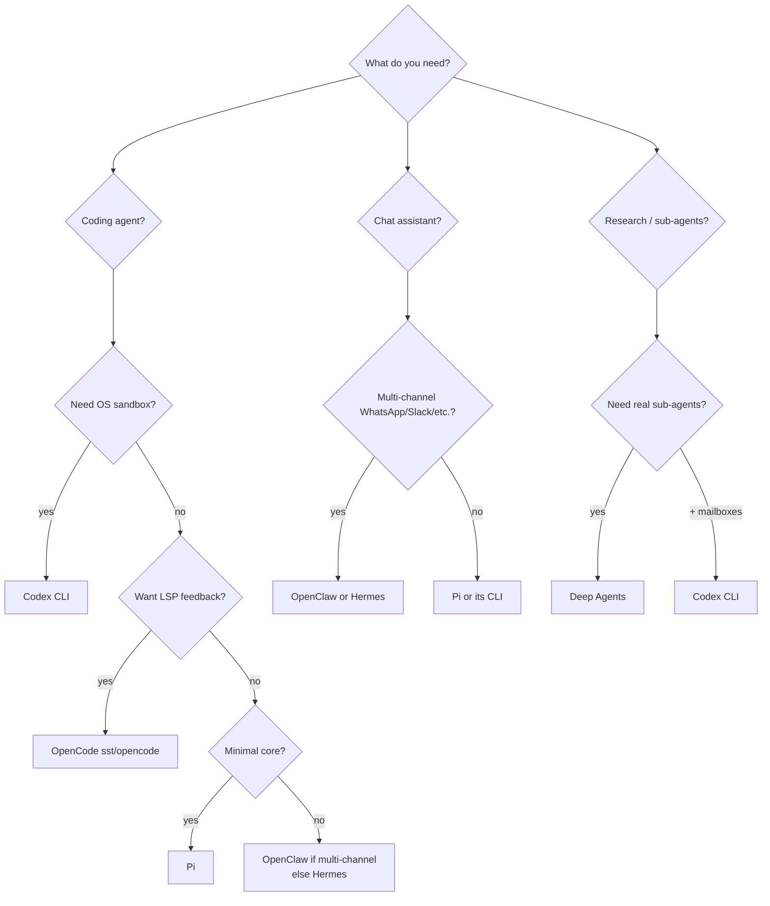
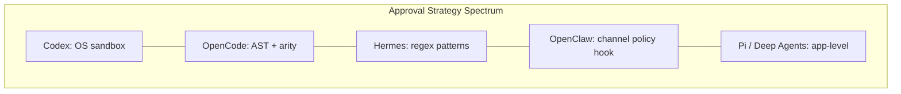

# Cross-Agent Comparison — How the Six Agents Compare

A synthesis of the six deep-dives in this series. Use this page to answer "which one should I pick?" or "how does X solve Y?"

The agents:

| Short | Full Name | Repo | Doc |
|---|---|---|---|
| **Pi** | Pi | [badlogic/pi-mono](https://github.com/badlogic/pi-mono) | [pi.md](pi.md) |
| **OC** | OpenClaw | [openclaw/openclaw](https://github.com/openclaw/openclaw) | [openclaw.md](openclaw.md) |
| **Her** | Hermes Agent | [NousResearch/hermes-agent](https://github.com/NousResearch/hermes-agent) | [hermes.md](hermes.md) |
| **OCo** | OpenCode | [sst/opencode](https://github.com/sst/opencode) | [opencode.md](opencode.md) |
| **DA** | Deep Agents | [langchain-ai/deepagents](https://github.com/langchain-ai/deepagents) | [deepagents.md](deepagents.md) |
| **Cx** | Codex CLI | [openai/codex](https://github.com/openai/codex) | [codex.md](codex.md) |

---

## 1. Capability Matrix

| Capability | Pi | OpenClaw | Hermes | OpenCode | Deep Agents | Codex |
|---|---|---|---|---|---|---|
| **Language** | TypeScript | TypeScript | Python | TS (Bun) + Go TUI | Python | Rust |
| **Core loop SLOC** | ~few hundred | embeds Pi | 16,400 (`run_agent.py`) | ~600 (`prompt.ts:225-427`) | LangGraph runtime | ~600 (`run_turn` rs) |
| **Tool count (default)** | 4 | 5-layer stack (~50) | 80+ | 11 + custom + MCP | ~15 | ~15 + MCP |
| **Sandboxing** | none | Docker / SSH / OpenShell | 7 terminal backends | tree-sitter AST perms | sandbox backends (Runloop/Daytona/Modal) | Seatbelt + bwrap + Landlock + execpolicy |
| **Hooks** | event-emit | 2 layers (Gateway + Loop) | 17 enum events | 5 surfaces | middleware composition | 8 Claude-Code-compat events |
| **Stop-hook continuation** | — | — | — | — | — | ✓ (`continuation_fragment`) |
| **MCP client** | bridge (`mcporter`) | ✓ | ✓ | ✓ | ✓ (adapters) | ✓ (`codex-mcp/`) |
| **MCP server (inbound)** | — | ✓ | ✓ | — | — | ✓ (`mcp-server/`) |
| **Skills (markdown)** | ✓ progressive | 56 bundled, 6 dirs | ✓ + Skills Hub | dev branch only | ✓ progressive | ✓ explicit + implicit |
| **Memory model** | session JSONL | MEMORY.md + daily + vector opt | 3 channels (id / curated / 1 ext) | AGENTS.md + shadow-git + FileTime | AGENTS.md + state | AGENTS.md hierarchical + override + rollouts |
| **Vector DB by default** | ✗ | ✗ (plugin) | ✗ (1 ext provider) | ✗ | ✗ | ✗ |
| **Self-improving skills** | — | — | ✓ curator on aux model | — | — | — |
| **Session shape** | **tree** (parentId JSONL) | JSONL | SQLite + FTS5 | JSON on disk → SQLite | LangGraph state + checkpointer | JSONL rollouts |
| **Sub-agents** | community ext | `sessions_spawn` (subagent/acp) | `delegate_task` shared budget | `task` synchronous | `task` ephemeral parallel | first-class registry + mailboxes |
| **Provider portability** | excellent (mid-session swap) | excellent | excellent | provider-tuned prompts | LangChain `init_chat_model` | Responses API primary |
| **Prompt caching discipline** | basic | `openclaw.cache-ttl` entries | frozen-snapshot system prompt | 2-block system split | Anthropic content-block | provider-side (Responses API stateful) |
| **Eval harness in-repo** | ✗ | ✗ | mini_swe_runner + trajectory pipeline | httpapi-exercise (contract test) | `harbor` sister pkg | ✗ (internal) |
| **First commit feel** | minimal | productized | maximalist | engineered | composable | hardened |

---

## 2. Choose-Your-Own-Adventure



---

## 3. Architectural Patterns — Who Did What First

### Tree-shaped sessions
- **Pi** invented this for terminal coding agents — JSONL with `parentId`, `/tree`, `/fork`, side-quests.
- OpenClaw inherits Pi's session model.
- OpenCode has parent/child sessions for sub-agents but linear within.

### Middleware as the universal extension point
- **Deep Agents** doubled down on this — every capability is a middleware that wraps `wrap_model_call` / `wrap_tool_call` / `before_agent`.
- Pi has event hooks (less structured).
- Codex hooks fire at fixed lifecycle points but aren't a stack.

### Frozen-snapshot system prompt + user-side context injection
- **Hermes** is most disciplined about this — mid-session memory writes go to files (durable) but don't change the system prompt until next session, preserving the prompt cache.
- OpenClaw does similar via `openclaw.cache-ttl` markers.
- Codex relies on the Responses API's server-side cache (no client markers).

### LSP as model feedback channel
- **OpenCode** is alone in this. After every edit, the tool waits 3s for diagnostics and embeds errors in the tool output.
- Codex has nothing equivalent for type checks; relies on the user/sandbox to enforce.

### OS-enforced sandboxing
- **Codex** is the strongest — three independent layers per platform (bwrap+seccomp+Landlock on Linux, Seatbelt on macOS, AppContainer on Windows) + execpolicy.
- Hermes has 7 terminal backends but defers actual isolation to the backend (Docker/SSH/etc.).
- OpenClaw delegates sandboxing to Docker/SSH backends for non-`main` sessions.
- OpenCode uses tree-sitter to parse bash AST and check per-command permissions — different abstraction (AST vs syscall), not directly comparable.

### Hooks
- **Codex** copied Anthropic Claude Code's hook schema deliberately (the engine type is literally `ClaudeHooksEngine`). Eight identical events.
- **Hermes** has 17 events (a superset, but its own schema).
- **OpenClaw** has two layers (Gateway events vs Loop lifecycle).
- **OpenCode** has 5 distinct surfaces (commands / agents / file-tools / plugins / shell hooks).

### Cron / webhooks / scheduled agents
- **Hermes** shipped these 2 months before Anthropic's Claude Code Routines (per their own `hermes-already-has-routines.md`).
- **OpenClaw** has full cron + webhooks + Gmail PubSub.
- Pi / OpenCode / Codex don't have built-in cron.

### Self-improving skills
- **Hermes** is unique here — `skill_manage` + 7-day curator on auxiliary model.
- Others can edit their own AGENTS.md / memory files but lack the curator promotion/archive loop.

---

## 4. Same Problem, Different Solutions

### "Don't let tool results blow up the context"

| Agent | Approach |
|---|---|
| **Pi** | Tree session lets you branch; main thread stays clean |
| **OpenClaw** | Pi's mechanism + cache-TTL pruning + compaction safeguards plugin |
| **Hermes** | ContextEngine plugin (default `ContextCompressor` summarizes) |
| **OpenCode** | Two-tier: prune tool-output to 40k cap, then compact if overflowing |
| **Deep Agents** | Result > 20k tokens evicted to `/large_tool_results/{id}`, replaced with head/tail preview |
| **Codex** | Mid-turn compaction triggered by `ContextWindowExceeded` error; 3 provider-specific impls |

### "Make the agent's plan visible"

| Agent | Approach |
|---|---|
| **Pi** | `/todos` community extension |
| **OpenClaw** | Codex-style `update_plan` tool (gated) |
| **Hermes** | `todo` tool — in-memory store hydrated from history |
| **OpenCode** | Built-in `todowrite` / `todoread` — model self-managed |
| **Deep Agents** | `write_todos` from `TodoListMiddleware` |
| **Codex** | `update_plan` emits `PlanUpdate` event; disabled in Plan mode |

### "Spawn a sub-agent to keep main context clean"

| Agent | Approach |
|---|---|
| **Pi** | community ext (`pi-subagents`) |
| **OpenClaw** | `sessions_spawn` with runtime `subagent` or `acp` |
| **Hermes** | `delegate_task` — isolated child, shared `IterationBudget` |
| **OpenCode** | `task` — child session with `parentID`, synchronous |
| **Deep Agents** | `task` — ephemeral, parallelizable, custom personas |
| **Codex** | First-class — `agent_jobs` / `multi_agents` / `multi_agents_v2`; registry + mailboxes + goals |

### "Make the agent's behavior portable across machines"

| Agent | Approach |
|---|---|
| **Pi** | `pi-ai` Context is serializable, mid-session model swap |
| **OpenClaw** | Pi's portability + Gateway snapshot of state |
| **Hermes** | Three API modes (chat_completions / anthropic_messages / codex_responses); model-agnostic in default config |
| **OpenCode** | OpenAPI 3.1 from server → Stainless generates SDKs |
| **Deep Agents** | LangChain `init_chat_model("provider:model")` |
| **Codex** | Same `Op`/`EventMsg` protocol → 5 frontends; Responses API + Anthropic/Ollama/Bedrock providers |

---

## 5. Design Philosophy in One Sentence Each

- **Pi** — "If you want the agent to do something new, ask it to build it."
- **OpenClaw** — "Pi, but on every messaging surface you live on."
- **Hermes** — "Ship one Python class with every feature you can imagine, then teach it to improve itself."
- **OpenCode** — "Treat your language server as the agent's compiler."
- **Deep Agents** — "Compose your agent from middleware; let LangGraph hold the state."
- **Codex** — "Don't trust the model — let the OS enforce."

---

## 6. The "What Did You Steal" Map

```mermaid
flowchart TD
    Claude[Claude Code<br/>Anthropic]
    Pi
    OC[OpenClaw]
    Her[Hermes]
    OCo[OpenCode]
    DA[Deep Agents]
    Cx[Codex CLI]

    Claude -. AGENTS.md convention .-> Pi
    Claude -. AGENTS.md .-> OCo
    Claude -. AGENTS.md .-> Cx
    Claude -. AGENTS.md .-> DA
    Claude -. hooks schema .-> Cx
    Claude -. hooks schema .-> Her
    Claude -. SKILL.md progressive disclosure .-> Pi
    Claude -. SKILL.md .-> Her
    Claude -. SKILL.md .-> Cx
    Claude -. SKILL.md .-> DA

    Pi -- embedded as runtime --> OC
    Pi -. inspires .-> OCo

    DA -. middleware idea .-> Cx
    Cx -. compaction patterns .-> Her
```

Patterns that have become de facto standards:
- **`AGENTS.md` as project memory** — Claude Code → adopted by Pi, OpenCode, Codex, Deep Agents
- **`SKILL.md` with YAML frontmatter** — adopted by Pi, Hermes, Codex, Deep Agents; agentskills.io is the cross-agent spec
- **Hooks JSON-over-stdio** — Anthropic schema → adopted by Codex (literally `ClaudeHooksEngine`)
- **`MCP` for tool composition** — Anthropic's MCP → outbound in all 6; inbound in OpenClaw / Hermes / Codex

---

## 7. When You Should Pick…

**Pi** when:
- You want to own your runtime end-to-end
- You're in TypeScript and prefer extensions over plugins
- You need cross-provider session portability

**OpenClaw** when:
- You want a personal assistant across 22 messaging channels
- You want cron + webhooks + Gmail without writing them
- You want disciplined prompt caching across providers

**Hermes Agent** when:
- You want a maximalist Python agent that "just works"
- You want self-improving skills (curator)
- You want training-data trajectory exports

**OpenCode** when:
- You want LSP feedback in the agent loop
- You want AST-based bash permissions
- You want one server powering TUI / IDE / desktop / CI / Slack

**Deep Agents** when:
- You're in the LangChain ecosystem
- You want middleware-composable capabilities
- You want a real eval harness (`harbor`)

**Codex CLI** when:
- You need OS-enforced sandboxing
- You want Claude-Code-compatible hooks
- You're integrating an agent into an IDE/desktop app

---

## 8. Deep Dive — Tool Use Across the Six

Each agent doc has a full "Deep Dive — Tool Use" section grounded in upstream code. This is the synthesis: where the six converge, where they diverge, and which tradeoffs each made.

### 8.1 · Tool definition format

| Agent | Schema library | Provider translation |
|---|---|---|
| **Pi** | TypeBox | None — TypeBox already emits JSON Schema; passed verbatim |
| **OpenClaw** | TypeBox (inherited from Pi) | None |
| **Hermes** | Plain Python dicts (OpenAI function-calling shape) | Per-mode wrapping: `{type:"function",function:…}` (chat) / passthrough (Anthropic) / legacy `functions:[…]` (codex_responses) |
| **OpenCode** | Effect Schema (not Zod) | `ProviderTransform.schema()` produces provider-specific JSON Schema; same canonical form |
| **Deep Agents** | LangChain `BaseTool` (Pydantic) | LangChain handles per-provider |
| **Codex** | Rust struct `ToolDefinition` with `JsonSchema` field | Handlers produce a `ToolSpec`; MCP tools get schema masking via `tool_with_model_visible_input_schema` |

**Pattern:** every agent treats JSON Schema as the lowest common denominator. The only one with a real translation layer is OpenCode (Effect → JSON Schema per provider). Codex is the only one that **masks** parts of an MCP tool's schema from the model (e.g., file-path params) — defense-in-depth at the schema layer.

### 8.2 · Tool count and source

| Agent | Built-in | Distinctive composition |
|---|---|---|
| Pi | 4 (Read/Write/Edit/Bash) | Custom tools via `pi.registerTool()` in extensions |
| OpenClaw | 5 layers: Pi core + ~20 OpenClaw + skills + MCP + sub-agents | All wrapped by one `before_tool_call` hook |
| Hermes | 80+ across 17 toolsets | AST auto-discovery of `tools/*.py` files |
| OpenCode | 11+ built-ins + custom from `{tool,tools}/*.{js,ts}` + plugin defs | Per-model filtering (`apply_patch` vs `edit` by model family) |
| Deep Agents | ~11 via middleware (Filesystem, SubAgent, AsyncSubAgent, TodoList) | Composition via `wrap_model_call` injecting tools |
| Codex | ~15 + MCP | All registered in `spec_plan.rs`; `defer_loading` flag for lazy schemas |

**Pattern:** number of tools is a poor proxy for capability — Pi extends to anything via `pi.registerTool()`, Hermes auto-discovers, Deep Agents composes via middleware. The agents that *look* feature-poor often pay capability in extensions.

### 8.3 · Dispatch model

| Agent | Style | Loop location |
|---|---|---|
| Pi | Default-parallel, per-tool `sequential` flag flips batch to serial | [`agent-loop.ts:373`](https://github.com/badlogic/pi-mono/blob/main/packages/agent/src/agent-loop.ts#L373) |
| OpenClaw | Pi's loop unchanged; tools pre-wrapped with hooks | [`pi-tools.before-tool-call.ts:29`](https://github.com/openclaw/openclaw/blob/main/src/agents/pi-tools.before-tool-call.ts#L29) |
| Hermes | Centralized `registry.dispatch()` with sync/async bridge | [`tools/registry.py:390-416`](https://github.com/NousResearch/hermes-agent/blob/main/tools/registry.py#L390) |
| OpenCode | External `while(true)` driving the AI SDK stream | [`prompt.ts:1239-1487`](https://github.com/sst/opencode/blob/dev/packages/opencode/src/session/prompt.ts#L1239) |
| Deep Agents | `wrap_tool_call(request, handler)` chain | [`middleware/filesystem.py:790-820`](https://github.com/langchain-ai/deepagents/blob/main/libs/deepagents/deepagents/middleware/filesystem.py#L790) |
| Codex | Trait-based: `ToolRouter::dispatch_any_with_terminal_outcome` | [`registry.rs:326`](https://github.com/openai/codex/blob/main/codex-rs/core/src/tools/registry.rs#L326) |

**Pattern:** **Pi/OpenClaw/Hermes/Codex** all have a single dispatch point (registry lookup + handler). **OpenCode** has an external loop manually driving the SDK. **Deep Agents** has *no* dispatch point — it's a middleware chain by design.

### 8.4 · Permission / approval model

| Agent | Layer | Mechanism |
|---|---|---|
| Pi | App-level | `beforeToolCall()` callback; no core gate |
| OpenClaw | Plugin hook | `before_tool_call` + per-channel `tool-policy.ts` allow/deny + plugin groups |
| Hermes | Regex-based | `tools/approval.py` dangerous-command patterns + per-session approval cache |
| OpenCode | Inline `ctx.ask()` + **tree-sitter bash AST + arity dictionary** | The only AST-based bash permission system in the six |
| Deep Agents | Middleware | `HumanInTheLoopMiddleware` in tail stack; per-tool `excluded_tools` profile |
| Codex | OS-enforced | Three-layer sandbox (bwrap+seccomp+Landlock / Seatbelt / AppContainer) + Starlark execpolicy + approval profile + PreToolUse hook |

**Pattern:** the spread here is wider than anywhere else. **Codex enforces with the OS**; **OpenCode enforces with AST parsing**; **Hermes uses regex**; **Pi/Deep Agents/OpenClaw delegate to higher layers**. If you care about untrusted-model safety, Codex > OpenCode > Hermes > everyone else.

### 8.5 · Sandboxing / isolation

| Agent | Isolation backend |
|---|---|
| Pi | None — runs in-process |
| OpenClaw | Per-session Docker / SSH / OpenShell, selected at session spawn |
| Hermes | 7 terminal backends: local, Docker, SSH, Singularity, Modal, Daytona, Vercel Sandbox |
| OpenCode | None at the OS level — defers to AST permission checks |
| Deep Agents | Pluggable `BackendProtocol`: StateBackend / FilesystemBackend / Runloop / Daytona / Modal |
| Codex | OS-enforced per call: bwrap+seccomp+Landlock (Linux) / Seatbelt (macOS) / AppContainer (Windows) |

**Pattern:** two distinct strategies — **OS-enforced** (Codex) vs **backend-delegated** (Hermes, Deep Agents, OpenClaw). OpenCode chose neither and bets on AST parsing being good enough. Pi runs everything in-process.

### 8.6 · Tool result post-processing — same problem, six answers

| Agent | Strategy |
|---|---|
| Pi | Per-tool truncation (bash: last 2000 lines / 50 KB to a temp file); core loop doesn't touch results |
| OpenClaw | Per-result truncation to 8 KB ([pi-embedded-subscribe.tools.ts:17-40](https://github.com/openclaw/openclaw/blob/main/src/agents/pi-embedded-subscribe.tools.ts#L17)); UTF-16-safe |
| Hermes | **Three-layer defense**: per-tool `max_result_size_chars` → per-result spill to `/tmp/hermes-results/{id}.txt` → per-turn aggregate budget (200 K) |
| OpenCode | Two-tier: tool-output cap 50 KB / 2000 lines, spilled to `/tmp/.opencode/truncation/tool_<ulid>`; then context compaction |
| Deep Agents | Result > 20 K tokens → offload to `/large_tool_results/{id}` via same backend; head/tail preview replaces message |
| Codex | Per-tool `max_output_tokens`; `approx_token_count()` token-aware; `DEFAULT_OUTPUT_BYTES_CAP` fallback |

**Pattern:** every agent except Pi truncates somewhere. The most disciplined is **Hermes** (three independent layers). The most elegant is **Deep Agents** (same backend stores results and offloads — `read_file` retrieves the spill). OpenCode hints the model toward `grep`/`task` instead of just truncating.

### 8.7 · MCP

| Agent | Outbound | Inbound | Schema masking |
|---|---|---|---|
| Pi | Extension only (`mcporter`) | — | — |
| OpenClaw | ✓ (`materializeBundleMcpToolsForRun`, `{server}_{name}` namespacing) | Sub-agent RPC pattern instead | — |
| Hermes | ✓ (`MCPServerTask` polling + dynamic registration as `mcp-{server}` toolsets) | ✓ (`mcp_serve.py`) | — |
| OpenCode | ✓ (stdio / HTTP / SSE / registry transports) | — | — |
| Deep Agents | Via `langchain-mcp-adapters` in `deepagents_code` CLI | — | — |
| Codex | ✓ (`codex-mcp/`) | ✓ (`mcp-server/`) | ✓ (`tool_with_model_visible_input_schema` masks file paths) |

**Codex and Hermes are the only "both directions"** agents — they can call and be called via MCP.

### 8.8 · Sub-agents as tools

| Agent | Tool name | Async? | Distinctive |
|---|---|---|---|
| Pi | `pi-subagents` community extension | — | — |
| OpenClaw | `sessions_spawn` / `sessions_send` / `sessions_yield` | Yes (resumable session mode + ACP runtime) | Channel-aware: child can deliver back to original chat |
| Hermes | `delegate_task` | Sync, parallel via `ThreadPoolExecutor` | Shared `IterationBudget`, depth/concurrency caps, blocked-tool list |
| OpenCode | `task` (+ `task_status` for background) | Both | Permissions derived via `deriveSubagentSessionPermission` |
| Deep Agents | `task` + `launch_task`/`get_task_result`/`list_tasks`/`cancel_task` | Both | Declarative TypedDict spec; ephemeral; fully isolated middleware stack |
| Codex | `spawn_agent`/`send_message`/`wait_agent`/`close_agent`/`list_agents` | Yes (mailboxes) | First-class registry, `UntilTerminal` token + timeout, same event protocol as UIs |

**Pattern:** **Codex** treats sub-agents as fully first-class (mailbox, registry, lifecycle events). **Deep Agents** treats them as ephemeral parallel ToolNodes. **Hermes** budget-shares with the parent. **OpenClaw** keeps the channel context.

### 8.9 · The one detail per agent worth stealing

- **Pi** — `executionMode: "sequential"` on any tool flips the whole batch to serial. Cheapest possible "this thing must finish before others start" primitive.
- **OpenClaw** — wrap every tool with one hook at construction; the hook is the policy. Codifies "policy as middleware" without needing a middleware framework.
- **Hermes** — AST-walk to find self-registering tool modules. Auto-discovery without an import cost for non-tool files.
- **OpenCode** — arity dictionary turns "`git checkout … && rm -rf /`" into two AST commands, not one substring. Regex-based bash permissions can't compete.
- **Deep Agents** — large tool results offload through the **same backend** the tool would use. `write_file` and `read_file` work on `/large_tool_results/{id}` automatically.
- **Codex** — `tool_with_model_visible_input_schema` masks parts of an MCP tool's schema from the model. Defense-in-depth at the schema, not just at exec.



---

## 9. Series Index

- [Pi](pi.md) · [OpenClaw](openclaw.md) · [Hermes](hermes.md) · [OpenCode](opencode.md) · [Deep Agents](deepagents.md) · [Codex CLI](codex.md)
- [Series umbrella issue](https://github.com/humanjack/ai-engineering/issues/51)
