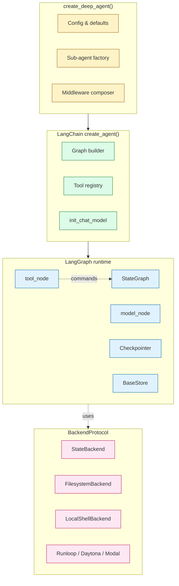
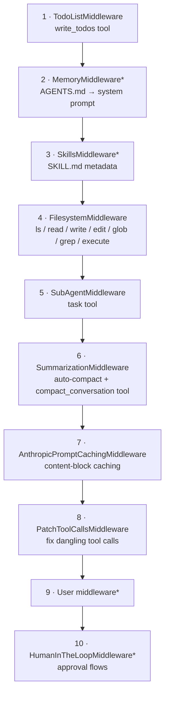
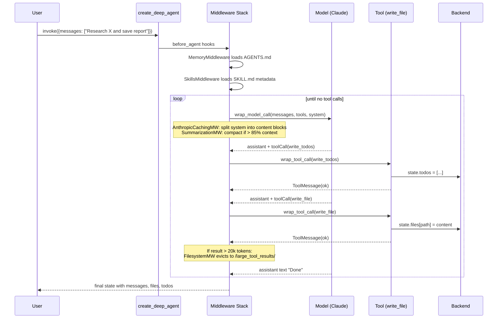
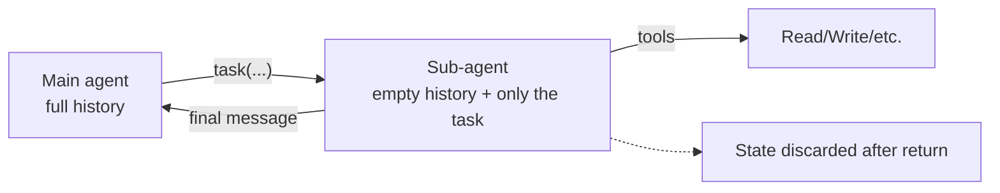

# Deep Agents — LangChain's Opinionated Agent Harness

> **Repository:** [langchain-ai/deepagents](https://github.com/langchain-ai/deepagents)
> **Language:** Python (≥3.11) · **License:** MIT
> **Built on:** LangChain + LangGraph
> **Tagline:** "Batteries-included agent harness inspired by Claude Code"

---

## TL;DR

- **Middleware stack, not a monolith.** Every capability — planning, filesystem, sub-agents, summarization, memory, skills — is a middleware that wraps the model call and the tool call. You compose your agent by selecting middleware.
- **Built on LangGraph primitives.** Streaming, checkpointing, persistence, and the `Command` pattern for atomic state updates come for free.
- **Batteries-included by design.** `create_deep_agent()` with zero args returns a working agent that can plan, read/write files, spawn sub-agents, and auto-compact its own context.

> **Analogy:** Pi gives you Lego bricks. Deep Agents gives you the Death Star kit. Both can build the same thing — Deep Agents just shipped most of it pre-assembled.

---

## 1. Why It Exists

LangChain noticed that everyone building serious agents was reimplementing the same five things: a todo list, file tools, shell execution, sub-agents, and context compaction. Rather than ship them as one-off recipes, they extracted the patterns into a **middleware framework** layered on top of LangGraph.

The result: you can `from deepagents import create_deep_agent` and have a working "Claude Code-shaped" agent in two lines, then peel back layers as your needs deviate from the default.

---

## 2. Two-Line Quickstart

```python
from deepagents import create_deep_agent

agent = create_deep_agent()
result = agent.invoke({
    "messages": [{"role": "user", "content": "Research LangGraph and write a summary"}]
})
```

That agent already has: planning (`write_todos`), filesystem (`read_file`/`write_file`/`edit_file`/`ls`/`glob`/`grep`), shell (`execute`), sub-agents (`task`), auto-summarization, Anthropic prompt caching, and AGENTS.md memory loading.

---

## 3. The Layered Stack



- **Deep Agents** = curated middleware + opinionated system prompt
- **LangChain `create_agent`** = the underlying agent builder + middleware framework
- **LangGraph** = the state machine, persistence, streaming
- **BackendProtocol** = pluggable storage + execution

---

## 4. The Middleware Stack

A Deep Agent is a **stack of middleware**, in this default order:



\* = optional, added conditionally based on `create_deep_agent()` args.

Each middleware can override any subset of these hooks:

| Hook | Fires | Used For |
|---|---|---|
| `before_agent(state)` | Once at start | Load memory, skills, patch state |
| `wrap_model_call(handler, request)` | Every model call | Inject system prompt, modify messages, summarize |
| `wrap_tool_call(handler, request)` | Every tool call | Evict large results, log, guard |

Source: [libs/deepagents/deepagents/middleware/](https://github.com/langchain-ai/deepagents/tree/main/libs/deepagents/deepagents/middleware)

---

## 5. A Request's Journey



---

## 6. Context Engineering — How Deep Agents Manages 200k Tokens

Five mechanisms cooperate:

### 6.1 · Stacked System Prompt with Caching
Each middleware appends a content block to `SystemMessage.content_blocks`. For Anthropic, stable prefix blocks are **prompt-cached** — only new blocks recompute. This drops cost ~80% on long sessions.

### 6.2 · Auto-Summarization
`SummarizationMiddleware` triggers when usage > 85% of `max_input_tokens`:
1. Compute cutoff index (keep last 10% of context)
2. Offload old messages to `/conversation_history/{thread_id}.md`
3. LLM-generated summary replaces evicted messages
4. Reference to offloaded file is included for retrieval

### 6.3 · Tool-Arg Truncation
Before full summarization, large `write_file`/`edit_file` args in older messages get truncated to "first 20 chars + …truncated".

### 6.4 · Large Result Eviction
Tool results > 20k tokens get written to `/large_tool_results/{tool_call_id}` and the inline result is replaced with head + tail preview + file reference. Agent reads in paginated chunks. Excluded: `ls`, `glob`, `grep`, `read_file`, `edit_file`, `write_file`.

### 6.5 · Skills Progressive Disclosure
Only skill `name` + `description` + `path` go in the system prompt. The agent reads the full `SKILL.md` only when it decides a skill is relevant.

---

## 7. Sub-Agents

`task(description, subagent_type)` spawns an **ephemeral** sub-agent:



Properties:
- **Context isolation** — sub-agent sees only its task description
- **Parallel execution** — multiple `task` calls in one assistant turn run concurrently
- **Same middleware stack** — sub-agents inherit TodoList, Filesystem, Summarization, PromptCaching, PatchToolCalls
- **Custom personas** — define `subagents=[{name, description, system_prompt, model, tools}]`

The default `general-purpose` sub-agent has all the main agent's tools.

---

## 8. Backend Abstraction

All file operations route through `BackendProtocol`:

```python
class BackendProtocol:
    def read(path, offset, limit) -> str
    def write(path, content) -> WriteResult
    def edit(path, old, new) -> EditResult
    def ls_info(path) -> list[FileInfo]
    def glob_info(pattern, path) -> list[FileInfo]
    def grep_raw(pattern, path, glob) -> list[Match]
    def download_files(paths)
    def upload_files(uploads)

class SandboxBackendProtocol(BackendProtocol):
    def execute(command, timeout) -> ExecuteResult
```

Available backends:

| Backend | Storage | Execution | Use Case |
|---|---|---|---|
| `StateBackend` | LangGraph state (ephemeral) | ✗ | Default, tests, stateless agents |
| `FilesystemBackend` | Local disk | ✗ | Persistent local files |
| `LocalShellBackend` | Local disk | ✓ local shell | Development |
| `StoreBackend` | LangGraph `BaseStore` | ✗ | Cross-session persistence |
| `CompositeBackend` | Routes paths → backends | mixed | Hybrid (e.g. `/memories/` → store) |
| Runloop / Daytona / Modal | Remote | ✓ sandboxed | Production |

---

## 9. Custom Configuration

```python
from deepagents import create_deep_agent
from deepagents.backends import CompositeBackend, StateBackend, StoreBackend
from langgraph.checkpoint.memory import MemorySaver

backend = CompositeBackend(
    default=StateBackend(),
    routes={"/memories/": StoreBackend()},
)

agent = create_deep_agent(
    model="openai:gpt-4o",
    tools=[my_search_tool],
    system_prompt="You are a researcher.",
    subagents=[{
        "name": "code-reviewer",
        "description": "Reviews PRs for bugs",
        "system_prompt": "You are a senior code reviewer...",
        "model": "anthropic:claude-sonnet-4-6",
        "tools": [read_file_tool, grep_tool],
    }],
    skills=["/skills/user/"],
    memory=["/AGENTS.md"],
    backend=backend,
    checkpointer=MemorySaver(),
    interrupt_on={"execute": True},   # human approval for shell
)
```

---

## 10. Testing & Evaluation

Deep Agents ships a sister package — **harbor** — for benchmarking:

- `libs/harbor/` — eval framework with task suites
- Provider-specific test matrices (Claude vs GPT vs Gemini)
- Reproducible benchmarks against published agent task suites
- Used by LangChain to compare middleware tweaks

Internal tests: `libs/deepagents/tests/` covers middleware ordering, summarization triggers, sub-agent isolation, prompt caching segmentation. The CLI and ACP packages have integration tests against a stub model.

---

## 11. Capabilities Matrix

| Capability | How Deep Agents Does It | Code Reference |
|---|---|---|
| Harness / runtime | LangGraph StateGraph + middleware stack | `libs/deepagents/deepagents/graph.py` |
| Context management | System-prompt composition + auto-summarization + arg truncation + result eviction | `middleware/summarization.py`, `middleware/filesystem.py` |
| Tool calling | `BaseTool`/`StructuredTool` + `Command` for state updates | `middleware/filesystem.py` |
| Automations | `interrupt_on` + middleware composition + custom hooks | `middleware/__init__.py` |
| Skills | `SKILL.md` progressive disclosure | `middleware/skills.py` |
| Memory | `AGENTS.md` loaded into system prompt; agent edits via `edit_file` | `middleware/memory.py` |
| Planning | `write_todos` tool + `TodoListMiddleware` | `middleware/__init__.py` |
| Sub-agents | `task` tool, ephemeral isolated agents | `middleware/subagents.py` |
| Testing | Unit tests + `harbor` eval framework | `libs/harbor/` |

---

## 12. Strengths & Tradeoffs

**Strengths**
- Best-in-class context management — many small techniques cooperating
- Composability via middleware (you can remove any capability)
- LangGraph gives you persistence + streaming + checkpointing for free
- Real benchmarking (`harbor`) baked into the org
- Drop-in agent in 2 lines

**Tradeoffs**
- LangChain/LangGraph dependency surface is large
- Middleware ordering matters and isn't trivially discoverable
- Python-first; Node bindings exist but lag
- Heavier abstraction than Pi or OpenCode — more concepts to internalize
- Tied to LangGraph's state model (you commit to that mental shape)

---

## 13. When to Choose Deep Agents

- You're already in the LangChain ecosystem
- You want a production-grade agent with **persistence + streaming + checkpointing**
- You need to compose specialized sub-agents (research, analysis, code-review)
- You want a real eval harness (`harbor`) to A/B middleware tweaks
- You're targeting remote sandboxes (Runloop/Daytona/Modal) for execution

---

## 14. Key Takeaways

1. **Middleware as the universal extension point** — every capability composes via the same hooks
2. **Context engineering is multi-layered** — five techniques cooperating beats any single trick
3. **Sub-agents solve context pollution** — isolate the messy work, keep the main thread clean
4. **Backend abstraction** — same agent code runs locally, in LangGraph state, or in a remote sandbox
5. **"Trust the LLM" security** — enforce at the sandbox layer, not the prompt layer

---

## Further Reading

- [Deep Agents repo](https://github.com/langchain-ai/deepagents)
- [LangGraph docs](https://langchain-ai.github.io/langgraph/)
- This repo's full analysis: [research/deepagents-analysis.md](../../research/deepagents-analysis.md)
- [Cross-agent comparison](comparison.md)
