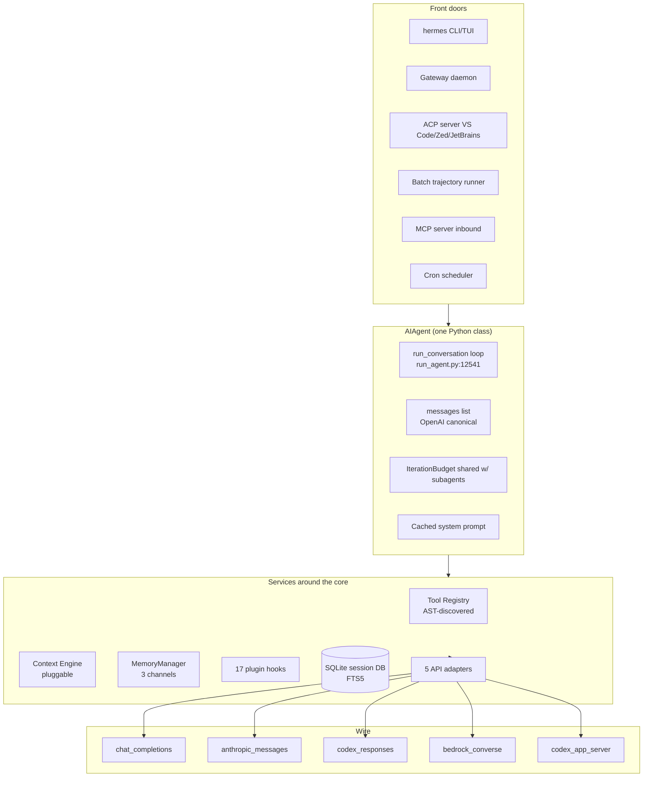
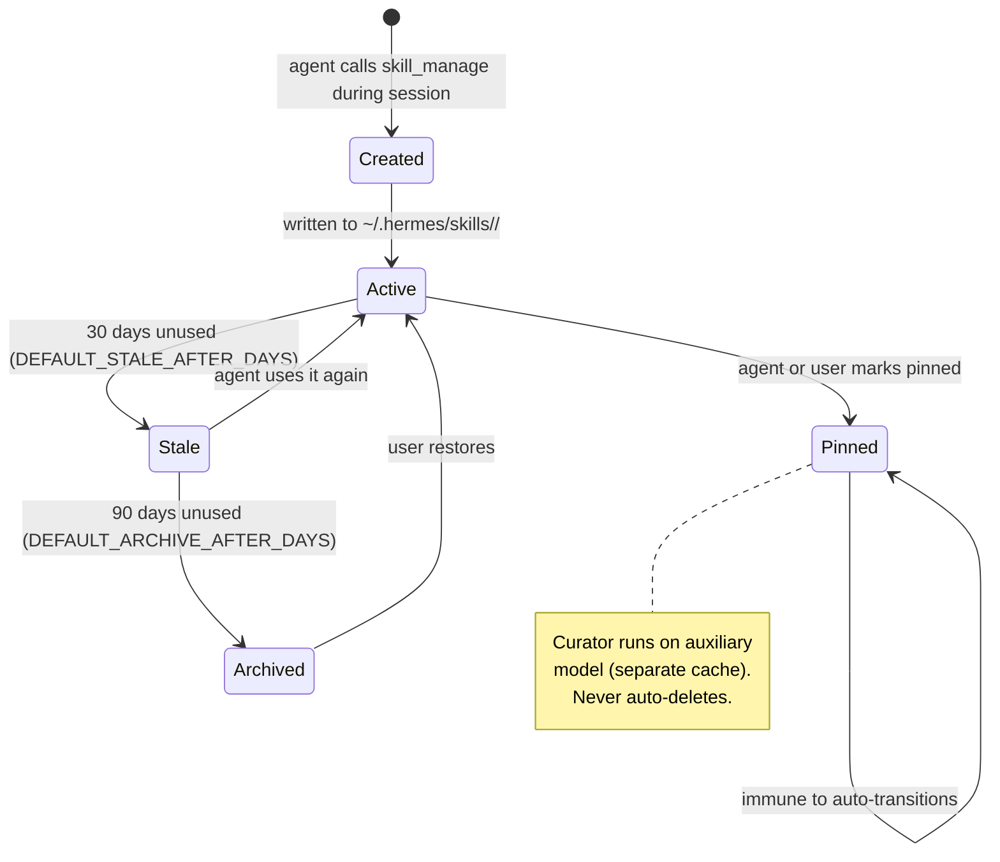
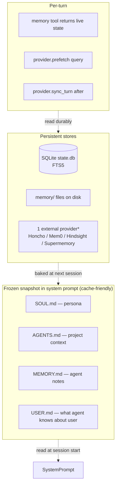

# Hermes Agent — The Self-Improving Maximalist Harness

> **Repository:** [NousResearch/hermes-agent](https://github.com/NousResearch/hermes-agent)
> **Language:** Python 3.11+ (uv-managed)
> **License:** MIT
> **Tagline:** "The self-improving AI agent built by Nous Research"

---

## TL;DR

- **Monolithic by design.** One giant `AIAgent` class (`run_agent.py` is ~16,400 LOC) wraps a conventional OpenAI-style JSON tool-calling loop. Every operational feature you can imagine is bolted on: 80+ tools, 7 terminal backends, 20+ messaging gateways, cron, ACP, MCP server *and* client, SQLite session FTS5, three API modes.
- **Self-improving via a curated skill loop.** `skill_manage` lets the agent author its own markdown skills during a session; a background **curator** on the auxiliary model promotes / archives skills on a 7-day cadence (`agent/curator.py`).
- **"Hermes" is branding, not coupling.** The default model is `anthropic/claude-opus-4.6`. The runtime *warns* if you point it at real Hermes-3/4 chat models because they don't tool-call reliably enough for an agent loop.

> **Analogy:** Hermes Agent is the Swiss Army knife of agents — every blade is real, every blade has been used in production, and the whole thing is somehow still one piece of metal.

---

## 1. Why It Exists

Nous Research wanted an open agent harness that (a) trains its own future tool-calling models and (b) actually runs reliably across messaging surfaces. The result is one of the largest single-process agent codebases in public source — designed to ship a working agent, not to invent new agent science.

Where other harnesses are minimal cores with extension points, Hermes is **a maximalist core with a plugin spine**. Most things you'd want exist as built-in tools; the plugin system covers the rest.

---

## 2. The Shape of the Beast



The single load-bearing line is at [`run_agent.py:12541`](https://github.com/NousResearch/hermes-agent/blob/main/run_agent.py):

```python
while (api_call_count < self.max_iterations
       and self.iteration_budget.remaining > 0) or self._budget_grace_call:
```

That `or self._budget_grace_call` is one of the harness's small kindnesses — when the budget runs out, the model gets one more iteration to produce a final summary instead of being silently truncated.

---

## 3. A Turn, End to End

```mermaid
sequenceDiagram
    participant U as User (or gateway)
    participant A as AIAgent
    participant P as Plugin hooks
    participant C as ContextEngine
    participant LLM as LLM (Anthropic/OpenAI/...)
    participant T as Tool

    U->>A: message
    A->>C: preflight token estimate
    alt over threshold
        C-->>A: compress old turns
    end
    A->>P: pre_llm_call (may inject user-msg context)
    A->>LLM: chat.completions.create (one of 5 API modes)
    LLM-->>A: response w/ optional tool_calls
    A->>A: strip XML tool blocks (defensive)
    alt has tool_calls
        A->>A: parallel? read-only? path-overlap?
        loop tool calls
            A->>P: pre_tool_call
            A->>T: dispatch (agent-internal / registry / MCP)
            T-->>A: result
            A->>P: post_tool_call (may rewrite)
        end
        A->>A: budget.consume(); loop
    else final response
        A->>P: post_llm_call
        A-->>U: final assistant message
    end
```

Notable details visible above:

- **Defensive XML stripping** — open models sometimes emit `<tool_call>` in prose. Hermes strips it ([`run_agent.py:3706-3798`](https://github.com/NousResearch/hermes-agent/blob/main/run_agent.py)) because the wire protocol is structured JSON tool calls only.
- **Plugin hooks at three points** — pre/post LLM, pre/post tool, pre/post API request (the full enum is 17 events in [`hermes_cli/plugins.py:128-168`](https://github.com/NousResearch/hermes-agent/blob/main/hermes_cli/plugins.py)).
- **Concurrency decision** — `_should_parallelize_tool_batch` looks at single-vs-multi, read-only vs write, and path-overlap heuristics before fanning out to a `ThreadPoolExecutor`.

---

## 4. The Self-Improving Skill Loop — The Distinctive Feature



The **curator** (`agent/curator.py`, 1,781 LOC) is the secret sauce. It runs every 7 days on the auxiliary model (to preserve the main model's prompt cache) and can:

- Promote skills the agent uses repeatedly to pinned
- Archive unused skills (recoverable)
- Consolidate near-duplicate skills
- Patch skill bodies for clarity

It never auto-deletes, and pinned skills are immune. Combined with **agentskills.io-compatible** markdown skills (progressive disclosure), `session_search` (FTS5 over SQLite session DB), and the bounded `MEMORY.md` file, this is the **closed learning loop** Hermes advertises.

---

## 5. Memory — Three Orthogonal Channels



\* Only one external provider runs at a time — enforced by `MemoryManager.add_provider`.

**Key invariant:** mid-session memory writes update files on disk *durably* but **do not** change the system prompt — this preserves the prefix cache. The `memory` tool's response contains the live state so the model still has read-back within the session. See [`tools/memory_tool.py:1-24`](https://github.com/NousResearch/hermes-agent/blob/main/tools/memory_tool.py).

---

## 6. Tool System — AST-Discovered Self-Registering Plugins

The tool registry is unusual:

```python
# tools/registry.py:42-74 (paraphrased)
def _module_registers_tools(path):
    # AST-parses each tools/<name>.py top-level body and imports
    # only modules that call registry.register(...)

def discover_builtin_tools():
    for path in tools_dir.iterdir():
        if _module_registers_tools(path):
            importlib.import_module(...)
```

This avoids hand-maintained registration lists and prevents accidental imports of helper modules.

Three dispatch paths share the same response shape:

| Path | What it Routes | Examples |
|---|---|---|
| **Agent-internal** | Direct state mutations | `todo`, `memory`, `clarify`, `delegate_task`, `session_search` |
| **Registry** | The ~75 normal tools | `terminal`, `read_file`, `write_file`, `apply_patch`, `image_generate`, `web_search`, ... |
| **MCP** | Outbound MCP servers | configured in `~/.hermes/config.yaml:mcp_servers` |

---

## 7. Capabilities Matrix

| Capability | How Hermes Does It | Code Reference |
|---|---|---|
| Harness | Monolithic `AIAgent`, 5 entry points → 1 loop | `run_agent.py:12094` (class), `:12541` (loop) |
| Context mgmt | Pluggable `ContextEngine` + default `ContextCompressor` + preflight + reactive | `agent/context_engine.py:32-211`, `agent/context_compressor.py` |
| Tool calling | JSON function-calling, AST-discovered registry, 3 dispatch paths | `tools/registry.py:42-74` |
| Automations | 17 plugin hooks + cron (file-locked 60s tick) + webhooks + slash commands | `hermes_cli/plugins.py:128-168`, `cron/scheduler.py` |
| Skills | `SKILL.md` (agentskills.io compatible) + progressive disclosure + Skills Hub | `tools/skills_tool.py` |
| Plugins | Python packages w/ `plugin.yaml`, 4 discovery sources, 17 hook enum | `hermes_cli/plugins.py` |
| Memory | 3 channels: identity files / curated bounded / pluggable external | `agent/memory_provider.py:42-279` |
| Planning loops | `todo` tool (in-memory store, history-hydrated) + `delegate_task` | `tools/todo_tool.py:25`, `tools/delegate_tool.py` |
| Sub-agents | `delegate_task` spawns isolated `AIAgent` children; shared `IterationBudget` | `tools/delegate_tool.py` |
| Sandboxing | 7 terminal backends — local / docker / ssh / singularity / modal / daytona / vercel | terminal backend modules |
| MCP | Client (built-in) + server (inbound) | `tools/mcp_tool.py` |
| Self-improvement | `skill_manage` + curator on auxiliary model | `agent/curator.py:1-60` |
| Testing | ~17k tests across ~900 files | `tests/`, `scripts/run_tests.sh` |

---

## 8. Cache Discipline & The Frozen-Snapshot Trick

Hermes goes to unusual lengths to preserve the Anthropic / OpenAI prompt cache:

1. **System prompt is built once per session and reused verbatim.** Stored in `_cached_system_prompt` and on disk in `state.db`.
2. **New plugin context per turn is injected into the *user* message**, never the system prompt (see the comment block at [`run_agent.py:12446-12468`](https://github.com/NousResearch/hermes-agent/blob/main/run_agent.py)).
3. **Memory writes are visible to the writer's `memory` tool response (live state)** but only baked into the system prompt on the next session.
4. **Curator runs on the auxiliary model** so even its expensive reviews don't pollute the main session's cache.

These are small choices that compound into a real cost-per-turn delta in long sessions.

---

## 9. Testing & Evaluation

- **~17,000 tests** across ~900 files (May 2026 snapshot from `AGENTS.md:61`)
- Canonical runner: `scripts/run_tests.sh` enforces `-n 4` xdist, `TZ=UTC`, `LANG=C.UTF-8`, `PYTHONHASHSEED=0`
- Heavy coverage on agent-loop edge cases: long context overflow, 4xx compression handling, Anthropic prompt-cache policy, dedup, anthropic truncation continuation, codex multimodal results
- **`mini_swe_runner.py`** (~28k LOC) — a SWE-bench-style runner that uses Hermes's terminal backends and outputs trajectories in Hermes's training format
- **Trajectory compressor** (`trajectory_compressor.py`, 1,508 LOC) post-processes finished trajectories to a token budget — preserve head/tail, compress middle — producing training data for Nous's own future models

A nuance: the **trajectory format on disk is XML** (`<tool_call>`/`<tool_response>`), the **wire format at inference is JSON**. This dual representation is one of the few places where "Hermes" the brand actually drives an implementation choice — Hermes 3 was trained on XML tool calls.

---

## 10. Strengths & Tradeoffs

**Strengths**
- Everything you might want is already in the box
- The self-improving skill loop is a real differentiator
- Disciplined cache management at every layer
- 17k tests covering very long-tail edge cases
- 7 terminal backends + 20+ messaging gateways

**Tradeoffs**
- Reading `run_agent.py` (16k LOC) is a real commitment
- Python plugins have full Turing power — no sandbox
- A new hook event requires a core PR (fixed enum)
- Cron coupled to gateway uptime (no separate daemon)
- No native eval-as-code dashboard

---

## 11. When to Choose Hermes Agent

- You want a **maximalist single-process** agent that "just works" out of the box
- You want a **self-improving skill loop** and are OK trusting the curator
- You're already in the agentskills.io ecosystem
- You want training-data trajectory exports for future models
- You're comfortable in a large Python codebase

---

## 12. Key Takeaways for AI Engineers

1. **Engineering > Novelty.** Hermes proves that "shipping an agent" is mostly retries, surrogates, JSON repair, dead-connection cleanup, and provider quirks — not new agent science.
2. **Cache discipline pays.** Frozen-snapshot system prompts + user-message context injection + auxiliary-model curator = real cost wins.
3. **AST-based plugin discovery** beats hand-maintained registries.
4. **Self-improvement needs invariants.** Curator never auto-deletes; pinned skills bypass everything; archive is recoverable.
5. **Bounded memory is honest.** "Explicit curation > infinite vector recall" forces the agent to decide what's worth remembering.

---

## Further Reading

- [Hermes Agent repo](https://github.com/NousResearch/hermes-agent)
- [agentskills.io specification](https://agentskills.io/specification)
- [`hermes-already-has-routines.md`](https://github.com/NousResearch/hermes-agent) — Hermes's own essay on shipping cron + webhooks before Anthropic's Claude Code Routines
- [Cross-agent comparison](comparison.md)
