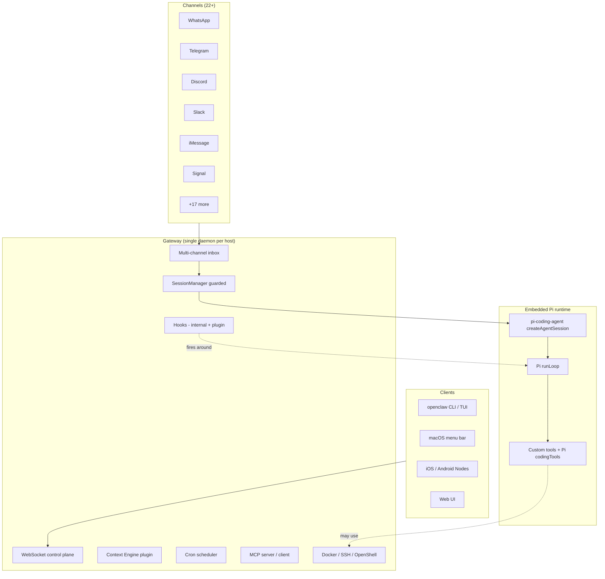
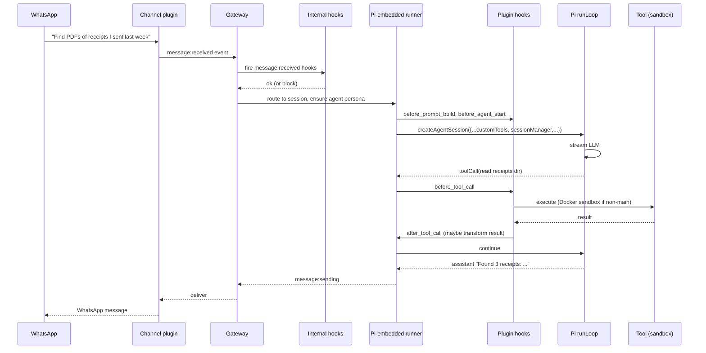
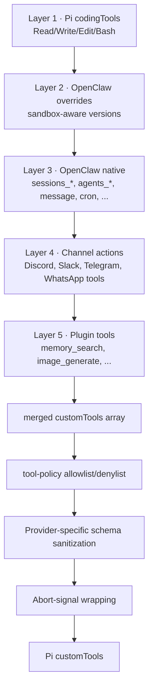
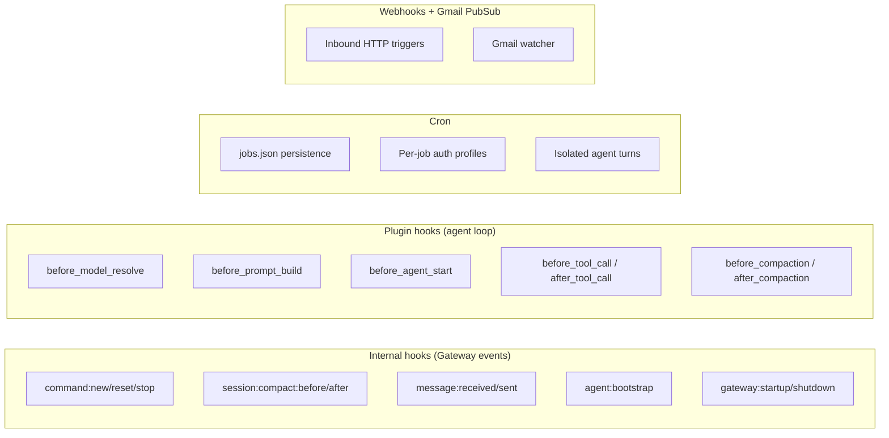
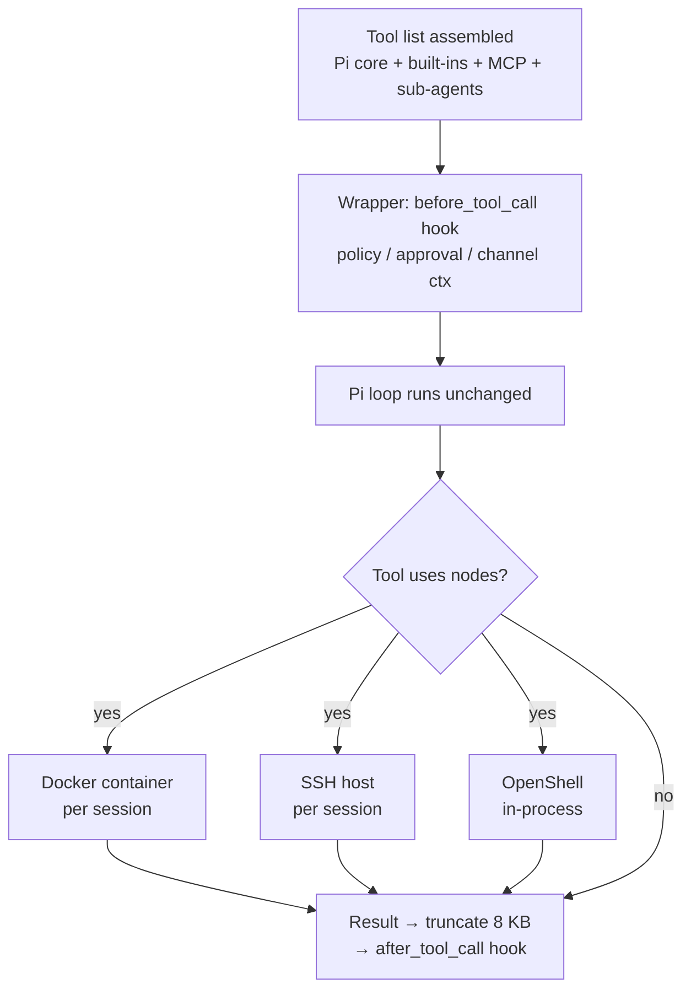

# OpenClaw — A Multi-Channel Productization of Pi

> **Repository:** [openclaw/openclaw](https://github.com/openclaw/openclaw)
> **Language:** TypeScript (Node ESM, strict)
> **License:** MIT
> **Tagline:** "A local-first, multi-channel personal AI assistant daemon"

---

## TL;DR

- **OpenClaw is Pi, productized.** It embeds [`@earendil-works/pi-coding-agent`](https://github.com/badlogic/pi-mono) (v0.74.0) as its actual agent runtime, then layers on a Gateway, 22+ messaging channels, 122 plugin packages, and 56 bundled skills.
- **One Gateway per host.** A long-lived local daemon with a WebSocket control plane. Many clients (CLI, macOS menu bar, iOS/Android nodes, web UI) connect to one Gateway, which runs one Pi loop per session.
- **Memory, MCP, cron, hooks, sandboxing.** Everything Pi doesn't include is added as a plugin: pluggable Context Engine, MCP server + client, cron scheduler, two layers of hooks, Docker/SSH/OpenShell sandboxes, file-based memory with optional vector search.

> **Analogy:** If Pi is the V8 engine, OpenClaw is the entire car — body, dashboard, infotainment, and the routes to 22 highway systems.

---

## 1. Why It Exists

Pi is a beautiful minimal engine that ships only a TUI. To use Pi as a persistent personal assistant (always-on, talking on Slack/iMessage/Discord, running cron jobs, remembering things) you need a *lot* of glue. OpenClaw is that glue, productized as a daemon you install once and live with.

The philosophy is captured in [`AGENTS.md`](https://github.com/openclaw/openclaw/blob/main/AGENTS.md): plugin-SDK-only boundaries, prompt-cache stability as a first-class engineering rule, no internal back-compat shims, no agent-hierarchy frameworks.

---

## 2. Where OpenClaw Sits Relative to Pi



The load-bearing line is in [`src/agents/pi-embedded-runner/run/attempt.ts:5`](https://github.com/openclaw/openclaw/blob/main/src/agents/pi-embedded-runner/run/attempt.ts):

```ts
import { createAgentSession, SessionManager } from "@earendil-works/pi-coding-agent";
```

OpenClaw doesn't fork Pi; it *uses* Pi. The four `@earendil-works/pi-*` packages are pinned at v0.74.0 in `package.json`.

---

## 3. A Message from WhatsApp to a Tool Call



Notice: there are **two hook layers** — Gateway-internal (event-level, e.g. `message:received`) and Plugin-loop (request-lifecycle, e.g. `before_tool_call`). They fire at different times intentionally.

---

## 4. Capabilities at a Glance

| Capability | How OpenClaw Does It | Code Reference |
|---|---|---|
| Harness | Embedded Pi via SDK | [`src/agents/pi-embedded-runner/run/attempt.ts`](https://github.com/openclaw/openclaw/blob/main/src/agents/pi-embedded-runner/run/attempt.ts) |
| Context mgmt | Pluggable Context Engine + Pi compaction + cache-TTL transcript entries | [`src/context-engine/`](https://github.com/openclaw/openclaw/tree/main/src/context-engine), [`src/agents/pi-embedded-runner/cache-ttl.ts:14`](https://github.com/openclaw/openclaw/blob/main/src/agents/pi-embedded-runner/cache-ttl.ts) |
| Tool calling | 5-layer tool stack (Pi base / OC overrides / OC custom / channel tools / plugin tools) | [`src/agents/openclaw-tools.ts:35`](https://github.com/openclaw/openclaw/blob/main/src/agents/openclaw-tools.ts) |
| Automations | Internal hooks + plugin hooks + cron + webhooks + Gmail PubSub | [`src/hooks/`](https://github.com/openclaw/openclaw/tree/main/src/hooks), [`src/cron/`](https://github.com/openclaw/openclaw/tree/main/src/cron) |
| Skills | AgentSkills-compatible `SKILL.md` from 6 precedence locations | [`src/agents/skills.ts`](https://github.com/openclaw/openclaw/blob/main/src/agents/skills.ts) |
| Plugins | `openclaw.plugin.json` manifest + `openclaw/plugin-sdk/*` barrel | [`packages/plugin-sdk/`](https://github.com/openclaw/openclaw/tree/main/packages/plugin-sdk) |
| Memory | `MEMORY.md` + `memory/YYYY-MM-DD.md` + optional `memory-lancedb` vector + `memory-wiki` Obsidian | [`extensions/memory-core/index.ts`](https://github.com/openclaw/openclaw/blob/main/extensions/memory-core/index.ts) |
| Planning loops | Codex-style `update_plan` tool (gated) | [`src/agents/tools/update-plan-tool.ts`](https://github.com/openclaw/openclaw/blob/main/src/agents/tools/update-plan-tool.ts) |
| Sub-agents | `sessions_spawn` with runtime `"subagent"` or `"acp"` | [`src/agents/tools/sessions-spawn-tool.ts`](https://github.com/openclaw/openclaw/blob/main/src/agents/tools/sessions-spawn-tool.ts) |
| MCP | Server (`openclaw mcp serve`) + client registry (`openclaw mcp set/unset`) | [`src/mcp/channel-server.ts`](https://github.com/openclaw/openclaw/blob/main/src/mcp/channel-server.ts) |
| Sandboxing | Docker / SSH / OpenShell backends for non-`main` sessions | `src/sandbox/` |
| Testing | 5,474 test files across the monorepo; Vitest + import-boundary tests | `test/`, `**/*.test.ts` |

---

## 5. The 5-Layer Tool Stack



Profiles (`minimal | coding | messaging | full` in [`src/agents/tool-catalog.ts:13`](https://github.com/openclaw/openclaw/blob/main/src/agents/tool-catalog.ts)) cap the set per persona. Sandbox sessions get a default deny-list (`browser, canvas, nodes, cron, discord, gateway`) so a guest persona in a group chat can't fire side-effecting tools.

---

## 6. The Prompt-Cache Discipline

OpenClaw treats prompt caching as a **first-class engineering invariant**, codified in [`AGENTS.md`](https://github.com/openclaw/openclaw/blob/main/AGENTS.md):

> "Prompt cache: deterministic ordering for maps/sets/registries/plugin lists/files/network results before model/tool payloads. Preserve old transcript bytes when possible."

This shows up in:

- **Custom transcript entry** `openclaw.cache-ttl` — marks cache TTL anchors inside the JSONL session (see [`cache-ttl.ts:14`](https://github.com/openclaw/openclaw/blob/main/src/agents/pi-embedded-runner/cache-ttl.ts))
- **`isCacheTtlEligibleProvider()`** — decides per-provider whether to emit TTL markers (Anthropic family, Kilocode-routed Anthropic, Google/Gemini)
- **Cache-TTL-aware pruning** in [`src/agents/pi-hooks/context-pruning.ts`](https://github.com/openclaw/openclaw/blob/main/src/agents/pi-hooks/context-pruning.ts)
- **Compaction safeguards** in `pi-hooks/compaction-safeguard.ts` — "save important notes to memory before compacting"

---

## 7. Automations: 4 Surfaces



---

## 8. Memory — Bounded Files + Optional Vectors

OpenClaw's memory model is intentionally **file-based + curated**, not vector-by-default:

- `MEMORY.md` — persistent top-level notes
- `memory/YYYY-MM-DD.md` — daily journal entries (auto-rotated)
- `memory-lancedb` plugin — optional vector search atop the markdown files
- `memory-wiki` plugin — Obsidian-style wiki link resolution

The agent can `memory_search` / `memory_get` when the plugin is enabled, but the canonical store is human-readable markdown. The author's stance (from `VISION.md`): explicit curation > implicit infinite recall.

---

## 9. Multi-Agent: Per-Persona Auth + Failover

OpenClaw natively supports **multiple agent personas** on one Gateway. Each persona has:
- Its own workspace, AGENTS.md, skills allowlist
- Its own auth profile (rotation + failover across API keys)
- Its own channel bindings (e.g. "the coding agent answers in #engineering")

Inter-persona communication is **not** an agent hierarchy — explicitly listed in [`VISION.md:106-117`](https://github.com/openclaw/openclaw/blob/main/VISION.md) as "what we will not merge." Instead, `sessions_spawn` lets one agent kick off a subordinate session; results return via standard messaging.

---

## 10. Testing

- **5,474 test files** across the monorepo
- Vitest with import-boundary tests enforcing the plugin SDK contract: [`test/plugin-extension-import-boundary.test.ts`](https://github.com/openclaw/openclaw/blob/main/test)
- 21 `AGENTS.md` files acting as living spec docs
- No formal eval harness — OpenClaw is verified by daily use across many real channels

---

## 11. Strengths & Tradeoffs

**Strengths**
- True multi-channel: 22+ messaging surfaces from one daemon
- Disciplined prompt-cache engineering
- Plugin SDK with enforced boundaries — runtime stays evolvable
- Pi embedding gives full event-stream control
- Hooks at two well-defined levels (Gateway vs Loop)

**Tradeoffs**
- Tight coupling to Pi's SDK surface (~129 `@earendil-works/pi-*` imports)
- Two hook layers is a learning curve
- "Code plugin vs bundle plugin" distinction is intentional but adds friction
- Large surface area (8,948 prod TS files) — onboarding is non-trivial

---

## 12. When to Choose OpenClaw

- You want a **personal assistant on chat platforms**, not just in a terminal
- You want cron + webhooks + Gmail triggers without writing them yourself
- You want first-class prompt caching across multiple providers
- You want to extend via a stable plugin SDK rather than fork the runtime
- You're OK living on a long-running local daemon

---

## 13. Deep Dive — Tool Use

OpenClaw inherits Pi's `AgentTool` shape unchanged but wraps every tool — Pi's defaults plus ~20 OpenClaw built-ins plus inbound MCP tools — with a single hook at construction. That wrapper is the policy point for the whole runtime.

### 13.1 · The 5-layer stack, where it's wired

Tool composition is concentrated in `createOpenClawTools()` ([src/agents/openclaw-tools.ts:70-162](https://github.com/openclaw/openclaw/blob/main/src/agents/openclaw-tools.ts)). The five layers are wired in order:

| # | Layer | Site | Examples |
|---|---|---|---|
| 1 | Pi core (4) | imported from `@earendil-works/pi-agent-core` ([pi-embedded-subscribe.tools.ts:2](https://github.com/openclaw/openclaw/blob/main/src/agents/pi-embedded-subscribe.tools.ts)) | `read`, `write`, `edit`, `bash` |
| 2 | OpenClaw built-ins (~20) | `openclaw-tools.ts:373-474` | `nodes`, `cron`, `message`, `gateway`, `sessions_*`, `web_search`, `tts`, `image_generate`, `update_plan` |
| 3 | Skills | `src/agents/skills.ts:31-38` | Skills are **not standalone tools** — they get disclosed in the prompt and run through `nodes` (shell) |
| 4 | MCP inbound | `materializeBundleMcpToolsForRun()` ([pi-bundle-mcp-materialize.ts:65-148](https://github.com/openclaw/openclaw/blob/main/src/agents/pi-bundle-mcp-materialize.ts#L65)) | Tools named `{server}_{name}` to avoid collisions ([:99-109](https://github.com/openclaw/openclaw/blob/main/src/agents/pi-bundle-mcp-materialize.ts#L99)) |
| 5 | Sub-agents | `sessions_spawn`, `sessions_send`, `sessions_yield` ([sessions-spawn-tool.ts:246-500](https://github.com/openclaw/openclaw/blob/main/src/agents/tools/sessions-spawn-tool.ts#L246)) | Spawn modes `"run"` (one-shot) or `"session"` (resumable); runtimes `"subagent"` or `"acp"` |

### 13.2 · The single wrapper — `wrapToolWithBeforeToolCallHook`

Every tool, regardless of layer, is wrapped at registration time ([pi-tools.before-tool-call.ts:29](https://github.com/openclaw/openclaw/blob/main/src/agents/pi-tools.before-tool-call.ts#L29)). Pi's loop runs unchanged; the wrapper does five things synchronously before delegating to the original `execute()`:

1. Fire `before_tool_call` plugin hook ([:95-170](https://github.com/openclaw/openclaw/blob/main/src/agents/pi-tools.before-tool-call.ts#L95)) — can mutate params in place ([:155-166](https://github.com/openclaw/openclaw/blob/main/src/agents/pi-tools.before-tool-call.ts#L155))
2. Veto via `BeforeToolCallBlockedError` ([:111-115](https://github.com/openclaw/openclaw/blob/main/src/agents/pi-tools.before-tool-call.ts#L111))
3. Resolve `allow`/`deny` policy ([tool-policy.ts:13-220](https://github.com/openclaw/openclaw/blob/main/src/agents/tool-policy.ts)) — supports `group:plugins` and per-plugin groups, expanded by `expandPluginGroups()` ([:130-156](https://github.com/openclaw/openclaw/blob/main/src/agents/tool-policy.ts#L130))
4. Optionally raise an **asynchronous approval request** ([:183-410](https://github.com/openclaw/openclaw/blob/main/src/agents/pi-tools.before-tool-call.ts#L183)) — used for per-channel policies where the user approves from WhatsApp, Slack, etc.
5. Inject channel delivery context ([openclaw-tools.ts:186-191, 304-317](https://github.com/openclaw/openclaw/blob/main/src/agents/openclaw-tools.ts#L186)) and `senderIsOwner` ([:120](https://github.com/openclaw/openclaw/blob/main/src/agents/openclaw-tools.ts#L120))

After the tool returns, an `after_tool_call` hook fires, and results pass through truncation ([pi-embedded-subscribe.tools.ts:17-40](https://github.com/openclaw/openclaw/blob/main/src/agents/pi-embedded-subscribe.tools.ts#L17)):

```typescript
const TOOL_RESULT_MAX_CHARS = 8000;
function truncateToolText(text: string): string {
  if (text.length <= TOOL_RESULT_MAX_CHARS) return text;
  return `${truncateUtf16Safe(text, TOOL_RESULT_MAX_CHARS)}\n…(truncated)…`;
}
```

There is **no per-result TTL cache** — the `openclaw.cache-ttl` markers in the comparison doc apply to prompt-cache discipline (system prompt / message stack), not to tool results.

### 13.3 · Per-session sandbox: Docker / SSH / OpenShell

The `nodes` tool (shell execution) routes through a per-session `SandboxContext`:

- Factory: `getSandboxBackendFactory()` ([sandbox.ts:14-50](https://github.com/openclaw/openclaw/blob/main/src/agents/sandbox.ts#L14)) returns Docker (default), SSH, or in-process OpenShell
- Workspace mount: `ensureSandboxWorkspaceForSession()` ([:13](https://github.com/openclaw/openclaw/blob/main/src/agents/sandbox.ts#L13))
- Path translation: `SandboxFsBridge` ([:36](https://github.com/openclaw/openclaw/blob/main/src/agents/sandbox.ts#L36)) mediates host ↔ container paths
- Policy gate: `resolveSandboxToolPolicyForAgent()` ([:35](https://github.com/openclaw/openclaw/blob/main/src/agents/sandbox.ts#L35)) + `applyNodesToolWorkspaceGuard()` ([openclaw-tools.ts:330-335](https://github.com/openclaw/openclaw/blob/main/src/agents/openclaw-tools.ts#L330))
- Pluggable: `registerSandboxBackend()` lets runtime plugins add backends

Sandboxing is **per-session** rather than per-tool — a session spawned with `runtime: "subagent"` gets its own container; the main session runs locally by default unless reconfigured.

### 13.4 · `update_plan` is opt-in

The Codex-style `update_plan` tool is conditionally constructed ([openclaw-tools.ts:360-372](https://github.com/openclaw/openclaw/blob/main/src/agents/openclaw-tools.ts#L360)):

```typescript
const includeUpdatePlanTool =
  isToolExplicitlyAllowedByFactoryPolicy({ toolName: "update_plan", ... }) ||
  isUpdatePlanToolEnabledForOpenClawTools({ config, agentSessionKey, agentId, modelProvider, modelId });
```

Validation enforces at-most-one `in_progress` step and returns structured `details` ([update-plan-tool.ts:76-97](https://github.com/openclaw/openclaw/blob/main/src/agents/tools/update-plan-tool.ts#L76)). It has no side effects on Pi's turn loop — the model just gets visibility into its own plan.

### 13.5 · Failover happens at run scope

When a model fails mid-tool (rate-limit, overload, auth), OpenClaw's classifier ([pi-embedded-runner/result-fallback-classifier.ts](https://github.com/openclaw/openclaw/blob/main/src/agents/pi-embedded-runner/result-fallback-classifier.ts)) triggers `runWithModelFallback()` ([model-fallback.ts](https://github.com/openclaw/openclaw/blob/main/src/agents/model-fallback.ts)) which **restarts the whole turn** with the fallback model. Codex's per-call retry semantics are not present — failover is coarser-grained on purpose, to keep prompt-cache windows aligned.



---

## 14. Key Takeaways

1. **Embedding > forking** — OpenClaw stays compatible with upstream Pi by using its SDK, not patching it
2. **Cache discipline is engineering** — codified in `AGENTS.md`, enforced via transcript-level cache TTL markers and deterministic ordering rules
3. **Hooks bifurcate by abstraction level** — Gateway hooks for system events, Plugin hooks for loop lifecycle
4. **Five tool layers** is real complexity, mitigated by profiles + policy + sandbox deny-lists
5. **Memory should be human-readable first**, vector second — Obsidian-compatible markdown over silent semantic recall

---

## Further Reading

- [OpenClaw repo](https://github.com/openclaw/openclaw)
- [OpenClaw `docs/pi.md`](https://github.com/openclaw/openclaw/blob/main/docs/pi.md) — the internal Pi-integration architecture doc
- [Pi (badlogic/pi-mono)](https://github.com/badlogic/pi-mono) — the runtime OpenClaw embeds
- [Pi deep-dive](pi.md) (this series)
- [Cross-agent comparison](comparison.md)
