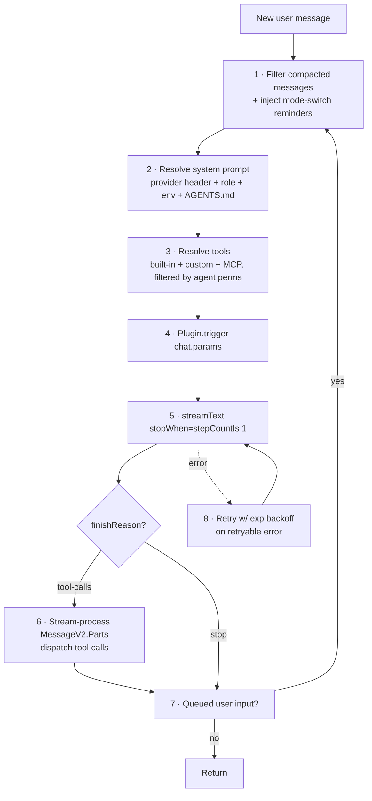
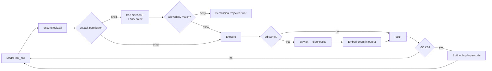

# OpenCode — The LSP-Native Coding Agent

> **Repositories (mind the lineage):**
> - **Primary subject:** [sst/opencode](https://github.com/sst/opencode) — active, TS server + (in v1) Go TUI
> - **Original ancestor:** [opencode-ai/opencode](https://github.com/opencode-ai/opencode) — pure Go, **archived 2025-09-17**, continued as [charmbracelet/crush](https://github.com/charmbracelet/crush)
>
> **This deep-dive pins to `sst/opencode@v1.0.0`** for the canonical "Go TUI + TS server" picture. The modern `dev` branch has removed the Go TUI in favor of `@opentui/solid` (SolidJS-based terminal renderer).

---

## TL;DR

- **Two cooperating processes, one binary.** A TypeScript Hono server (Bun) owns the agent loop, LLM calls, tools, LSP, MCP, storage, plugins. A Go Bubble Tea TUI is embedded into the binary, extracted on first launch, and `Bun.spawn`'d as a child connected via localhost HTTP/SSE.
- **LSP is a model-feedback channel.** After every edit, the tool synchronously waits up to 3s for `publishDiagnostics` and **embeds compiler errors into the tool result** so the model sees the type errors and self-corrects in the next step.
- **Shadow-git snapshots, tree-sitter bash permissions, no vector DB.** Three distinctive engineering bets: full revertability via a hidden git repo, per-AST-node bash permissions via tree-sitter, and `ripgrep`-only retrieval (no embeddings).

> **Analogy:** OpenCode is the agent that pair-programs with your language server. Where most agents treat code as text, OpenCode treats it as a tree that the compiler can talk back about.

---

## 1. The "Two Processes, One Binary" Architecture

```mermaid
flowchart TB
    User((User keyboard)) --> TUI

    subgraph Binary["one shipped binary"]
        subgraph Server["TS Hono server (Bun)"]
            Loop[session/prompt.ts:225-427<br/>explicit while(true) loop]
            Tools[Tool registry]
            LSP[LSP clients]
            MCPm[MCP clients]
            Plugins[Plugins API]
            Storage[JSON storage]
            Bus[Bus pub/sub]
        end

        subgraph TUIBlock["Go TUI (Bubble Tea v2)"]
            Render[Renderer]
            Input[Input handler]
            SSEcli[SSE client]
            Long[Long-poll inverse RPC]
        end
    end

    Embed[Bun.embeddedFiles<br/>extract to cache<br/>Bun.spawn] --> TUIBlock

    LLM[(LLM Provider)]
    LSPsv[(LSP servers)]
    MCPsv[(MCP servers)]

    TUI -- "POST /session/{id}/chat" --> Loop
    Loop --> LLM
    Loop --> Tools --> LSP --> LSPsv
    Loop --> Tools --> MCPm --> MCPsv
    Bus -- "SSE /event" --> SSEcli
    Server -. "callTui (queue)" .-> Long
    Long -. "POST /tui/control/response" .-> Server
```

The wiring lives in [`packages/opencode/src/cli/cmd/tui.ts:107-156`](https://github.com/sst/opencode/blob/v1.0.0/packages/opencode/src/cli/cmd/tui.ts):

```ts
const server = Server.listen({ port: args.port, hostname: args.hostname })
const tui = Bun.embeddedFiles.find((f) => (f as File).name.includes("tui")) as File
// ... write to cache ...
const proc = Bun.spawn({
  cmd: [...cmd, ...],
  env: { ...process.env, OPENCODE_SERVER: server.url.toString() },
  onExit: () => server.stop(),
})
```

**Why the split?** (1) Terminal UX requires a mature TUI runtime — Go + Bubble Tea is best-in-class; (2) the same Hono server powers the TUI, VS Code extension, Tauri desktop app, GitHub Action, and Slack bot; (3) the server emits OpenAPI 3.1 (`/doc`) which Stainless code-generates into the Go SDK — one wire format, many clients.

---

## 2. The Cleverest Detail — Inverse RPC Over Long-Poll

The server has work it wants the TUI to do: open a file picker, append text to the prompt buffer, show a toast. HTTP doesn't push, so OpenCode does **inverse RPC over long-poll** in [`packages/opencode/src/server/tui.ts:1-69`](https://github.com/sst/opencode/blob/v1.0.0/packages/opencode/src/server/tui.ts):

```ts
const request = new AsyncQueue<TuiRequest>()
const response = new AsyncQueue<any>()

export async function callTui(ctx: Context) {
  const body = await ctx.req.json()
  request.push({ path: ctx.req.path, body })
  return response.next()  // blocks until TUI POSTs back
}
```

The TUI sits in a loop hitting `GET /tui/control/next`. When the server queues work, the next GET drains it; the TUI processes and POSTs to `/tui/control/response`. Bidirectional comms without WebSockets.

---

## 3. The Execution Loop — Explicit, Step-By-Step

OpenCode does **not** rely on the Vercel AI SDK's auto-loop. Instead it uses `stopWhen: stepCountIs(1)` + a manual `while(true)` in [`packages/opencode/src/session/prompt.ts:225-427`](https://github.com/sst/opencode/blob/v1.0.0/packages/opencode/src/session/prompt.ts):



That `stopWhen: stepCountIs(1)` is intentional — it surrenders the SDK's loop so OpenCode can run snapshots, plugin hooks, and tool dispatches between every step.

---

## 4. The Standout — LSP as Model Feedback

This is the **defining behavior** of OpenCode. In [`packages/opencode/src/tool/edit.ts:104-116`](https://github.com/sst/opencode/blob/v1.0.0/packages/opencode/src/tool/edit.ts):

```ts
await LSP.touchFile(filePath, /* waitForDiagnostics */ true)
const diagnostics = await LSP.diagnostics()
const errors = diagnostics
  .filter(d => d.severity === 1)
  .map(d => `${d.range.start.line}: ${d.message}`)
  .join("\n")
return { output: `${editSummary}\n\nDiagnostics:\n${errors}`, ... }
```

After every edit, the tool **blocks up to 3s** for the language server to reply, then **embeds compiler errors directly into the tool result**. The model sees `"unused import 'foo'"` immediately and can fix it on the next step without being asked.

Plus two LSP-exposed tools:
- `lsp-diagnostics` — model can proactively fetch all diagnostics
- `lsp-hover` — model can ask for type info at a location

And a workspace symbol index for the `task` sub-agent (`LSP.workspaceSymbol(query)` filtered to Class/Function/Method/Interface/Variable/Constant/Struct/Enum, top 10).

---

## 5. Tree-Sitter Bash Permissions

Naïve regex bash permissions break on pipes, subshells, and string boundaries. OpenCode uses `web-tree-sitter` with the bash grammar to extract every `command` node, then matches each literal command string against the agent's wildcard set ([`packages/opencode/src/tool/bash.ts:59-100`](https://github.com/sst/opencode/blob/v1.0.0/packages/opencode/src/tool/bash.ts)):

```ts
const tree = await parser().then(p => p.parse(params.command))
const permissions = await Agent.get(ctx.agent).then(x => x.permission.bash)
const askPatterns = new Set<string>()
for (const node of tree.rootNode.descendantsOfType("command")) {
  // ... check each command against agent's wildcard rules
}
```

For `rg pattern | grep todo | xargs rm -rf`, each of the four commands is checked independently. This catches escapes that regex would miss.

---

## 6. Shadow-Git Snapshots

Every session can revert via a **shadow git repository**, separate from the user's `.git`:

```bash
GIT_DIR=$XDG_DATA/opencode/snapshot/$projectID
GIT_WORK_TREE=$worktree
```

See [`packages/opencode/src/snapshot/index.ts:13-50`](https://github.com/sst/opencode/blob/v1.0.0/packages/opencode/src/snapshot/index.ts). Every assistant turn commits to the shadow repo; `Snapshot.patch(hash)` reverts. Zero new infrastructure — just clever git usage. Tied to git (non-git projects skip snapshots).

---

## 7. The 5 Automation Surfaces

| Surface | Format | Loaded From | Purpose |
|---|---|---|---|
| **Slash commands** | Markdown + frontmatter | `.opencode/command/*.md` | Templated prompts; can pin agent/model/subtask |
| **Custom agents** | Markdown + frontmatter | `.opencode/agent/*.md` | `mode: primary | subagent | all` |
| **File-tool drop-ins** | TypeScript module | `.opencode/tool/*.ts` | Use `@opencode-ai/plugin` types |
| **Plugins** | npm packages or `file://` | `config.plugin` | Export hooks: `chat.params`, `tool.execute.before/after`, `permission.ask` |
| **Experimental hooks** | shell commands | `config.experimental.hook` | `file_edited` per-glob + `session_completed` |

Five surfaces is real surface area, but each serves a distinct need. See [`packages/opencode/src/config/config.ts:171-660`](https://github.com/sst/opencode/blob/v1.0.0/packages/opencode/src/config/config.ts).

---

## 8. Context Management

Three mechanisms cooperate:

1. **Pruning** — silently truncates the `output` field of old tool-call parts (preserves the request, drops the response). Last ~40k tokens of tool outputs visible. [`compaction.ts:50-88`](https://github.com/sst/opencode/blob/v1.0.0/packages/opencode/src/session/compaction.ts)
2. **Compaction** — full summarization when projected tokens > `model.limit.context - max_output`. [`compaction.ts:33-41`](https://github.com/sst/opencode/blob/v1.0.0/packages/opencode/src/session/compaction.ts)
3. **Anthropic prompt caching** — system prompt explicitly split into exactly two messages (cache-friendly):
   ```ts
   // packages/opencode/src/session/prompt.ts:497-510
   const [first, ...rest] = system
   system = [first, rest.join("\n")]   // exactly 2 for caching
   ```

Storage is **flat JSON on disk** (`session/`, `message/`, `part/` directories). Human-debuggable, Git-diffable, but slow to search across thousands of sessions — the modern `dev` branch is migrating to SQLite via Drizzle.

---

## 9. Provider-Specific System Prompts

OpenCode ships **different system prompts per provider** ([`session/system.ts:25-31`](https://github.com/sst/opencode/blob/v1.0.0/packages/opencode/src/session/system.ts)):

| Provider | Prompt file | Notes |
|---|---|---|
| GPT-5 family | `codex.txt` | Tuned for the Codex prompt style |
| Gemini | `gemini.txt` | |
| Claude | `anthropic.txt` | Plus an "anthropic_spoof" header for certain features |
| Anything else | `qwen.txt` | Default fallback |

Each prompt encodes the same intent but with provider-specific cues.

---

## 10. Memory

**Persistent:**
- `AGENTS.md` (preferred), `CLAUDE.md`, `CONTEXT.md` — walked up from `cwd` to worktree root, first match wins
- Global `~/.config/opencode/AGENTS.md` + `~/.claude/CLAUDE.md` (Claude Code interop)
- `config.instructions` — arbitrary glob list of rule files

**Per-session:**
- Full message history (subject to prune/compact)
- `Snapshot` shadow git for revertability
- `FileTime` map per session — tracks "agent has read this file at version X" to detect external edits

**Not present:** no vector DB, no embeddings. Search is `ripgrep` exposed to the model via `grep`/`glob`, plus a 200-line project tree injected into the system prompt.

---

## 11. Capabilities Matrix

| Capability | How OpenCode Does It | Code Reference |
|---|---|---|
| Harness | TS Hono server (Bun) + Go Bubble Tea TUI as child process | `cli/cmd/tui.ts:107-156`, `server/server.ts:81-148` |
| Context mgmt | Prune (40k cap on tool output) → Compact → 2-block cache-friendly system prompt | `session/compaction.ts`, `session/prompt.ts:497-510` |
| Tool calling | `Tool.define()` factory; 11 built-ins + custom + MCP; tree-sitter bash perms | `tool/tool.ts:1-55`, `tool/bash.ts:59-100` |
| Automations | 5 surfaces — commands / agents / file-tools / plugins / shell hooks | `config/config.ts:171-660` |
| Skills | (Modern only) `SKILL.md` from `.claude/skills/`, `.opencode/skill/`, `.agents/skills/` + remote skill pulls | `skill/index.ts` |
| Memory | AGENTS.md walk-up + shadow-git + `FileTime` + ripgrep tree | `session/system.ts:58-115`, `snapshot/index.ts` |
| Planning | 3 built-in modes (`build`/`plan`/`general`) + per-mode permission lockdown | `agent/agent.ts:51-95` |
| Sub-agents | `task` tool spawns child session w/ `parentID`; synchronous | `tool/task.ts:30-90` |
| LSP integration | First-class: edit tools wait for diagnostics; `lsp-hover`, `lsp-diagnostics` tools | `tool/edit.ts:104-116`, `tool/lsp-*.ts` |
| MCP | Both stdio + remote (HTTP/SSE); tool names namespaced `{server}_{tool}` | `mcp/index.ts:55-219` |
| Testing | Unit tests; `httpapi-exercise.ts` contract test in 3 modes | `test/`, `script/httpapi-exercise.ts` |

---

## 12. Strengths & Tradeoffs

**Strengths**
- LSP-as-feedback is a genuinely novel UX — agent fixes type errors before you ask
- Tree-sitter bash perms beat regex
- Shadow-git snapshots = free revertability
- OpenAPI-driven multi-client wire format
- Provider-tuned system prompts

**Tradeoffs**
- Two-language build/release engineering complexity
- Long-poll control channel is single-tenant (one TUI per server)
- JSON storage doesn't scale to thousands of sessions (migration to SQLite in progress)
- Five hook surfaces is a lot of surface area to learn
- Plugins are in-process Bun imports — weak security boundary

---

## 13. When to Choose OpenCode

- You want a coding agent that **uses your language server like a human does**
- You want **per-AST-node bash permissions**, not regex
- You want **free revertability** via shadow git
- You want a single agent server that powers TUI + IDE + desktop + CI + Slack
- You're OK with five extension surfaces

---

## 14. Deep Dive — Tool Use

OpenCode's tool stack is the most production-engineered in the series. Three things make it distinctive: **Effect-based schemas** (not bare Zod), **tree-sitter bash AST** for permissions, and **LSP diagnostics embedded into tool results**.

### 14.1 · Effect Schema, not Zod

The tool type ([packages/opencode/src/tool/tool.ts:53-63](https://github.com/sst/opencode/blob/dev/packages/opencode/src/tool/tool.ts#L53)):

```typescript
export interface Def<Parameters extends Schema.Decoder<unknown> = ...> {
  id: string
  description: string
  parameters: Parameters                    // Effect Schema
  jsonSchema?: JSONSchema7
  execute(args: ..., ctx: Context): Effect.Effect<ExecuteResult<M>>
  formatValidationError?(error: unknown): string
}
```

Effect Schema gives composable, type-safe validation; JSON Schema is generated on demand per-provider in `ProviderTransform.schema()` ([session/tools.ts:75-116](https://github.com/sst/opencode/blob/dev/packages/opencode/src/session/tools.ts#L75)). The provider transform is the only place schemas diverge from canonical form.

`Tool.define()` ([:149-180](https://github.com/sst/opencode/blob/dev/packages/opencode/src/tool/tool.ts#L149)) compiles the validation closure once at init time and wires span tracing + output truncation around every call.

### 14.2 · The execution context is rich

Every `execute()` gets a `Context` ([:34-51](https://github.com/sst/opencode/blob/dev/packages/opencode/src/tool/tool.ts#L34)) with:

- `sessionID`, `messageID`, `callID` — for snapshots and event correlation
- `abort: AbortSignal` — cooperative cancellation
- `metadata(input)` — partial result streaming back to the client
- `ask(input)` — **inline permission prompt** that suspends execution until the user decides
- `extra` — including `promptOps` (used by `task` to recurse into the prompt loop) and `bypassAgentCheck`

This is the cleanest "tool context" abstraction in the six agents — everything a tool needs comes through `ctx`, not through global imports.

### 14.3 · Registry: built-ins + plugins + disk scans

`registry.ts` ([:141-276](https://github.com/sst/opencode/blob/dev/packages/opencode/src/tool/registry.ts#L141)) builds three sources:

```typescript
type State = {
  custom: Tool.Def[]    // {tool,tools}/*.{js,ts} in config dirs + plugin defs
  builtin: Tool.Def[]   // 11+ tools initialized at startup
  task: TaskDef
  read: ReadDef
}
```

Per-call filtering ([:322-367](https://github.com/sst/opencode/blob/dev/packages/opencode/src/tool/registry.ts#L322)) decides which tools exist for which model — e.g., GPT-family models get `apply_patch` while everyone else gets `edit`:

```typescript
const usePatch = input.modelID.includes("gpt-") && ...
if (tool.id === ApplyPatchTool.id) return usePatch
if (tool.id === EditTool.id)       return !usePatch
```

That's how a single tool registry serves divergent model conventions without forking.

### 14.4 · Prompt loop is explicit, not SDK-driven

The loop in [`prompt.ts:1239-1487`](https://github.com/sst/opencode/blob/dev/packages/opencode/src/session/prompt.ts#L1239) is `while (true)`. Each iteration either streams a step from `handle.process()` ([processor.ts:368+](https://github.com/sst/opencode/blob/dev/packages/opencode/src/session/processor.ts#L368)), handles a queued subtask, or runs compaction. Stream events drive everything:

| AI SDK event | What OpenCode does |
|---|---|
| `text-delta` | accumulate into current text part |
| `tool-call-started` | `ensureToolCall()` creates pending ToolPart |
| `tool-call-input-delta` | append to raw input |
| `tool-call-input-end` | transition to `running` → **execute** |
| `tool-result` | `completeToolCall()` stores result |
| `finish` | break loop if no pending tool calls |

External loop (not SDK loop) gives OpenCode room to snapshot, fire plugin hooks, and check permissions between every step.

### 14.5 · Tree-sitter bash permissions — the headline feature

`shell.ts` uses **web-tree-sitter** to parse bash, PowerShell, and cmd.exe into ASTs ([shell.ts:94-400+](https://github.com/sst/opencode/blob/dev/packages/opencode/src/tool/shell.ts#L94)). The AST is walked to extract `command` nodes; each command's tokens are reduced to a canonical prefix via the **arity dictionary** ([permission/arity.ts:24-200+](https://github.com/sst/opencode/blob/dev/packages/opencode/src/permission/arity.ts#L24)) — ~150 entries mapping commands to how many tokens identify them:

```typescript
// arity examples
"git" → 2          // "git checkout" matches "git checkout" rule
"npm run" → 3      // "npm run dev" needs all three tokens
"docker compose" → 3
```

Then permission rules match against the prefix. Why this matters: regex rules misclassify `git checkout -- file && rm -rf /` (substring match for `rm` happens; AST sees a second command and checks it separately). The AST also handles quoting and command substitution properly.

### 14.6 · LSP diagnostics, embedded in the tool result

This is the standout. Post-edit ([edit.ts:193-197](https://github.com/sst/opencode/blob/dev/packages/opencode/src/tool/edit.ts#L193)):

```typescript
yield* lsp.touchFile(filePath, "document")
const diagnostics = yield* lsp.diagnostics()
const block = LSP.Diagnostic.report(filePath, diagnostics[normalizedFilePath] ?? [])
if (block) output += `\n\nLSP errors detected in this file, please fix:\n${block}`
```

`diagnostics()` blocks up to ~3s waiting for the language server. The model sees compiler-level feedback in the same turn as the edit — no "now run `tsc`" trip required. This is the closest thing in the series to giving the agent a real compiler.

### 14.7 · Two-tier output truncation

`truncate.output()` ([truncate.ts:76-100+](https://github.com/sst/opencode/blob/dev/packages/opencode/src/tool/truncate.ts#L76)) caps every tool result at **50 KB / 2000 lines** (configurable via `tool_output.max_bytes`). Overflow is spilled to `/tmp/.opencode/truncation/tool_<ulid>` and the model gets a hint:

> *…12.3 KB truncated… Use `grep`/`read` with offset/limit to inspect the saved file, or delegate to an explore agent via `task`.*

Tool-level truncation runs before the second tier — **compaction** — which kicks in when total context overflows ([prompt.ts](https://github.com/sst/opencode/blob/dev/packages/opencode/src/session/prompt.ts) auto-triggers `compaction.process()`).

### 14.8 · Shadow-git snapshot per message

Captured **before** the LLM stream starts ([processor.ts:105-121](https://github.com/sst/opencode/blob/dev/packages/opencode/src/session/processor.ts#L105)):

```typescript
const initialSnapshot = yield* snapshot.track()
```

Not per-tool. Per-message. Each `edit`/`write` produces its own `FileDiff` ([edit.ts:177-182](https://github.com/sst/opencode/blob/dev/packages/opencode/src/tool/edit.ts#L177)) tracking additions, deletions, and a unified diff. Combined with the snapshot, this gives free revertability without any new infrastructure.

### 14.9 · `task` — synchronous or background

[`task.ts:36-59`](https://github.com/sst/opencode/blob/dev/packages/opencode/src/tool/task.ts#L36):

```typescript
Parameters = Schema.Struct({
  description, prompt, subagent_type,
  task_id: optional(...),       // resume an existing session
  background: optional(...),    // async mode
})
```

Foreground: parent recurses through `ctx.extra.promptOps.loop()` into the child session and blocks until done. Background: `background.run(...)` forks; parent gets a `task_id` and polls via `task_status`. Permissions are derived by `deriveSubagentSessionPermission()` — child inherits the parent's permission set plus the child agent's own rules.



---

## 15. Key Takeaways

1. **Compilers can talk to agents.** LSP-as-feedback turns the language server from a developer tool into a model tool.
2. **AST > regex for permissions.** Tree-sitter catches escapes regex misses.
3. **Shadow git is genius.** Full revertability with zero new infrastructure.
4. **External loops beat SDK loops.** `stopWhen: stepCountIs(1)` + manual `while(true)` enables snapshots/hooks between every step.
5. **One server, many clients.** OpenAPI + Stainless = the right way to ship multi-UI agents.

---

## A Note on the Two OpenCodes

If you read GitHub and feel confused: `opencode-ai/opencode` (pure Go) is **archived**. Its lineage continues as `charmbracelet/crush`. The "active" OpenCode the community talks about is `sst/opencode`, and most of the architecture analyzed here belongs to its v1 era. The current `dev` branch has dropped the Go TUI for `@opentui/solid`, but the server-side design persists.

---

## Further Reading

- [sst/opencode](https://github.com/sst/opencode)
- [opencode-ai/opencode (archived)](https://github.com/opencode-ai/opencode)
- [charmbracelet/crush](https://github.com/charmbracelet/crush) — the spiritual successor of the original
- [Cross-agent comparison](comparison.md)
