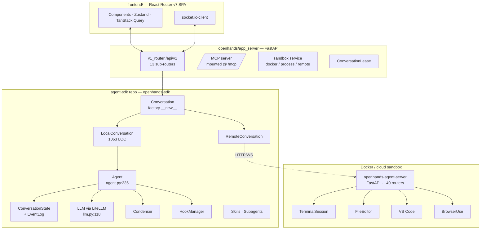
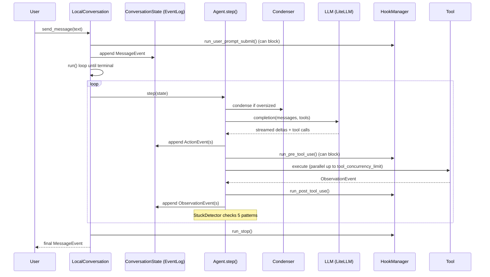
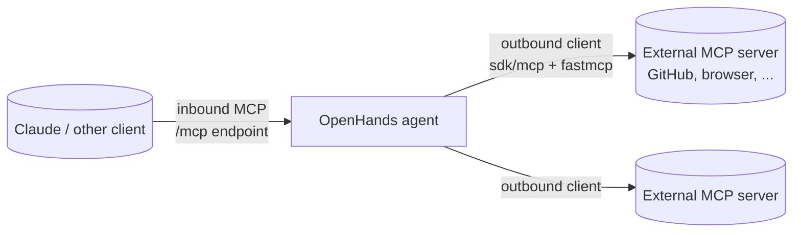

# OpenHands — Event-Sourced Agent With a FastAPI Sandbox

> **Repositories (note the v1 split):**
> - **Main:** [All-Hands-AI/OpenHands](https://github.com/All-Hands-AI/OpenHands) — FastAPI app server + React SPA (~74k★)
> - **SDK:** [OpenHands/agent-sdk](https://github.com/OpenHands/agent-sdk) — `openhands-sdk` + `openhands-tools` + `openhands-agent-server`
> - **CLI:** [OpenHands/OpenHands-CLI](https://github.com/OpenHands/OpenHands-CLI) — standalone TUI/headless
> - **Benchmarks:** [OpenHands/benchmarks](https://github.com/OpenHands/benchmarks) — SWE-Bench / GAIA / Commit0 / ProgramBench / OpenAgentSafety
>
> **License:** MIT (core); `enterprise/` is Polyform Free Trial 1.0.0
> **Languages:** Python 62%, TypeScript 36%
> **Latest:** 1.7.0 (May 2026) | **History:** renamed from **OpenDevin** in mid-2024
> **Headline number:** 77.6 on SWE-Bench Verified (per README)

---

## TL;DR

- **Event-sourcing as ground truth.** Every action and observation is a frozen Pydantic event in a persisted `EventLog` ([`event/base.py:16`](https://github.com/OpenHands/agent-sdk/blob/main/openhands-sdk/openhands/sdk/event/base.py)). Replay, `fork()`, `rerun_actions()`, and encrypted persistence all fall out of one design choice — most other agents hold an ephemeral message array.
- **The sandbox is its own FastAPI app.** `openhands-agent-server` runs *inside* the Docker container with ~40 routers (terminal, file, git, vscode, bash, desktop, hooks, MCP). It's a PyInstaller binary the host SDK talks to over HTTP/WS — not a thin `docker exec` wrapper.
- **Local/remote symmetry via one factory.** `Conversation.__new__()` ([`conversation.py:56`](https://github.com/OpenHands/agent-sdk/blob/main/openhands-sdk/openhands/sdk/conversation/conversation.py)) inspects the workspace and returns either `LocalConversation` or `RemoteConversation` — same API, remote variant proxies every call to the in-sandbox server. Move from laptop to cloud sandbox by changing one argument.

> **Analogy:** OpenHands is the agent built like a distributed system. Events are immutable, the sandbox is a service, and `Local`/`Remote` are interchangeable transports. Where Codex makes the OS enforce, OpenHands makes the architecture enforce.

---

## 1. The Workspace at a Glance



The flagship repo on `main` is **mostly the app server and frontend**. The actual agent loop, tools, LLM layer, condensers, hooks, MCP, skills, and the in-sandbox server all live in [OpenHands/agent-sdk](https://github.com/OpenHands/agent-sdk). They share the `openhands.*` Python namespace via `pkgutil.extend_path()` in [`openhands/__init__.py`](https://github.com/All-Hands-AI/OpenHands/blob/main/openhands/__init__.py).

---

## 2. The v1 Repository Split — Mind The 404s

In **v1.0 (December 2025)**, the OpenDevin-era monolith was carved into three repos:

| Lived in old `openhands/` | Now lives in | Notes |
|---|---|---|
| `controller/` (the agent loop) | `agent-sdk/openhands-sdk/openhands/sdk/conversation/` | `LocalConversation.run()` is the loop |
| `agenthub/` (CodeActAgent etc.) | `agent-sdk/openhands-sdk/openhands/sdk/agent/` | Now one `Agent` class — see §4 |
| `runtime/` | `agent-sdk/openhands-agent-server/` | The sandbox runs a real FastAPI server |
| `events/` | `agent-sdk/openhands-sdk/openhands/sdk/event/` | Pydantic discriminated unions |
| `llm/` | `agent-sdk/openhands-sdk/openhands/sdk/llm/` | LiteLLM-backed |
| `microagent/` | `agent-sdk/openhands-sdk/openhands/sdk/skills/` | Renamed to "skills" |
| `core/main.py` (headless) | `OpenHands-CLI/openhands_cli/` | `openhands` CLI, 8 commands |

The `openhands/` package on `main` now contains only `analytics/`, `app_server/`, and a legacy `server/` shim. If you're following old OpenDevin tutorials, expect every file path to 404 — the structure below is the v1 layout.

---

## 3. Event-Sourcing as Ground Truth

OpenHands' most distinctive choice: the conversation is a **log of immutable events**, not a list of messages.

```
ConversationState
├── _events: EventLog          # persisted, optionally encrypted via _cipher
├── _save_depth                # nested mutations → one autosave (FIFOLock)
├── _on_state_change            # observer callback for UI
├── activated_knowledge_skills
└── invoked_skills
```

Every event subclasses [`Event`](https://github.com/OpenHands/agent-sdk/blob/main/openhands-sdk/openhands/sdk/event/base.py) (`base.py:16`) with `id`, `timestamp`, `source`. Those that participate in the LLM transcript subclass `LLMConvertibleEvent` (`base.py:57`) and implement `to_llm_message()`. The four concrete types:

| Event | File | Purpose |
|---|---|---|
| `MessageEvent` | `event/llm_convertible/message.py` | User or assistant text turn |
| `ActionEvent` | `event/llm_convertible/action.py` | A single tool call (carries `thought`, `reasoning_content`, `tool_name`, `tool_call_id`, `security_risk`, `critic_result`, `summary`) |
| `ObservationEvent` | `event/llm_convertible/observation.py` | Tool result; `action_id` links back |
| `SystemPromptEvent` | `event/llm_convertible/system.py` | System prompt versioning |

What this design buys:
- **Fork** — `LocalConversation.fork()` snapshots the event log and replays into a new state (`examples/01_standalone_sdk/48_conversation_fork.py`).
- **Rerun** — `rerun_actions()` re-executes a slice without re-prompting the model.
- **Encrypted persistence** — `ConversationState` accepts a `_cipher` so logs at rest are encrypted, not in-memory only.
- **Discriminated polymorphism** — Events, Agents (`agent_kind: "openhands" | "acp"`), Workspaces, and Sandboxes all (de)serialize via Pydantic's `DiscriminatedUnionMixin`. JSON ↔ Python is free.

---

## 4. One Agent Class — Specialization Goes Sideways

There is **no zoo of agent classes** anymore. The single concrete agent lives at [`agent/agent.py:235`](https://github.com/OpenHands/agent-sdk/blob/main/openhands-sdk/openhands/sdk/agent/agent.py):

```python
class Agent(CriticMixin, ResponseDispatchMixin, AgentBase):
    # step() at line 372, decorated with @observe(name="agent.step")
    # _execute_actions() ~line 549
    # _execute_action_event() ~line 752
```

`AgentBase` ([`agent/base.py:88`](https://github.com/OpenHands/agent-sdk/blob/main/openhands-sdk/openhands/sdk/agent/base.py)) carries the configuration surface: `llm`, `tools`, `mcp_config`, `agent_context`, `system_prompt`, `condenser`, `critic`, `tool_concurrency_limit`. The `agent_kind` property at `base.py:525` is the discriminator — `"openhands"` (this class) or `"acp"` ([`agent/acp_agent.py`](https://github.com/OpenHands/agent-sdk/blob/main/openhands-sdk/openhands/sdk/agent/acp_agent.py) for the Anthropic Agent Communication Protocol variant).

Specialization happens via **four sideways extension points**, not subclassing:

| Vector | Where | Example |
|---|---|---|
| **Tools** | `Agent(tools=[...])` | `BrowserToolSet` opt-in, `TaskToolSet` when `enable_sub_agents=True` |
| **Presets** | `openhands-tools/openhands/tools/preset/` | `default.py`, `gpt5.py`, `gemini.py`, `planning.py` |
| **Skills (YAML)** | `.openhands/skills/*.md` | `CodeActAgent` is now a *skill name*, not a class |
| **Subagent registry** | `subagent/registry.py` | `register_agent()`, file-based YAML factories |

`get_default_agent()` at [`preset/default.py:49`](https://github.com/OpenHands/agent-sdk/blob/main/openhands-tools/openhands/tools/preset/default.py) wires the canonical config: Terminal + FileEditor + TaskTracker tools, `LLMSummarizingCondenser(max_size=80, keep_first=4)`, default system prompt.

---

## 5. The Step Loop



The loop lives in [`conversation/impl/local_conversation.py:552`](https://github.com/OpenHands/agent-sdk/blob/main/openhands-sdk/openhands/sdk/conversation/impl/local_conversation.py) (`LocalConversation.run()`, 1063 LOC total). It iterates while the conversation isn't paused or stuck, calls `agent.step()` under a state lock, and breaks on a terminal status or `max_iterations` (default **500**).

`Agent.step()` itself ([`agent.py:372`](https://github.com/OpenHands/agent-sdk/blob/main/openhands-sdk/openhands/sdk/agent/agent.py)) has a nested `_ActionBatch` dataclass (~lines 70-180) that batches tool calls within one model turn, with special handling for the `FinishTool` (the agent signals completion by calling it).

---

## 6. Local ↔ Remote Conversation Symmetry

The factory in [`conversation/conversation.py:56`](https://github.com/OpenHands/agent-sdk/blob/main/openhands-sdk/openhands/sdk/conversation/conversation.py):

```python
class Conversation:
    def __new__(cls, agent, workspace, ...):
        if isinstance(workspace, BaseWorkspace) and workspace.is_remote():
            return RemoteConversation(...)
        return LocalConversation(...)
```

The same call site, the same returned API surface — `send_message`, `run`, `pause`, `fork`, `rerun_actions`, state access. What changes is the **transport**:

| | LocalConversation | RemoteConversation |
|---|---|---|
| Where it lives | Host (your laptop, app server) | Host — but every method is a thin RPC |
| Where the agent runs | Same process | Inside `openhands-agent-server` in the sandbox |
| Workspace | `LocalWorkspace(working_dir)` — subprocess + shutil | `AsyncRemoteWorkspace` — HTTP to `workspace_router` |
| Tool execution | In-process | Inside the sandbox, results streamed back |

This is the architectural answer to "how do we run the same agent on a laptop and in a cloud VM?" Rather than maintain two control loops, OpenHands runs **one loop** and lets the transport differ.

---

## 7. The In-Sandbox Agent-Server

`openhands-agent-server` (in the `agent-sdk` repo) is a full FastAPI app, not a runtime shim. It compiles to a single PyInstaller binary (`agent-server.spec`) that the host installs into the Docker image.

```mermaid
flowchart LR
    Host[Host: RemoteConversation]
    subgraph Container["Docker / KVM / Remote VM"]
        API[api.py<br/>FastAPI app]
        subgraph Routers["~20 routers"]
            R1[conversation_router]
            R2[bash_router]
            R3[file_router]
            R4[git_router]
            R5[mcp_router]
            R6[vscode_router]
            R7[hooks_router]
            R8[skills_router]
            R9[event_router]
            R10[desktop_router]
        end
        subgraph Services["services"]
            S1[bash_service]
            S2[conversation_service]
            S3[event_service]
            S4[hooks_service]
            S5[tool_preload_service]
            S6[vscode_service]
            S7[desktop_service]
        end
        Persist[persistence/]
        Sock[sockets — websockets]
    end
    Host -.HTTP REST.-> API
    Host -.WS.-> Sock
    API --> Routers
    Routers --> Services
    Services --> Persist
```



**Why is the sandbox a server?** Three payoffs:
1. **VS Code lives there.** `vscode_router` + `vscode_extensions/openhands-settings/` ship a working VS Code instance inside the sandbox; the host UI tunnels in.
2. **Tool execution is uniform.** Whether the conversation is local or remote, tools talk to the same FastAPI interface. The host's `RemoteConversation` is just another client.
3. **It can be the ACP variant too.** `conversation_router_acp` exposes the Agent Communication Protocol so external Anthropic-style agents can drive it.

Sandbox backends in the app server (`openhands/app_server/sandbox/`):

| Backend | Use case |
|---|---|
| `docker_sandbox_service.py` | Default — local Docker; KVM support added in 1.7.0 |
| `process_sandbox_service.py` | Local OS process; **no isolation** (trusted dev) |
| `remote_sandbox_service.py` | Cloud sandbox provider |

---

## 8. Tool & Action Model

Every tool is `ToolDefinition[ActionT, ObservationT]` ([`tool/tool.py`](https://github.com/OpenHands/agent-sdk/blob/main/openhands-sdk/openhands/sdk/tool/tool.py)) — strongly typed in/out, emitting `ActionEvent`/`ObservationEvent` rather than returning raw values. Built-in tools live in [`openhands-tools/openhands/tools/`](https://github.com/OpenHands/agent-sdk/tree/main/openhands-tools/openhands/tools):

| Tool | Notes |
|---|---|
| `terminal/` | `TerminalSession`, command status tracking, metadata enrichment |
| `file_editor/` | Anthropic-style `str_replace_editor` semantics |
| `apply_patch/` | Codex-style patch envelope |
| `browser_use/` | Playwright + BrowserGym for web automation |
| `glob/`, `grep/` | File search via ripgrep |
| `task/`, `task_tracker/` | In-context to-do management |
| `delegate/` | `DelegateTool` — parent agent → subagent w/ confirmation |
| `planning_file_editor/` | Plan-mode file edits |
| `gemini/`, `tom_consult/` | Model-specific helpers |

**Calling convention:** native function-calling by default (`LLM.native_tool_calling=True`); falls back to a `NonNativeToolCallingMixin` parser for models that don't support it. Tools serialize via `to_openai_tool()` and `to_mcp_tool()` (~line 370 in `tool.py`).

**Parallelism:** `Agent.tool_concurrency_limit` gates concurrent execution; `DeclaredResources` on each tool definition lets the runtime detect conflicts (e.g. two writes to the same file) and serialize where needed.

**Security:** Every `ActionEvent` carries an LLM-attested `security_risk` field, extracted by `_extract_security_risk()` (~`agent.py:570`). The `sdk/security/` subdirectory layers `analyzer.py`, `llm_analyzer.py`, `ensemble.py`, `confirmation_policy.py`, plus a `defense_in_depth/` directory and a `grayswan/` adversarial test suite.

---

## 9. The LLM Layer — LiteLLM, ~50 Providers

[`llm/llm.py:118`](https://github.com/OpenHands/agent-sdk/blob/main/openhands-sdk/openhands/sdk/llm/llm.py):

```python
class LLM(BaseModel, RetryMixin, NonNativeToolCallingMixin):
    # ~50 config fields: model, base_url, api_key,
    # Bedrock creds (lines 154-168), temperature, top_p,
    # max_input_tokens, max_output_tokens, caching_prompt,
    # native_tool_calling, reasoning_effort, fallback_strategy, ...
```

Key paths in this 1317-LOC file:
- `completion()` at **line 631** — Chat Completions API
- `responses()` at **line 769** — OpenAI Responses API
- `litellm_completion()` actually called at **line 1087**
- `_coerce_inputs()` lines 492-532 — provider name rewrites (`openhands/*` → `litellm_proxy/*`, Azure version normalization)
- Capability probes lines 1096-1140 — `_supports_vision()`, `is_caching_prompt_active()`, `uses_responses_api()`
- Subscription login lines 1268-1317 — OAuth flow for ChatGPT Plus/Pro
- Retry exceptions at line 96 (`LLM_RETRY_EXCEPTIONS`), decorated at 689-704 and 856-871

**Ecosystem features:**
- **Prompt caching** — explicit `caching_prompt` flag, queryable via `is_caching_prompt_active()`.
- **Fallback strategy** — `llm/fallback_strategy.py` cascades to a backup model on failure.
- **Multi-LLM registry** — `llm/llm_registry.py` lets a single agent route different turns to different models.
- **Routing** — `llm/router/` for content-based model selection.

---

## 10. Context Management — Condenser + Stuck Detector

OpenHands separates two concerns most agents conflate.

### Condenser — "the context is too big"

Lives in `sdk/context/condenser/`. The default is `LLMSummarizingCondenser` ([`llm_summarizing_condenser.py:71`](https://github.com/OpenHands/agent-sdk/blob/main/openhands-sdk/openhands/sdk/context/condenser/llm_summarizing_condenser.py), 282 LOC):

| Field | Default | Role |
|---|---|---|
| `max_size` | 240 (SDK default), 80 (preset) | Trigger threshold |
| `keep_first` | 2 (SDK), 4 (preset) | Cache-stable prefix events |
| `minimum_progress` | 0.1 | Don't condense if we'd evict too little |
| `hard_context_reset_max_retries` | 5 | Fallback for runaway context |
| `hard_context_reset_context_scaling` | 0.8 | Aggressive reset multiplier |

Algorithm: get_condensation_reasons → determine the forgettable window → LLM-summarize → replace those events with a single summary event, **preserving the first `keep_first`** for prompt-cache hits.

Other condensers: `NoOpCondenser` (passthrough), `PipelineCondenser` (chain multiple).

### Stuck Detector — "the agent is in a loop"

[`stuck_detector.py`](https://github.com/OpenHands/agent-sdk/blob/main/openhands-sdk/openhands/sdk/conversation/stuck_detector.py) (429 LOC) inspects the event log for **five patterns**:
1. Repeating action→observation pair
2. Action followed by repeated errors
3. Agent monologue (no tool calls for N turns)
4. A-B-A-B alternation
5. Context-window errors despite condensation

When any pattern fires, the conversation transitions to a `STUCK` status and `run()` breaks out of the loop.

---

## 11. Skills (formerly Microagents)

YAML-front-matter markdown files. Two flavors:

- **Knowledge skills** — keyword/slash-triggered, repo-agnostic. 27 ship public in [`OpenHands/skills/`](https://github.com/All-Hands-AI/OpenHands/tree/main/skills) (e.g. `github.md`, `kubernetes.md`, `code-review.md`, `pdflatex.md`, `address_pr_comments.md`).
- **Repo skills** — auto-loaded for a project from `.openhands/skills/` (V1) or `.openhands/microagents/` (V0).

```yaml
# skills/code-review.md
version: "1.0"
name: "Automated Code Reviewer"
description: "..."
triggers: [/codereview]
schema:
  input:  { type, required_fields }
  output: { type, format }
```

Skill SDK code at [`sdk/skills/`](https://github.com/OpenHands/agent-sdk/tree/main/openhands-sdk/openhands/sdk/skills) (`skill.py`, `trigger.py`, `execute.py`, `fetch.py`, `installed.py`). Activation flows through `ConversationState.activated_knowledge_skills` and `invoked_skills`, so an event-log replay reproduces the same skill state.

---

## 12. MCP — Both Directions



- **Client:** [`sdk/mcp/client.py`](https://github.com/OpenHands/agent-sdk/blob/main/openhands-sdk/openhands/sdk/mcp/client.py) wraps `fastmcp.Client` with sync/async bridges. Configure per-agent via `Agent.mcp_config`.
- **Server:** `openhands/app_server/app.py` mounts an MCP server at **`/mcp`** (streamable HTTP). The in-sandbox `mcp_router.py` exposes a parallel surface so the agent-server itself can be called via MCP.
- **OAuth:** example `08_mcp_with_oauth.py` walks through OAuth-protected MCP servers.

---

## 13. Hooks (v1.6.0+)

[`sdk/hooks/manager.py`](https://github.com/OpenHands/agent-sdk/blob/main/openhands-sdk/openhands/sdk/hooks/manager.py) (~220 LOC) — `HookManager` with these events:

| Method | Can block? | Fires |
|---|---|---|
| `run_pre_tool_use()` | **yes** | Before each tool invocation |
| `run_post_tool_use()` | no | After each tool result |
| `run_user_prompt_submit()` | **yes** | When user sends a message |
| `run_session_start()` | no | Conversation init |
| `run_session_end()` | no | Conversation teardown |
| `run_stop()` | no | Agent says it's done |

Hooks are looked up dynamically via `config.get_hooks_for_event()` (config-driven, not register/dispatch). The in-sandbox server has a parallel `hooks_router.py` so hooks can be sandbox-resident. Webhook fan-out is handled host-side by `app_server/event_callback/webhook_router.py` + `sql_event_callback_service.py`.

---

## 14. Sub-Agents & Delegation

Three layers, three different abstractions:

1. **`subagent/` registry** — global `_agent_factories` dict + lock; `register_agent()`, `register_agent_if_absent()`, `register_file_agents()` for YAML-defined personas, `register_plugin_agents()` for Python entry points.
2. **`tools/delegate/`** — `DelegateTool` lets the parent agent invoke a registered subagent by name with confirmation. Exports `DelegateAction`, `DelegateObservation`, `DelegateExecutor`, `ConfirmationHandler`, `DelegationVisualizer`.
3. **`tools/task/` (`TaskToolSet`)** — opt-in via `enable_sub_agents=True` in the preset; richer task-tracking around delegations.

Inside a single turn, [`agent/parallel_executor.py`](https://github.com/OpenHands/agent-sdk/blob/main/openhands-sdk/openhands/sdk/agent/parallel_executor.py) drives multiple tool calls concurrently up to `tool_concurrency_limit`.

Working example: [`examples/01_standalone_sdk/25_agent_delegation.py`](https://github.com/OpenHands/agent-sdk/tree/main/examples).

---

## 15. The Three Frontends

| Surface | Repo | Stack |
|---|---|---|
| **GUI** | `All-Hands-AI/OpenHands` | React 19 + React Router v7 + Vite + Tailwind 4, Zustand + TanStack Query, Monaco, xterm v6, socket.io-client; backend on uvicorn :3000 |
| **CLI** | [`OpenHands/OpenHands-CLI`](https://github.com/OpenHands/OpenHands-CLI) | Textual TUI; 8 commands (`serve`, `web`, `acp`, `login`, `logout`, `mcp`, `cloud`, `view`); headless via `--task`/`--file` |
| **SDK** | [`OpenHands/agent-sdk`](https://github.com/OpenHands/agent-sdk) | Direct Python — 46 numbered examples from `01_hello_world.py` to `49_switch_llm_tool.py` |

The frontend was migrated from Remix → React Router v7 in the v1.0 wave. `frontend/src/` is organized by domain (`api/`, `routes/`, `services/`, `stores/`, `hooks/`, etc.), with service modules following a `*-service.api.ts` + `*.types.ts` pair pattern and TanStack Query hooks gating component access.

---

## 16. Evaluation

Lives in a separate repo: [`OpenHands/benchmarks`](https://github.com/OpenHands/benchmarks). Six benchmark suites:

1. **SWE-Bench** — GitHub-issue software tasks (claimed 77.6 Verified)
2. **SWE-Bench Pro** — long-horizon SWE
3. **GAIA** — general AI assistant multi-step reasoning
4. **Commit0** — Python function implementation
5. **OpenAgentSafety** — adversarial/safety with NPCs
6. **ProgramBench** — rebuild a program from binary + docs

The org also maintains the (archived) `swe-bench` OpenDevin fork and the SWE-Bench leaderboard site.

---

## 17. Capabilities Matrix

| Capability | How OpenHands Does It | Code Reference |
|---|---|---|
| Harness | FastAPI app + SDK + in-sandbox FastAPI; `Conversation.__new__` factory | `conversation.py:56` |
| Agent loop | `LocalConversation.run()` w/ stuck detector + max_iterations | `local_conversation.py:552` |
| Tools | Typed `ToolDefinition[ActionT, ObservationT]`; native fn-calling | `tool/tool.py`, `tools/preset/default.py:23` |
| Sandboxing | Docker (default), KVM (1.7), process (trusted), remote | `app_server/sandbox/` (15 files) |
| Sandbox-as-service | `openhands-agent-server` FastAPI w/ ~20 routers + VS Code | `agent-sdk/openhands-agent-server/` |
| LLM | LiteLLM, ~50 providers, prompt caching, fallback chains, OAuth login | `llm/llm.py:118` |
| Context mgmt | `LLMSummarizingCondenser` + 5-pattern `StuckDetector` | `condenser/`, `stuck_detector.py` |
| Hooks | 6 events; PreToolUse + UserPromptSubmit can block | `hooks/manager.py` (1.6.0+) |
| Skills | YAML front-matter md; knowledge + repo; slash-triggered | `skills/`, `sdk/skills/` |
| Memory | Event log (persisted, optionally encrypted); skills-as-state | `event/`, `ConversationState` |
| Planning | `task_tracker/` + `planning_file_editor/` + planning preset | `tools/task_tracker/`, `preset/planning.py` |
| Sub-agents | Registry + `DelegateTool` + `TaskToolSet`; parallel within turn | `subagent/`, `tools/delegate/`, `parallel_executor.py` |
| MCP | Client (`fastmcp`) + server (`/mcp` endpoint, plus in-sandbox) | `sdk/mcp/`, `app_server/mcp/` |
| Security | LLM-attested risk per action + ensemble analyzers + confirmation | `sdk/security/`, `agent.py:570` |
| Persistence | `EventLog` w/ encryption; `fork()` + `rerun_actions()` | `ConversationState`, `_cipher` |
| Eval | 6-benchmark suite (SWE-Bench, GAIA, Commit0, ...) | `OpenHands/benchmarks` |

---

## 18. Strengths & Tradeoffs

**Strengths**
- Event-sourced state gives you replay, fork, and encrypted persistence for free
- In-sandbox FastAPI server is unusually capable — VS Code, hooks, MCP all available *inside* the box
- Five-tier productization (SDK → CLI → GUI → Cloud → Enterprise) off one core
- LiteLLM coverage is among the broadest in the survey (~50 providers, fallback chains, subscription OAuth)
- First-class MCP **client + server**, with the server mounted in both host and sandbox
- 77.6 on SWE-Bench Verified (highest among the agents in this series) and a 6-benchmark suite to back it
- Strong security story: LLM-attested per-action risk, ensemble analyzers, defense-in-depth subdirs

**Tradeoffs**
- The v1.0 split scatters code across `OpenHands`, `agent-sdk`, `OpenHands-CLI`, `benchmarks`, `docs`, `OpenHands-Cloud`, `extensions`, `typescript-client` — onboarding is real work
- Heavyweight stack: FastAPI host + FastAPI sandbox + React + Docker + LiteLLM + Playwright; not lightweight
- `enterprise/` is Polyform-licensed (30-day annual non-commercial trial)
- Agent-server PyInstaller binary adds an HTTP hop and a build artifact per release
- No agent-class diversity — one `Agent` class with mixins; fundamentally different control loops mean writing an SDK plugin
- Old OpenDevin docs and tutorials still rank high on Google but cite paths that 404 in v1

---

## 19. When to Choose OpenHands

- You want **event-sourced** conversations: replay, fork, audit, encrypted storage.
- You want the sandbox to ship **VS Code** and a full HTTP API, not just a shell.
- You want **one agent** that runs identically on a laptop and in a cloud sandbox.
- You need broad provider coverage with **fallback chains and subscription login**.
- You want to publish your skills as **YAML files** and have them version-controlled with the repo they describe.
- You're integrating with **GitHub/GitLab/Bitbucket/Azure DevOps/Forgejo** — first-class repo skills.

Avoid if: you want a minimal single-binary agent (try Pi/Codex), or you don't want to operate Docker.

---

## 20. Key Takeaways

1. **Events are the data model.** Replay, fork, encryption, and remote symmetry are all consequences of treating the conversation as an immutable log rather than a message array.
2. **The sandbox is a service, not a shell.** Running a full FastAPI agent-server inside Docker lets the host treat local and cloud identically — and gets you VS Code, MCP, and hooks inside the box for free.
3. **One agent, four extension axes.** Tools, presets, skills (YAML), and a subagent registry replace the old agent-class hierarchy. CodeActAgent is now a string in a YAML front matter, not a Python subclass.
4. **Condenser + stuck detector are orthogonal.** "Context is too big" and "agent is in a loop" are two different problems; OpenHands keeps the components separable.
5. **The v1.0 split is the story.** OpenDevin was a monolith; OpenHands is a polyrepo where each layer has one job. Read the SDK first, then the app server, then the frontend.

---

## Further Reading

- [All-Hands-AI/OpenHands](https://github.com/All-Hands-AI/OpenHands) — main app server + frontend
- [OpenHands/agent-sdk](https://github.com/OpenHands/agent-sdk) — the actual agent
- [OpenHands/OpenHands-CLI](https://github.com/OpenHands/OpenHands-CLI) — TUI / headless
- [OpenHands/benchmarks](https://github.com/OpenHands/benchmarks) — eval harness
- [docs.openhands.dev](https://docs.openhands.dev/) — published docs
- [Cross-agent comparison](comparison.md)
