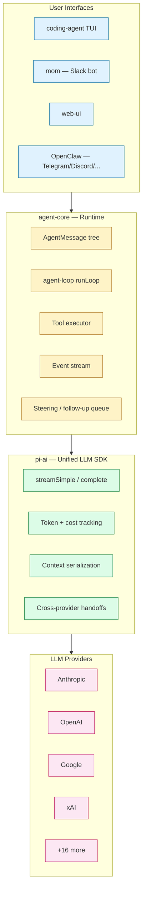
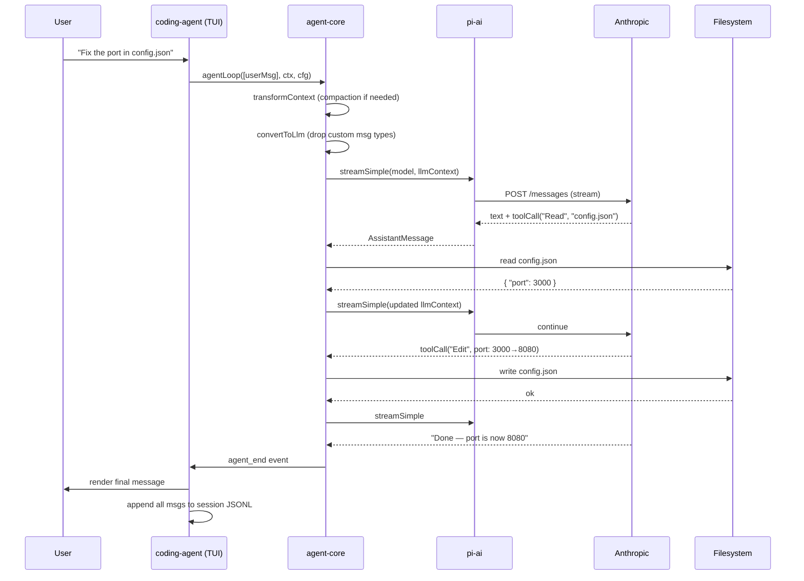
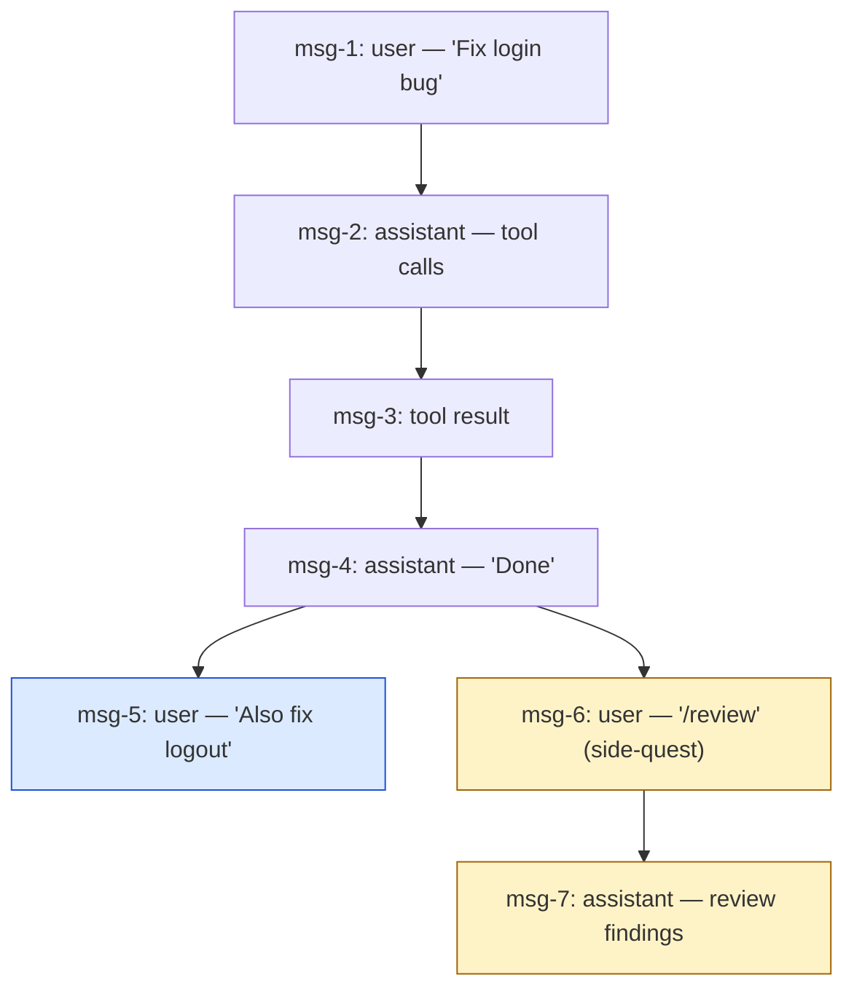
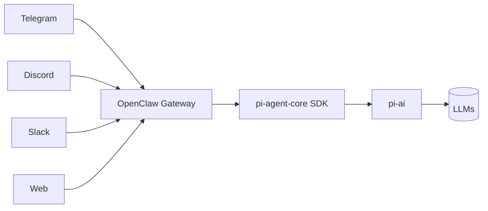
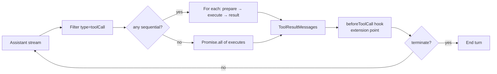

# Pi — A Minimal Self-Extending Coding Agent

> **Repository:** [badlogic/pi-mono](https://github.com/badlogic/pi-mono)
> **Author:** Mario Zechner ([@badlogic](https://github.com/badlogic))
> **Powers:** [OpenClaw](https://openclaw.ai)
> **Language:** TypeScript
> **License:** MIT

---

## TL;DR

- **4 tools, short prompt, big extension surface.** Pi ships with only `Read`, `Write`, `Edit`, `Bash`. Everything else — sub-agents, plan mode, web search, deployment — is added by the agent writing its own TypeScript extensions at runtime.
- **Sessions are trees, not lists.** Every message has a `parentId`. You can branch off to fix a tool, do a code review, and come back without polluting the main context.
- **Provider-agnostic by construction.** A single `Context` object is portable across Anthropic, OpenAI, Google, xAI, Mistral, and 15+ more — you can swap models mid-conversation without losing state.

> **Analogy:** Pi is the [busybox](https://busybox.net/) of coding agents. Tiny core, hot-reloadable plugins, "if you want it to do X, ask it to write X."

---

## 1. Why It Exists

Most agents grow by accretion: more tools, more prompts, more middleware, more lock-in. Pi inverts the design. The core agent does exactly four things; everything else is built by the agent itself (or by the user) as extensions in TypeScript. The model — modern frontier models that already know TS — becomes the runtime's compiler.

This is the philosophy: **"clay, not concrete."** The agent maintains its own functionality.

---

## 2. Layered Architecture



### Layer 1 · `pi-ai` — Unified LLM API

- One `stream()` / `complete()` interface for all providers
- `Context = { systemPrompt, messages[], tools[] }` is serializable and transferable
- TypeBox schemas for type-safe tool definitions
- Automatic model discovery — surfaces only tool-capable models per provider
- Built-in token counting + per-provider cost tables

### Layer 2 · `agent-core` — The Runtime

The heart of Pi is `runLoop` in [packages/agent/src/agent-loop.ts](https://github.com/badlogic/pi-mono/blob/main/packages/agent/src/agent-loop.ts):

```typescript
// packages/agent/src/agent-loop.ts:155
async function runLoop(
  currentContext: AgentContext,
  newMessages: AgentMessage[],
  config: AgentLoopConfig,
  signal?: AbortSignal,
  emit: AgentEventSink,
  streamFn?: StreamFn,
): Promise<void> {
  while (!signal?.aborted) {
    const message = await streamAssistantResponse(...);  // ~line 193
    const toolCalls = message.content.filter(c => c.type === "toolCall");

    if (toolCalls.length === 0) break;   // No tool calls → done
    await executeToolCalls(...);          // line 380+
  }
}
```

Key concepts:

| Concept | Purpose |
|---|---|
| **`AgentMessage`** | A superset of LLM messages. Extensions can inject custom message types (UI-only, metadata, state) that get filtered out by `convertToLlm()` before the API call |
| **Events** | `agent_start → turn_start → message_start → message_update (streaming) → message_end → tool_execution_start/end → turn_end → agent_end` |
| **Steering** | Interrupt mid-tool-execution with a new instruction. Remaining tool calls are skipped, the assistant is re-prompted |
| **Follow-up queue** | Stack messages to run after the current agent turn finishes |
| **Sequential vs parallel tool execution** | If any tool is marked `sequential`, all tools in the same assistant turn run in order. Otherwise they fan out — see [agent-loop.ts:381](https://github.com/badlogic/pi-mono/blob/main/packages/agent/src/agent-loop.ts) |

### Layer 3 · `coding-agent` — The CLI

The actual coding agent ([packages/coding-agent/src/](https://github.com/badlogic/pi-mono/tree/main/packages/coding-agent/src)):

- **4 built-in tools:** Read, Write, Edit, Bash
- **4 extension points:** Extensions (TS), Skills (markdown), Prompt Templates, Themes
- **4 run modes:** interactive TUI, print/JSON, RPC (process integration), SDK (library embed)
- Loads `AGENTS.md` / `CLAUDE.md` from cwd + parent dirs + global config

---

## 3. A Full Turn — How "Fix the port in config.json" Flows



While steps 4–9 are happening, the user can:
- **Steer** — type a new message; current tool calls are skipped, the agent is redirected
- **Queue follow-ups** — stack messages to run after current turn

---

## 4. Sessions as Trees

Sessions are **JSONL files** where every entry has an `id` and `parentId`. The user can rewind to any point and continue — all history is preserved in one file.



This enables:
- **`/tree`** — navigate to any past point, continue from there
- **`/fork`** — create a new session file from a branch point
- **Compaction** — older messages get summarized, but the full tree is preserved in JSONL
- **Side-quests** — review/refactor in a branch, rewind, summarize back

---

## 5. The Extension System

Extensions are TypeScript modules loaded by [packages/coding-agent/src/core/extensions/loader.ts](https://github.com/badlogic/pi-mono/blob/main/packages/coding-agent/src/core/extensions/loader.ts):

```typescript
export default function (pi: ExtensionAPI) {
  pi.registerTool({ name: "deploy", ... });        // Custom tools
  pi.registerCommand("stats", { ... });             // Slash commands
  pi.on("tool_call", async (event, ctx) => { });    // Event hooks
  pi.registerComponent("MyOverlay", MyComponent);   // TUI components
}
```

What extensions can do:

- Register / replace tools (even built-in ones)
- Add slash commands and keyboard shortcuts
- Render custom TUI components (someone shipped Doom inside Pi — really)
- Implement sub-agents, plan mode, permission gates
- Custom compaction / summarization logic
- Persist state into sessions (survives reload)
- **Hot-reload** — agent writes code → reloads → tests → iterates

### Extension Mechanisms Compared

| Mechanism | Format | Loaded When | Purpose |
|-----------|--------|-------------|---------|
| **Extension** | TypeScript | Startup, hot-reloadable | Tools, commands, UI, event hooks |
| **Skill** | Markdown (SKILL.md) | On-demand by name / model invocation | Domain knowledge, workflows |
| **Prompt Template** | Markdown w/ `{{vars}}` | On `/name` | Reusable prompts |
| **Theme** | JSON/TS | Auto, hot-reload | Visual styling |

All four can be bundled as **Pi Packages** and shared via npm or git.

---

## 6. Capabilities at a Glance

| Capability | How Pi Does It | Code Reference |
|---|---|---|
| **Harness / runtime** | Bun TUI with event-streamed agent loop | [agent-loop.ts](https://github.com/badlogic/pi-mono/blob/main/packages/agent/src/agent-loop.ts) |
| **Context management** | Tree-based JSONL sessions + auto-compaction | [core/compaction/](https://github.com/badlogic/pi-mono/tree/main/packages/coding-agent/src/core/compaction) |
| **Tool calling** | 4 core tools, custom tools via extensions; TypeBox schemas | [packages/agent/src/types.ts](https://github.com/badlogic/pi-mono/blob/main/packages/agent/src/types.ts) |
| **Automations** | Slash commands, event hooks, prompt templates | [core/extensions/](https://github.com/badlogic/pi-mono/tree/main/packages/coding-agent/src/core/extensions) |
| **Skills** | Markdown files with frontmatter, progressive disclosure | [core/skills.ts](https://github.com/badlogic/pi-mono/blob/main/packages/coding-agent/src/core/skills.ts) |
| **Memory** | `AGENTS.md` / `CLAUDE.md` walk-up + global config + session state | [core/agent-session.ts](https://github.com/badlogic/pi-mono/blob/main/packages/coding-agent/src/core/agent-session.ts) |
| **Planning loops** | Optional via `pi-subagents` extension, `/todos`, etc. | community extensions |
| **Testing** | Vitest across packages; manual TUI testing | `**/test/`, `**/*.test.ts` |

---

## 7. Testing & Evaluation

Pi uses **Vitest** with co-located test files. Notable areas:

- `packages/agent/src/agent-loop.test.ts` — verifies event ordering, steering, abort
- `packages/ai/` — provider-by-provider stream parsing tests
- `packages/coding-agent/src/core/extensions/runner.test.ts` — extension sandbox semantics
- The TUI is verified via printable smoke modes (`--print`, `--json`)

There is **no large eval suite** in-repo. The author's stance: Pi's quality is judged by daily use; a benchmark would optimize the wrong thing.

---

## 8. Strengths & Tradeoffs

**Strengths**
- Smallest possible cognitive footprint — you can read the entire core in an hour
- Hot-reload extensions = self-debugging agent
- True provider neutrality (you can hop providers mid-session)
- Tree sessions are a genuinely novel UX primitive

**Tradeoffs**
- No MCP by default — you bridge via `mcporter` CLI if you need MCP servers
- Skills/extensions are TypeScript-first — Python users must call out via Bash
- Less batteries-included than Deep Agents or OpenCode; you're expected to build
- TUI runtime tied to Bun; Node-only environments need extra setup

---

## 9. When to Choose Pi

- You want to **own** your agent's behavior end-to-end
- You're comfortable in TypeScript and want an extension API instead of a plugin marketplace
- You need to **multiplex providers** (e.g., Claude for code, Gemini for vision, GPT-5 for browsing)
- You want **tree-based session UX** without writing it yourself
- You want a stable runtime that powers other interfaces (Slack, web, Telegram)

---

## 10. How OpenClaw Uses Pi

OpenClaw is the **productized** integration of Pi. It strips the TUI and connects the agent to messaging channels:



OpenClaw adds channel routing, heartbeats, cron, multi-session memory, sub-agents, and node control — but the loop is still Pi's `runLoop`.

---

## 11. Deep Dive — Tool Use

### 11.1 · Tool shape: TypeBox is the schema, no translation layer

Pi defines tools via `AgentTool<TParameters>` ([packages/agent/src/types.ts:361](https://github.com/badlogic/pi-mono/blob/main/packages/agent/src/types.ts#L361)) which extends the base `Tool` from `pi-ai` ([packages/ai/src/types.ts:327](https://github.com/badlogic/pi-mono/blob/main/packages/ai/src/types.ts#L327)). The `parameters` field is a **TypeBox** `TSchema` — TypeBox already emits JSON Schema, so providers receive it verbatim:

- OpenAI Responses: `parameters: tool.parameters as any` ([openai-responses-shared.ts:274](https://github.com/badlogic/pi-mono/blob/main/packages/ai/src/providers/openai-responses-shared.ts#L274))
- Anthropic: same passthrough ([anthropic.ts](https://github.com/badlogic/pi-mono/blob/main/packages/ai/src/providers/anthropic.ts))
- Google: `sanitizeForOpenApi()` only for the OpenAPI dialect ([google-shared.ts](https://github.com/badlogic/pi-mono/blob/main/packages/ai/src/providers/google-shared.ts))

Argument validation runs through TypeBox's `Compile()` + `Value.Convert()` at [validation.ts:292](https://github.com/badlogic/pi-mono/blob/main/packages/ai/src/utils/validation.ts#L292), giving cheap runtime coercion of strings → numbers, etc.

### 11.2 · Dispatch: tiny loop, default-parallel

`executeToolCalls()` at [agent-loop.ts:373](https://github.com/badlogic/pi-mono/blob/main/packages/agent/src/agent-loop.ts#L373) is the entire dispatch surface. Per turn: stream assistant ([:275](https://github.com/badlogic/pi-mono/blob/main/packages/agent/src/agent-loop.ts#L275)) → filter `toolCall` content ([:203](https://github.com/badlogic/pi-mono/blob/main/packages/agent/src/agent-loop.ts#L203)) → batch dispatch ([:208](https://github.com/badlogic/pi-mono/blob/main/packages/agent/src/agent-loop.ts#L208)) → append `ToolResultMessage[]` ([:212](https://github.com/badlogic/pi-mono/blob/main/packages/agent/src/agent-loop.ts#L212)) → loop unless `terminate === true` ([:544](https://github.com/badlogic/pi-mono/blob/main/packages/agent/src/agent-loop.ts#L544)).

Default mode is **parallel** ([types.ts:252](https://github.com/badlogic/pi-mono/blob/main/packages/agent/src/types.ts#L252)): `Promise.all()` fans out, results are reassembled in source order ([:502](https://github.com/badlogic/pi-mono/blob/main/packages/agent/src/agent-loop.ts#L502)). Any single tool marked `executionMode: "sequential"` ([types.ts:382](https://github.com/badlogic/pi-mono/blob/main/packages/agent/src/types.ts#L382)) flips the whole batch to serial execution.

### 11.3 · Permissions live outside the core

The core agent has **no built-in approval gate** — all registered tools run. Policy is layered in by the application via the `beforeToolCall()` callback ([types.ts:262](https://github.com/badlogic/pi-mono/blob/main/packages/agent/src/types.ts#L262), called at [agent-loop.ts:581](https://github.com/badlogic/pi-mono/blob/main/packages/agent/src/agent-loop.ts#L581)). Returning `{ block: true, reason }` aborts the call. The coding-agent TUI uses this hook to surface approval dialogs; OpenClaw uses it to wire per-channel policies.

### 11.4 · Bash, Read, Edit specifics

| Tool | Schema | Output policy |
|---|---|---|
| `bash` | `{command, timeout?}` ([bash.ts:23](https://github.com/badlogic/pi-mono/blob/main/packages/coding-agent/src/core/tools/bash.ts#L23)) | Streams via `onData` ([:298](https://github.com/badlogic/pi-mono/blob/main/packages/coding-agent/src/core/tools/bash.ts#L298)) at 100 ms throttle ([:155](https://github.com/badlogic/pi-mono/blob/main/packages/coding-agent/src/core/tools/bash.ts#L155)). Truncates to last 2000 lines / 50 KB; full output spilled to a temp file |
| `read` | `{path, offset?, limit?}` ([read.ts:20](https://github.com/badlogic/pi-mono/blob/main/packages/coding-agent/src/core/tools/read.ts#L20)) | Same 2000-line / 50 KB cap ([truncate.ts:11-12](https://github.com/badlogic/pi-mono/blob/main/packages/coding-agent/src/core/tools/truncate.ts#L11-L12)) |
| `edit` | `{path, edits: [{oldText, newText}…]}` ([edit.ts:43](https://github.com/badlogic/pi-mono/blob/main/packages/coding-agent/src/core/tools/edit.ts#L43)) | All edits matched against the original file (not incrementally); generates unified patch + display diff |

The core loop itself does **not** truncate tool results — only the tools do. Apps that need turn-level pruning use the `transformContext()` hook ([types.ts:186](https://github.com/badlogic/pi-mono/blob/main/packages/agent/src/types.ts#L186)).

### 11.5 · Steering does not interrupt in-flight tools

`getSteeringMessages()` ([types.ts:230](https://github.com/badlogic/pi-mono/blob/main/packages/agent/src/types.ts#L230)) is called **after** the current batch finishes ([agent-loop.ts:253](https://github.com/badlogic/pi-mono/blob/main/packages/agent/src/agent-loop.ts#L253)). Real interruption flows through the `AbortSignal` threaded into every `execute()` — `bash` honors it via `waitForChildProcess()` ([bash.ts:98](https://github.com/badlogic/pi-mono/blob/main/packages/coding-agent/src/core/tools/bash.ts#L98)).

### 11.6 · MCP is not in the core

Pi-mono ships no MCP client in the core agent or default tool set. An extension wires MCP by fetching the server catalog and calling `pi.registerTool()` per remote tool ([extensions/types.ts:1133](https://github.com/badlogic/pi-mono/blob/main/packages/coding-agent/src/core/extensions/types.ts#L1133)). OpenClaw embeds this layer separately (see [openclaw.md](openclaw.md)).

### 11.7 · Three streaming events per call

`tool_execution_start` → `tool_execution_update` (when the tool calls `onUpdate(partial)`) → `tool_execution_end` ([types.ts:416-418](https://github.com/badlogic/pi-mono/blob/main/packages/agent/src/types.ts#L416-L418), emitted at [agent-loop.ts:408](https://github.com/badlogic/pi-mono/blob/main/packages/agent/src/agent-loop.ts#L408), [:640](https://github.com/badlogic/pi-mono/blob/main/packages/agent/src/agent-loop.ts#L640), [:494](https://github.com/badlogic/pi-mono/blob/main/packages/agent/src/agent-loop.ts#L494)). The TUI and extensions subscribe to these to render per-tool UI.



The whole thing is ~150 lines of TS. Everything else — approval UI, MCP, sub-agents, plan mode — lives in extensions that hook into this loop.

---

## 12. Key Takeaways for AI Engineers

1. **You don't need 30 tools.** Read/Write/Edit/Bash + extension API covers nearly every coding task.
2. **Tree-shaped sessions** are a UX primitive worth stealing.
3. **Cross-provider context portability** unlocks model arbitrage you can't otherwise do.
4. **Hot-reload extensions** turn the agent into a self-debugging system.
5. **Self-extension > plugin marketplaces.** The agent writes what it needs from docs + examples in the repo.

---

## Further Reading

- [Pi blog post — Armin Ronacher](https://lucumr.pocoo.org/2026/1/31/pi/)
- [pi-mono README](https://github.com/badlogic/pi-mono)
- [OpenClaw](https://openclaw.ai)
- This repo: [research/deepagents-analysis.md](../../research/deepagents-analysis.md) and the [comparison matrix](comparison.md)
