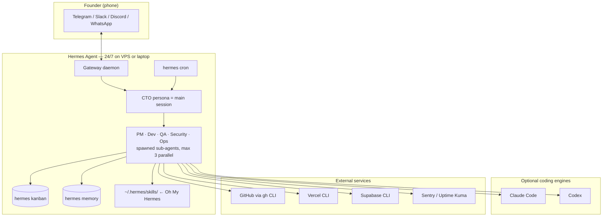

# Oh My Hermes — Architecture & Code Analysis

**Repository:** [Salomondiei08/oh-my-hermes](https://github.com/Salomondiei08/oh-my-hermes)
**Author:** Salomon DIEI · **License:** MIT · **Languages:** Markdown + Bash (no application runtime)
**Tagline:** "An opinionated workflow layer for building, shipping, and operating apps — delivered directly to Hermes."

> **Not to be confused with** [`docs/agents/hermes.md`](../docs/agents/hermes.md), which analyzes **NousResearch/hermes-agent** — the agent *runtime*. **Oh My Hermes is a third-party content pack that installs *on top of* that runtime.** The relationship is exactly "Oh My Zsh → Zsh": Hermes is the shell, Oh My Hermes is the curated config.

---

## 1. What Is Oh My Hermes?

Oh My Hermes is **not software you run** — it is a curated set of files that Hermes Agent loads and executes. The repo ships:

- **23 skills** (`SKILL.md` files in agentskills.io format) copied into `~/.hermes/skills/`
- **6 agent role definitions** (personas) copied into `~/.hermes/agents/`
- **5 workflows** (composite documents that chain skills) into `~/.hermes/workflows/`
- **Templates** (`AGENTS.md`, `.env`, `/health` endpoints for Next.js + Express)
- **5 Bash scripts** (install / bootstrap / setup-cto / verify / uninstall)
- **7 docs** + a Dockerfile + docker-compose + a Next.js starter example

The thesis from [`docs/architecture.md:5-7`](https://github.com/Salomondiei08/oh-my-hermes): *"Oh My Hermes is not a runtime. It is an opinionated extension layer… The repository ships files. Hermes runs them."*

The payload that gives it value is the **autonomous "CTO loop"**: install it, message your bot *"set up the CTO loop"*, and Hermes will monitor a GitHub repo, triage issues hourly, implement fixes (via its own terminal, Claude Code, or Codex), security-scan and QA the PR, then message you on Telegram/Slack for a YES/NO before merging and deploying to Vercel.

---

## 2. Core Features

| Feature | Where It Lives |
|---|---|
| One-command install of skills/agents/workflows into `~/.hermes/` | `install.sh` |
| Autonomous multi-agent "CTO loop" (triage → implement → review → approve → ship) | `workflows/cto-loop.md` + 6 agents |
| Chat-guided onboarding (no terminal — paste a token into your bot) | `skills/onboarding.md` |
| Engine routing (Hermes / Claude Code / Codex / Claude Design) | `skills/choose-engine.md`, `docs/engines.md` |
| Full app lifecycle: clarify → brief → design-handoff → implement → deploy → monitor | `skills/*.md` + `workflows/idea-to-deploy.md` |
| GitHub ops via `gh` CLI (issues, PRs, triage, merge) | `skills/{manage-github-issues,create-github-pr,auto-issue-triage,review-github-pr}.md` |
| Security gate on every PR (secret scan + OWASP + CVE + weekly supply chain) | `skills/security-review.md`, `agents/security.md` |
| Human-in-the-loop merge gate ("never ship without YES") | `skills/await-merge-approval.md` |
| Kanban tracking surfaced to the founder | `skills/kanban-task.md` (uses `hermes kanban`) |
| Vercel deploy + Supabase wiring + Sentry/Uptime-Kuma monitoring | `skills/{deploy-to-vercel,connect-supabase,setup-monitoring}.md` |
| Scheduled automation (hourly triage, 15-min health, daily report, weekly security) | `scripts/setup-cto.sh` via `hermes cron` |
| Project bootstrap (AGENTS.md, .env.example, `/health` route, .gitignore guard) | `scripts/bootstrap.sh` |
| Containerized smoke-test + runtime image | `Dockerfile`, `docker/{entrypoint,test}.sh` |
| Meta-skill that authors new skills in the correct format | `skills/create-skill.md` |

---

## 3. Repository Layout

```
oh-my-hermes/
├── README.md                  # Marketing + copy-paste install prompts for AI assistants
├── AGENTS.md                  # Conventions for agents editing THIS repo
├── INSTALL_FOR_AGENTS.md      # Canonical machine-readable install protocol
├── CHANGELOG.md               # 1.0.0 → 1.4.0 (all dated 2026-05-09)
├── install.sh                 # Copies skills/workflows/agents → ~/.hermes/
├── Dockerfile / docker-compose.yml
├── docker/  ├── entrypoint.sh  # Installs Hermes, then Oh My Hermes, then verifies
│            └── test.sh        # Offline smoke tests (TEST_MODE=1)
│
├── skills/        # 23 SKILL.md files (the product) → ~/.hermes/skills/
├── agents/        # 6 personas: cto, pm, dev, qa, ops, security → ~/.hermes/agents/
├── workflows/     # 5 composite flows → ~/.hermes/workflows/
├── templates/     # AGENTS.md.template, .env.example, healthcheck/{nextjs,express}
├── examples/      # starter-app/ — minimal Next.js + health route
├── scripts/       # bootstrap, verify, setup-cto, uninstall
└── docs/          # architecture, engines, workflows, design-handoff,
                   #   installation, setup-guide, improvements-to-hermes
```

Total: ~10k lines, overwhelmingly Markdown. There is **no compiled artifact, no server, no package**. The only executable code is Bash (scripts) plus two tiny TypeScript/JS health-endpoint templates.

---

## 4. Design & Architecture

### 4.1 · The layering model

Oh My Hermes deliberately does **not** wrap or proxy Hermes. From [`docs/architecture.md:184`](https://github.com/Salomondiei08/oh-my-hermes): *"Hermes-native, not Hermes-wrapped. Skills load into Hermes as first-class citizens. No wrapper process, proxy, or daemon."*



Everything load-bearing — memory, scheduling, the gateway, sub-agent spawning, the kanban — belongs to **Hermes**. Oh My Hermes contributes only the *instructions* (skills/agents/workflows) and the *glue scripts*.

### 4.2 · Skills as the unit of behavior

Every skill is a Markdown file with YAML frontmatter and a fixed section contract enforced by convention ([`AGENTS.md:34-49`](https://github.com/Salomondiei08/oh-my-hermes)):

```markdown
---
name: skill-name
description: Use when …      # triggering condition only — Hermes matches on this
version: 1.0.0
tags: [..]
---
## Overview / When to Use / Prerequisites / Procedure / Pitfalls / Verification
```

The `description` field is **CSO-optimized** (Context-Skill-Optimization): per [`CHANGELOG.md:82-84`](https://github.com/Salomondiei08/oh-my-hermes) every description was rewritten to start with *"Use when…"* and describe *only* the triggering condition, never a workflow summary, and kept under 350 words "for Hermes memory efficiency." This is a real prompt-engineering discipline — Hermes does on-demand skill loading by matching the task to the `description`, so a tight trigger phrase improves recall and avoids polluting context.

### 4.3 · Agents as personas, not processes

The 6 agent files are **persona prompts**, not code. `scripts/setup-cto.sh` turns them into real Hermes profiles by copying each into `~/.hermes/profiles/<role>/agent-role.md`. At runtime the **CTO is the main session** and PM/Dev/QA/Security/Ops are spawned as Hermes sub-agents (the README notes Hermes' default cap of 3 parallel sub-agents). Sub-agents share the same memory and kanban — coordination is via shared state, not message passing.

### 4.4 · Opinionated defaults, documented escape hatches

The stack is hard-opinionated — **Next.js + Vercel + Supabase + Sentry + Uptime Kuma + Slack** — but [`docs/architecture.md:186`](https://github.com/Salomondiei08/oh-my-hermes) frames it as *"Opinionated defaults, pluggable internals"*: every skill documents how to substitute Railway/Render, PlanetScale/Neon, Clerk/Auth.js, etc. A standard `/health` contract (`{status, version, timestamp}`, 200/503) is the seam that monitoring hangs off of.

---

## 5. Workflows (with code)

The five workflow files are orchestration scripts written in prose + ASCII flow diagrams. The flagship is `cto-loop.md` (v2.0.0):

```
CRON (hourly)
  → PM Agent: auto-issue-triage  → kanban: Backlog
  → CTO assigns → Dev Agent: choose-engine → implement → create-github-pr → kanban: Review
  → Security Agent: security-review   (Critical/High → block + alert founder)
  → QA Agent: review-github-pr        (FAIL → block + feedback to Dev)
  → CTO: await-merge-approval         → founder gets Telegram message
        YES → gh pr merge --squash → Ops: post-deploy-followup → health check → kanban: Done
        NO  → save feedback → reopen issue → back to Backlog
        LATER → remind in 2h
```

The actual mechanics live in the skills the workflow references. Representative code:

**Issue scoring** ([`skills/auto-issue-triage.md:52-63`](https://github.com/Salomondiei08/oh-my-hermes)) — a transparent additive heuristic, not an LLM black box:

```
bug: +4 · priority:high: +3 · priority:low: −2 · no labels: +1 · >7 days old: +1
has comments: +1/comment (max +2) · in-progress/assigned: skip · wontfix/blocked/needs-design: skip
```

**The merge gate** ([`skills/await-merge-approval.md:51-64`](https://github.com/Salomondiei08/oh-my-hermes)) — the single most important safety property of the whole system:

```bash
# On YES only:
gh pr merge [number] --squash --delete-branch
# On NO: gh pr close + gh issue reopen + save feedback to memory → back to triage
```

**The secret-scan gate** ([`skills/create-github-pr.md:26-32`](https://github.com/Salomondiei08/oh-my-hermes), duplicated in `security-review.md`) — runs *before* a PR is opened:

```bash
git diff main...HEAD | grep -iE "(api_key|secret|password|token|private_key|SERVICE_KEY|DATABASE_URL)\s*=" \
  | grep -v "your-" | grep -v "example"
git ls-files | grep -iE "\.env"
```

The four other workflows (`idea-to-deploy`, `design-to-code`, `deploy-and-monitor`, `github-ops`) are subsets/variants of the same skill graph.

---

## 6. Code Structure (the scripts)

Since the only real code is Bash, structure analysis is script analysis. They are small, defensive, and idempotent:

| Script | Role | Notable properties |
|---|---|---|
| `install.sh` | `cp skills/*.md workflows/*.md agents/*.md` → `~/.hermes/` | Guards on `~/.hermes` existing; counts installed files; `set -e` |
| `scripts/bootstrap.sh` | Scaffolds a *project*: AGENTS.md, .env.example, `/api/health/route.ts` | Refuses to run inside the omh repo itself (`:14`); `[SKIP]` if file exists; appends `.env.local` to `.gitignore` |
| `scripts/setup-cto.sh` | Creates Hermes profiles, kanban, gh auth, **4 cron jobs** | Step-by-step Pass/Warn/Fail accounting; idempotent profile create; **loudly warns about duplicate gateways** (`:150-167`) |
| `scripts/verify.sh` | Asserts every skill/agent/workflow/profile is present | Checks all 23 skills + 6 agents + 5 workflows + scripts |
| `scripts/uninstall.sh` | Removes omh files, **preserves Hermes memory/gateway/cron** | Interactive `y/N` confirm; explicit "Hermes itself is untouched" |

Quality signals: consistent `ok/warn/fail` helpers, `set -e`, prerequisite checks before mutation, human-readable summaries, and idempotency as a stated requirement ([`AGENTS.md:66`](https://github.com/Salomondiei08/oh-my-hermes)). The Dockerfile pins Ubuntu 22.04 + Node 20 and installs `gh`, `vercel`, and the `supabase` CLI (arch-aware binary fetch).

---

## 7. Reliability

**Strengths**

- **Human-in-the-loop is the backstop.** Nothing merges or ships without an explicit `YES`; `LATER`/no-answer never auto-approve (`await-merge-approval.md:75`). This is the right failure mode for an autonomous system.
- **Idempotent, re-runnable scripts** with clear status output and prerequisite gating.
- **Offline smoke tests** (`docker/test.sh`, `TEST_MODE=1`) validate skill presence, the *"Use when"* description convention, and CLI availability without needing a live Hermes.
- **Operational guardrails encoded as prose pitfalls** drawn from real failure modes: don't run two tasks in parallel (always check `current-task` memory first), `vercel --prod` exit 0 ≠ healthy (always `post-deploy-followup`), cron sessions can't create crons, wait 30-90s for Vercel before health-checking.

**Weaknesses / risks**

- **Documentation count drift.** The advertised skill count disagrees across files: README says **23** (×3), `INSTALL_FOR_AGENTS.md` says **22** (×2), `docs/installation.md` says **12**, `CHANGELOG.md` references **18→20**. Actual on disk: **23**. A maintenance smell for a project whose entire value *is* its documentation.
- **Stale tests / changelog.** `docker/test.sh` only checks **20** skills and **5** agents — it never validates the newest `security-review`, `onboarding`, `backup-hermes-data` skills or the `security` agent, so a regression in those would pass CI. `CHANGELOG.md` stops at 1.4.0 and never documents the security agent or those three skills despite their being shipped.
- **Workflow/script divergence.** `setup-cto.sh` schedules **4** crons (incl. weekly supply-chain security), but `cto-loop.md`'s "Monitoring" section lists only **3** — the weekly security cron is missing from the workflow doc.
- **Untestable core.** Because the product is prose executed by an LLM, there is no way to unit-test the *behavior* — only the *presence* of files. Correctness depends entirely on the model interpreting Markdown faithfully, and on Hermes CLI commands (`hermes profile create`, `hermes kanban init`, `hermes cron add`) matching what the scripts assume. The scripts hedge with `|| true` and `warn` fallbacks, acknowledging version drift against Hermes.

---

## 8. Security

This is the most interesting dimension because the system is **autonomous, credential-bearing, and acts on attacker-reachable input.**

**Good practices**

- **Repo carries no secrets.** Top-level `.env.example` is intentionally empty ("This repo has no server and requires no secrets"). `AGENTS.md` mandates placeholder-only values and presence-checks before use.
- **A dedicated Security Agent + `security-review` skill** gate every PR: secret scan, dangerous-pattern flags (`eval(`, string-concatenated SQL, `dangerouslySetInnerHTML`, client-side `service_role` key, secrets in logs), `npm audit`/`pip-audit` on dependency changes, an OWASP Top-10 pass, and a weekly typosquatting/account-takeover supply-chain check. Findings have a severity → action matrix (Critical = block + alert).
- **Security baked into the generated `AGENTS.md`** ([`bootstrap.sh:47-53`](https://github.com/Salomondiei08/oh-my-hermes)): validate input server-side, never trust client identity, Supabase RLS, secrets in `.env.local` only, OWASP Top 10.
- **Security awareness in the README**: explicitly warns *"Do not use `npm install -g gbrain` — a squatter package exists on npm under that name."*

**Risks worth flagging**

- **Credentials pasted into a chat / LLM context.** The headline onboarding flow (`onboarding.md` Step 2) instructs the user to **paste a fine-grained GitHub PAT directly into Telegram/Slack**. Even though the skill says "never echo the token back" and acknowledge only with "✓ Connected," the secret necessarily transits the messaging platform, the LLM provider, and Hermes' process. That is a materially larger exposure surface than `export GITHUB_TOKEN=…` in a shell.
- **Naive secret scanner.** The gate is a `grep -iE "(...)=" | grep -v your- | grep -v example` heuristic. It only matches `KEY=value` assignments and misses JWTs, base64 blobs, multi-line PEM keys, and any credential not on the hardcoded keyword list. It is a speed bump, not a scanner like `gitleaks`/`trufflehog`.
- **Prompt-injection via GitHub issues.** `auto-issue-triage` reads issue titles/bodies/comments (`gh issue list --json …`) — **fully attacker-controlled** (anyone can open an issue) — and feeds them into the LLM that then implements code. The Dev Agent acts on this *before* the human approval gate. The human YES on the final PR is the main mitigation, but a crafted issue could attempt to steer implementation, exfiltrate via the diff, or waste the loop. No input sanitization or injection defense is documented.
- **`curl … | bash` install** for both Hermes and Oh My Hermes is the standard pipe-to-shell trust assumption; combined with the agent-facing copy-paste prompts in the README (which tell an assistant to clone+run scripts), the trust root is the GitHub repo's integrity.
- **Broad token scope + autonomy.** A PAT with Contents/Issues/PRs R/W, held by a 24/7 process that auto-implements and (post-YES) auto-merges, means a single prompt-injection or logic slip has write access to the repo. Squash-merge-and-delete-branch is triggered by parsing a free-text chat reply for "YES".

Net: the **design intent is security-conscious** (dedicated agent, OWASP framing, human gate, no committed secrets), but the **threat model for an autonomous agent acting on public input with live credentials is under-addressed** — chiefly credentials-in-chat and issue-borne prompt injection.

---

## 9. Who Uses It

**Primary user: the solo founder / indie hacker.** The entire UX is built around someone who wants an app operated *for* them from their phone, with zero terminal after install. The pitch — *"a $5/month VPS, message your bot, reply YES to ship"* — targets non-infra-savvy builders who can describe what they want but don't want to run ops.

**Secondary user: AI coding assistants themselves.** Uniquely, the repo treats *agents* as a user class. `INSTALL_FOR_AGENTS.md` is a machine-readable install protocol, and the README opens with copy-paste prompts to hand Claude/Cursor/Copilot ("Install Oh My Hermes on this project… clone, run install.sh, bootstrap, verify"). This is install-by-delegation-to-an-agent.

**Prerequisite user base:** anyone already running **NousResearch Hermes Agent** with a configured gateway and an LLM provider (default `anthropic/claude-opus`). Oh My Hermes is useless without that runtime — it's an add-on to an existing Hermes install, ideally on an always-on VPS so the crons fire.

**Maturity / adoption:** single-author project (Salomon DIEI), MIT-licensed, V1 by its own roadmap, with V2 (rollback, staging→prod promotion, incident creation) and V3 (multi-service, hosted wizard) planned. It is best read as a **well-structured opinionated reference implementation** of "agent-as-CTO," not a battle-tested platform.

---

## 10. Key Takeaways

1. **It's a content pack, not a runtime** — the cleanest possible separation: Hermes provides the engine (memory, cron, gateway, sub-agents, kanban); Oh My Hermes provides the instructions. Mirrors Oh My Zsh exactly.
2. **Skills-as-prose is the whole architecture.** Behavior lives in Markdown with disciplined `description` triggers and a fixed section contract. The "code" is the prompt engineering.
3. **The human YES gate is the load-bearing safety feature** and is correctly designed (no implicit approval).
4. **Security is a first-class concern in intent** (dedicated agent, OWASP, secret gates) but the autonomous-agent threat model — credentials in chat, prompt injection from public GitHub issues, a heuristic secret scanner — is the main gap.
5. **The biggest reliability risk is doc/test drift** in a project whose product *is* documentation: skill counts disagree across four files, and the smoke tests + changelog don't cover the three newest skills or the security agent.

---

## Further Reading

- [Oh My Hermes repo](https://github.com/Salomondiei08/oh-my-hermes)
- [`docs/agents/hermes.md`](../docs/agents/hermes.md) — analysis of the underlying NousResearch Hermes Agent runtime
- [agentskills.io specification](https://agentskills.io/specification) — the skill file format Oh My Hermes targets
