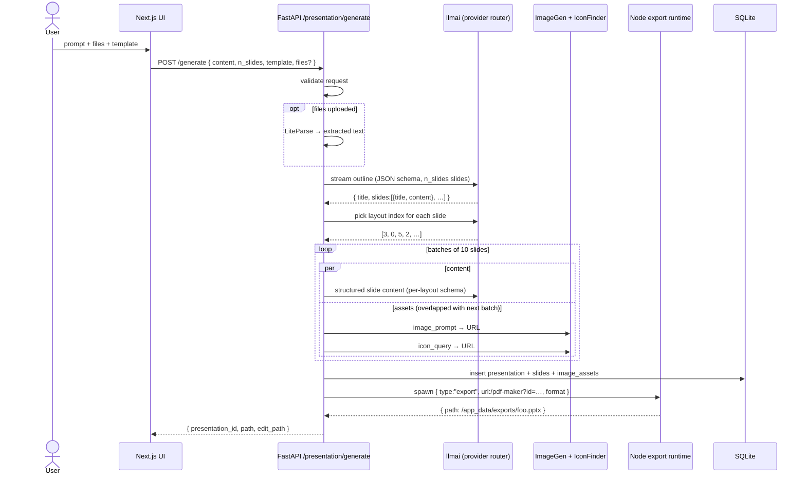

# Presenton — Architecture & Code Analysis

**Repository:** [presenton/presenton](https://github.com/presenton/presenton)
**License:** Apache 2.0 · **Python:** 3.11 · **Node:** 20 · **Frontend:** Next.js 16 + React 19
**Tagline:** Open-source AI presentation generator (a self-hostable Gamma / Beautiful AI / Decktopus)

---

## 1. What Is Presenton?

Presenton turns a prompt or an uploaded document (PDF, PPTX, DOCX, images) into a full slide deck and exports it as a fully editable PPTX or a PDF. The differentiator versus closed SaaS like Gamma is that **everything runs locally** — including the model, if you pair it with Ollama / LM Studio / a ComfyUI image backend — and **slide layouts are first-class TSX/React components** rather than opaque templates baked into the product.

The same engine ships in three skins from one codebase:

- **Docker** (`Dockerfile` / `docker-compose.yml`) — production self-host, exposes nginx on port 80.
- **Electron desktop app** (`electron/`) — bundles the same FastAPI + Next.js + export runtime into a single binary for Mac/Windows/Linux.
- **Cloud** (`presenton.ai`) — hosted version of the same image.

It also exposes a **REST API** (`POST /api/v1/ppt/presentation/generate`) and an **MCP server** (FastMCP synthesized from the OpenAPI spec on port 8001) so other agents can drive presentation creation.

---

## 2. Core Features

| Feature | Where It Lives |
|---|---|
| Prompt → deck generation (sync + async) | `api/v1/ppt/endpoints/presentation.py` |
| Document → deck (PDF/PPTX/DOCX/images with OCR) | `services/documents_loader.py` + LiteParse runner |
| Streaming outline + slide generation via SSE | `api/v1/ppt/endpoints/{outlines,presentation}.py` |
| Slide-aware chat assistant with tools | `services/chat/` (~3.3k LoC) |
| LLM-driven template generation from a PPTX upload | `templates/handler.py` + `templates/prompts.py` |
| 14 LLM providers (OpenAI, Anthropic, Google, Vertex, Azure, Bedrock, OpenRouter, Fireworks, Together, Cerebras, Ollama, LM Studio, LiteLLM, custom + Codex OAuth) | `utils/llm_provider.py`, `utils/llm_config.py` |
| 9 image providers (DALL-E 3, GPT-Image-1.5, Gemini Flash, Nanobanana Pro, Pexels, Pixabay, ComfyUI, Open WebUI, OpenAI-compatible) | `services/image_generation_service.py` |
| Icon search over 8k+ Phosphor icons via FastEmbed | `services/icon_finder_service.py` |
| PPTX export (fully editable) + PDF export (Chromium print) | `services/export_task_service.py` + bundled Node runtime |
| Persistent memory across turns | mem0 + spaCy + FastEmbed BM25 |
| MCP server (auto-derived from OpenAPI) | `mcp_server.py` |
| Single-user auth (sessions + Basic) | `utils/simple_auth.py` |
| Webhook callbacks on generation events | `services/webhook_service.py` |

---

## 3. Repository Layout

```
presenton/
├── start.js                   # Node bootstrap: starts FastAPI + MCP + Next + nginx
├── nginx.conf                 # Reverse proxy fronting all three services on :80
├── Dockerfile                 # Multi-stage: fastapi-builder, nextjs-builder, assets-builder, runtime
├── docker-compose.yml         # 4 services: production, production-gpu, development, development-gpu
├── docs/  electron/  ...
│
├── servers/
│   ├── fastapi/               # Python backend (the engine)
│   │   ├── server.py          # uvicorn entry
│   │   ├── mcp_server.py      # FastMCP.from_openapi(spec) → MCP on :8001
│   │   ├── openai_spec.json   # OpenAPI spec used by MCP server
│   │   ├── api/v1/
│   │   │   ├── ppt/endpoints/ # 18 routers: presentation, slide, chat, outlines, files,
│   │   │   │                  #   pptx_slides, pdf_slides, theme, icons, images, ollama, …
│   │   │   ├── auth/          # session-token login
│   │   │   ├── webhook/       # outbound webhook subs
│   │   │   └── mock/          # dev fixtures
│   │   ├── templates/         # PPTX→TSX template-generation pipeline
│   │   ├── services/
│   │   │   ├── chat/          # 3.3k LoC: slide-aware tool-using chat agent
│   │   │   ├── export_task_service.py  # spawns Node export runtime
│   │   │   ├── documents_loader.py     # PDF/PPTX/OCR document ingestion
│   │   │   ├── icon_finder_service.py  # FastEmbed vector search
│   │   │   ├── image_generation_service.py
│   │   │   ├── liteparse_service.py    # bridge to @llamaindex/liteparse
│   │   │   ├── mem0_oss_memory.py      # mem0 client wrapper
│   │   │   └── mem0_presentation_memory_service.py
│   │   ├── utils/llm_calls/   # outline / structure / slide-content generators
│   │   ├── utils/oauth/       # OpenAI Codex sign-in (PKCE)
│   │   └── models/sql/        # SQLModel ORM: presentation, slide, template, …
│   │
│   └── nextjs/                # Frontend + per-template TSX layouts
│       ├── app/(presentation-generator)/   # editor, outline, upload, dashboard
│       ├── app/(export)/pdf-maker/         # headless page rendered by export runtime
│       ├── app/presentation-templates/     # 13 named templates, ~13 .tsx layouts each
│       │   ├── general/  modern/  standard/  swift/   # ← the 4 DEFAULT_TEMPLATES
│       │   ├── neo-general/  neo-modern/  neo-standard/  neo-swift/
│       │   ├── pitch-deck/  ProductOverview/  Code/  Education/  Report/
│       │   └── …/settings.json   # ordered?, icon_weight, default?
│       └── proxy.ts           # session-cookie middleware for /api/*
│
├── presentation-export/       # Pre-built bundled Node runtime (Puppeteer + PPTX gen)
│   └── index.cjs              # ~1MB minified — invoked as subprocess
│
└── electron/                  # Desktop wrapper
    ├── app/main.ts            # Electron main process
    ├── app/ipc/               # 12 IPC handlers (export, theme, user-config, …)
    └── resources/             # Bundled FastAPI + Next + export runtime
```

---

## 4. Process Topology

A running Presenton container holds **four cooperating processes**, supervised by `start.js`:

```
                    ┌─────────────────────────────┐
                    │ nginx :80  (reverse proxy)  │
                    └──┬───────┬──────┬───────────┘
                       │       │      │
        ┌──────────────┘       │      └──────────────────┐
        │                      │                          │
   /api/v1/* /docs        / (UI)                       /mcp/*
        │                      │                          │
        ▼                      ▼                          ▼
  FastAPI :8000          Next.js :3000             FastMCP :8001
  (uvicorn)              (Next standalone)         (FastMCP.from_openapi)
  ─────────────         ──────────────             ───────────────────
  • Engine              • Editor UI                • Re-exports the
  • Streaming SSE       • Renders /pdf-maker         FastAPI surface as
  • DB (sqlite default)   for headless export        MCP tools
  • Spawns Node                                    • Calls FastAPI on
    export runtime                                   127.0.0.1:8000
```

Plus, on demand, `start.js` will install + supervise `ollama serve` when `START_OLLAMA=true`.

**Key cross-process contracts:**

- `NEXT_PUBLIC_FAST_API` — bound to the live FastAPI port at startup so the editor can fetch from the same origin, **and** so the headless PDF/PPTX exporter can re-fetch slide assets.
- `EXPORT_RUNTIME_DIR` — points the export service at `/app/presentation-export`, the prebuilt Node bundle.
- `APP_DATA_DIRECTORY=/app_data` — bind-mounted in compose; holds `exports/`, `images/`, `uploads/`, `fonts/`, `pptx-to-html/`, the SQLite DB, the mem0 store, and `userConfig.json`.
- nginx serves `/app_data/{exports,uploads,fonts,pptx-to-html}/` via `auth_request /_auth_check` — an internal subrequest to FastAPI's `/api/v1/auth/verify` gates the static files. `/app_data/images/` is intentionally public so PPTX rebuilds can re-pull them without a session cookie.

---

## 5. The Generation Pipeline

The flagship flow — `POST /api/v1/ppt/presentation/generate` — is a 9-stage pipeline orchestrated in `generate_presentation_handler` (`api/v1/ppt/endpoints/presentation.py:565–999`). It has both **sync** (returns the export path) and **async** (returns a task ID for polling) variants. There's also a **streaming editor flow** (`/prepare` → `/stream/{id}`) that emits SSE so the UI can paint slides as they're built.

### Stages

| # | Stage | Implementation |
|---|---|---|
| 1 | **Validate** request (n_slides ≤ 50, template exists in `["general","modern","standard","swift"]` or `custom-<uuid>`) | `check_if_api_request_is_valid` |
| 2 | **Load documents** if files were uploaded → LiteParse (Node) handles PDF/PPTX/DOCX with OCR fallback | `services/documents_loader.py` |
| 3 | **Generate outline** as streaming structured JSON (one slide per object: `{title, content}` in markdown). Uses `llmai.get_client(...).stream` with a JSON schema response format dynamically narrowed to `n_slides`. | `utils/llm_calls/generate_presentation_outlines.py` |
| 4 | **Store generation context in mem0** — system prompt, user prompt, extracted doc text, source content, instructions all written to a `presentation:<id>` mem0 user-id. | `Mem0PresentationMemoryService.store_generation_context` |
| 5 | **Load layout template** from disk (or DB for custom templates) → list of `SlideLayoutModel` (each = `{id, name, description, json_schema, react_component}`). | `templates/get_layout_by_name.py` |
| 6 | **Pick a layout per slide** — for `ordered: true` templates (e.g. `pitch-deck`) the layout list is consumed in order; for `ordered: false` (the default) an LLM call ranks each outline against all layout descriptions and returns `[0, 3, 5, …]` indices. | `utils/llm_calls/generate_presentation_structure.py` |
| 7 | **Insert TOC slides** if requested — uses `select_toc_or_list_slide_layout_index` to find a TOC-compatible layout and injects the required count after the title slide. |  |
| 8 | **Generate slide content** — batches of 10 in parallel. For each slide, the layout's Zod schema is converted to JSON Schema, a `__speaker_note__` field is grafted on, and an LLM call returns structured content matching the schema. Image/icon prompts (`__image_prompt__`, `__icon_query__`) are placeholder strings in the schema; the model is told never to invent URLs. | `utils/llm_calls/generate_slide_content.py` |
| 9 | **Fetch assets in parallel with the next batch** — `process_slide_and_fetch_assets` walks `slide.content` for every `__image_prompt__` and `__icon_query__` key, dispatches them to `ImageGenerationService` and `IconFinderService`, and writes the resulting `__image_url__` / `__icon_url__` back into the JSON tree. Asset tasks for batch N run concurrently with content generation for batch N+1. | `utils/process_slides.py` |
| 10 | **Persist + export** — slides + image assets are flushed to SQLite, then `export_presentation` spawns the bundled Node runtime to either rasterize the `/pdf-maker` URL to PDF (Chromium print) or run the slides through `pptx-genjs` for a fully editable PPTX. | `utils/export_utils.py`, `services/export_task_service.py` |
| 11 | **Webhook + async status** — completion or failure is broadcast via `WebhookService.send_webhook` and persisted to the async-task table. |  |



The streaming UI flow (`POST /prepare` then `GET /stream/{id}`) is the same machine but emits one SSE event per slide and a separate `slide_assets` event when its images/icons resolve, so the editor can paint placeholders first and swap them when ready.

---

## 6. The Template System (the most interesting part)

Most presentation tools ship a fixed set of templates and tweak text-fill-in slots. Presenton takes a substantially harder path: **every layout is a real TSX React component plus a Zod schema**, and the LLM generates content that conforms to the schema.

### What a template looks like on disk

```
servers/nextjs/app/presentation-templates/general/
├── settings.json
├── BasicInfoSlideLayout.tsx         ← title + description + image
├── BulletWithIconsSlideLayout.tsx
├── ChartWithBulletsSlideLayout.tsx
├── MetricsSlideLayout.tsx
├── MetricsWithImageSlideLayout.tsx
├── QuoteSlideLayout.tsx
├── TableInfoSlideLayout.tsx
├── TableOfContentsSlideLayout.tsx
├── TeamSlideLayout.tsx
└── …
```

Each `.tsx` exports four things:

```tsx
export const layoutId   = 'basic-info-slide'
export const layoutName = 'Basic Info'
export const layoutDescription = 'A clean slide layout with title, description, and image.'
export const Schema = z.object({
  title:       z.string().min(3).max(40).default('Product Overview').meta({ description: '…' }),
  description: z.string().min(10).max(150).default('…').meta({ description: '…' }),
  image:       ImageSchema.default({
    __image_url__: 'https://…',
    __image_prompt__: 'Business team discussing product features',
  }).meta({ description: '…' }),
})

const BasicInfoSlideLayout = ({ data }) => (
  <div className="w-full max-w-[1280px] aspect-video bg-white relative …">
    {/* …content… */}
  </div>
)
```

`settings.json` declares whether the template is `ordered` (layouts consumed in sequence), what icon weight (`regular`, `bold`, `fill`, etc.) the deck uses, and an optional human description.

### How the engine consumes a template

`get_layout_by_name` in `servers/fastapi/templates/get_layout_by_name.py` is the bridge. For built-in templates it:

1. Reads `settings.json` from disk for the icon weight and ordering flag.
2. Calls back to Next.js at `http://localhost/api/template?group=<name>`, which uses esbuild/Babel to parse each TSX file, **statically extracts the Zod schema**, converts it to JSON Schema, and returns a `PresentationLayoutModel` with one slide-layout entry per `.tsx`.

This means **the same TSX file defines both the runtime React component used to render the slide *and* the JSON schema the LLM must obey to populate it.** One source of truth.

### AI-generated templates from a PPTX

The other half is the inverse pipeline at `templates/handler.py`. A user uploads a `.pptx`, and Presenton:

1. Runs LibreOffice headlessly to convert each slide to a PNG.
2. For each slide image, calls a **vision LLM** with the prompt in `templates/prompts.py` (`SLIDE_LAYOUT_CREATION_SYSTEM_PROMPT`).
3. The LLM returns a complete TSX file + Zod schema, following a 100-line rulebook covering decorative vs. content elements, fixed 1280×720 canvas, no `absolute` positioning, `__image_url__`/`__icon_url__` placeholders, max-length constraints, Recharts for graphs, etc.
4. The generated TSX is saved to `PresentationLayoutCodeModel` keyed under a UUID. Later that template can be selected as `custom-<uuid>` from the API.

This is genuinely unusual: it's a **layout compiler that produces production frontend code on the fly** and then immediately consumes it through the same generation pipeline as the built-in templates.

---

## 7. The Slide-Aware Chat Assistant

`services/chat/` is a ~3,300-LoC mini-agent that lets the user say "fix slide 4" or "add a chart to the team slide" inside the editor. It's a textbook tool-using assistant, with twelve tools exposed:

| Tool | Purpose |
|---|---|
| `getPresentationOutline` | Compact view of all slide titles/sections (live DB) |
| `searchSlides` | Keyword/semantic search across slide content |
| `getSlideAtIndex` | Read one slide (optionally full JSON before an edit) |
| `getAvailableLayouts` | List of layout IDs in the deck's template |
| `getContentSchemaFromLayoutId` | JSON schema for a target layout |
| `getPresentationThemeCatalog` | Built-in + custom color themes |
| `generateAssets` | Batch image + icon generation in one call |
| `generateImage` / `generateIcon` | Singular variants |
| `saveSlide` | Persist new content (validated against schema; returns `saved:true/false` + `validation_errors`) |
| `deleteSlide` | Remove a slide by index |
| `setPresentationTheme` | Apply a theme |

The system prompt (`services/chat/prompts.py`) is worth reading in full — it's a tight 70-line policy doc that codifies:

- *Source-of-truth ordering:* tool output > conversation > deck memory > everything else.
- 0-based vs 1-based slide index handling.
- "Treat a deck edit as successful only when `saveSlide` returns `saved:true`. If `saved:false`, read `validation_errors`; `maxLength` violations mean you must shorten those strings and `saveSlide` again — retry automatically."
- A "no stopping mid-job" rule: don't end with "I will…" if multiple slides still need edits.
- An autonomy rule: don't ask the user about optional layout/asset preferences — pick a sensible default.

The memory layer (`services/chat/memory_layer.py`, 1.3k LoC) splits two memories:

1. **Deck memory** (mem0 + FastEmbed BM25 + spaCy lemmas) — long-term, semantic. Holds uploaded document text, outline drafts, original prompts. Hydrated into the system prompt.
2. **Chat memory** (sqlite + same mem0 client) — turn-by-turn conversation history for the current thread.

This split is what lets the assistant answer "what did the user originally want?" via deck memory while answering "what does slide 4 actually say right now?" via the live SQL tools.

---

## 8. The Export Pipeline

This is the unsexy but load-bearing piece. The exporter is **not** a Python library — it's a prebuilt Node bundle in `presentation-export/index.cjs` (~1 MB minified) that Presenton spawns as a subprocess.

```
FastAPI               ExportTaskService            Node export runtime
   │                        │                              │
   │  export_presentation() │                              │
   ├───────────────────────►│                              │
   │                        │  spawn node index.cjs        │
   │                        │  stdin: { type:"export",     │
   │                        │   url, format, title, … }    │
   │                        ├─────────────────────────────►│
   │                        │                              │
   │                        │                  format=pdf  │ Puppeteer →
   │                        │                              │ Chromium prints
   │                        │                              │ /pdf-maker?id=…
   │                        │                              │ (a Next page that
   │                        │                              │ renders the deck)
   │                        │                              │
   │                        │                 format=pptx  │ pptxgenjs renders
   │                        │                              │ each slide from
   │                        │                              │ slide.content +
   │                        │                              │ layout TSX schema
   │                        │  { path: …/foo.pptx }        │
   │                        │◄─────────────────────────────┤
   │  PresentationAndPath   │                              │
   │◄───────────────────────┤                              │
```

The Next.js page `app/(export)/pdf-maker/page.tsx` is what's rasterized: it loads the deck from FastAPI using a session-token in the URL hash, applies a print stylesheet that forces 1280×720 pages and `break-after: page`, then signals to Puppeteer that it's ready.

A symmetrical inverse pipeline exists — `convert_pptx_to_html` — which takes a user-uploaded `.pptx` and turns each slide into HTML. That HTML is then either previewed in the editor or fed back into the template-generation pipeline as ground-truth alongside the LibreOffice-rendered slide images.

There's also a Python helper bundled into the runtime (`presentation-export/py/convert-linux-x64`) — likely a PyInstaller'd `python-pptx`-driven step that LibreOffice rendering doesn't cover (the source isn't in the repo; the binary is fetched by `sync-presentation-export.cjs`).

---

## 9. Document Ingestion

`services/documents_loader.py` is a fragile-looking but defensive document pipeline that supports:

- **PDF** via `pdfplumber` + LiteParse fallback with OCR.
- **PPTX/DOCX/XLSX** via LibreOffice `soffice --headless --convert-to pdf` → PDF → LiteParse.
- **Images** via LiteParse + Tesseract OCR (language inferred from the requested presentation language via `presentation_language_to_ocr_code`).
- **Text** files directly.

LiteParse is `@llamaindex/liteparse`, a Node library — Presenton runs it via a small CLI shim (`electron/resources/document-extraction/liteparse_runner.mjs`) that the Python side spawns. The Python ↔ Node bridge uses a "plain text on stdout" mode by default and falls back to a JSON envelope. There's about 100 lines of code in `documents_loader.py` whose sole purpose is **defensively unwrapping LiteParse's JSON envelope if it was previously stored as a document body** — i.e., recovering text from a corrupted/truncated previous run. That code's existence tells you a lot about what production breakage looked like.

---

## 10. Provider Matrix

The provider abstraction is a single env var (`LLM`) that picks from this enum (`enums/llm_provider.py`):

```
ollama  openai  google  vertex  azure  bedrock  openrouter
fireworks  together  cerebras  anthropic  litellm  lmstudio  custom  codex
```

`utils/llm_config.py` builds the right `*ClientConfig` from `llmai.shared` — `llmai` is an internal-looking pinned dependency (`llmai==0.2.5`) that abstracts streaming + structured-output across providers. All higher-level code only ever calls `client = get_client(config=get_llm_config())` and `await stream_generate_events(client, **get_generate_kwargs(...))`. Adding a new provider means adding a new `ClientConfig` branch in one place.

The `codex` provider is interesting: it's "Sign in with ChatGPT," using OpenAI's OAuth-with-PKCE flow at `utils/oauth/openai_codex.py`. The container even has to publish port `1455` because OpenAI redirects the browser directly to `localhost:1455` for the OAuth callback — a constraint that leaks all the way into `docker-compose.yml`.

Defaults at time of writing (`constants/llm.py`):
- OpenAI → `gpt-4.1` · Google → `gemini-2.5-flash` · Anthropic → `claude-sonnet-4-20250514`
- Bedrock → `claude-3-5-haiku` · OpenRouter → `openai/gpt-4o`
- Codex → `gpt-5.2` · Cerebras → `llama-3.3-70b`

Image providers are similar but with their own enum (`ImageProvider`): DALL-E 3, GPT-Image-1.5, Gemini Flash, Nanobanana Pro (Google's `gemini-2.0-flash-exp` image variant), Pexels/Pixabay (stock), ComfyUI workflows, Open WebUI, plus arbitrary OpenAI-compatible endpoints.

---

## 11. Icon Search

`services/icon_finder_service.py` is a tiny but production-realistic vector-search service:

- Uses `FastEmbed` (a Hugging Face / ONNX runtime) with `AllMiniLML6V2` embeddings.
- Source data is `assets/icons.json` — the full Phosphor icons catalogue, with each icon's `name` and tag list embedded as `"{name}||{tags}"`.
- At image build time `scripts/warm_fastembed_cache.py` is run so the ONNX weights are baked into the layer (the `HF_HOME` cache mount is intentionally **not** a BuildKit cache mount — otherwise weights would disappear from the final image).
- The vectorstore JSON is bundled as a read-only asset; if it's missing, the service builds it on first run and saves it to a writable path.
- Per-icon variants (`bold`, `regular`, `light`, `thin`, `fill`) are picked at query time per the deck's `icon_weight` setting.

---

## 12. Memory Layer (mem0)

mem0 is presenton's persistent semantic memory:

- One client per process (`services/mem0_oss_memory.py` → `get_shared_mem0_client`), configured via env (`MEM0_LLM_*`, `MEM0_EMBEDDER_*`, `MEM0_DIR`, `MEM0_SPACY_MODEL`).
- Embedder is FastEmbed (`BAAI/bge-small-en-v1.5`, 384 dims).
- BM25 lemmatization uses spaCy `en_core_web_sm` — installed at image-build time via an explicit wheel URL because mem0/spaCy would otherwise try to `pip download` it at runtime, which fails in the no-pip slim image.
- mem0 storage lives in `/app_data/mem0` (volume-mounted).
- `Mem0PresentationMemoryService` namespaces entries as `presentation:<uuid>` user-ids and tags them `[presentation_source_prompt]`, `[outline_user_prompt]`, `[document_extracted_text]`, `[outlines_generated]`, etc.

The chat service then pulls semantic snippets via `client.search(query, user_id=…)` and stuffs them into the system prompt as the "Deck memory" block.

---

## 13. Auth Model

`utils/simple_auth.py` is a single-user login system: one `AUTH_USERNAME` / `AUTH_PASSWORD_HASH` stored in `userConfig.json`. Sessions are JWT-like tokens kept in an HTTP-only cookie (`presenton_session`); Basic auth is also accepted (used by the export runtime when reposting to FastAPI).

The interesting part is how it interacts with nginx — see `nginx.conf`:

```
location = /_auth_check {
  internal;
  proxy_pass http://localhost:8000/api/v1/auth/verify;
  proxy_pass_request_body off;
  proxy_set_header Cookie $http_cookie;
}

location /app_data/exports/ {
  auth_request /_auth_check;
  alias /app_data/exports/;
}
```

This means file downloads of finished PPTXs are served by nginx (fast) but **gated by an internal subrequest into FastAPI's session-verify endpoint**. It's an `auth_request` trick straight out of the nginx playbook, applied cleanly: the only directory served unauthenticated is `/app_data/images/` because the PPTX export needs to re-fetch slide images without a session cookie.

The auth can be bootstrapped from env (`AUTH_USERNAME` + `AUTH_PASSWORD`) the first time the container starts, or reset via `RESET_AUTH=true`, or overridden via `AUTH_OVERRIDE_FROM_ENV=true`. There's also a `DISABLE_AUTH` flag for local dev.

---

## 14. The MCP Server

`mcp_server.py` is twenty real lines of code:

```python
openapi_spec = json.load(open("openai_spec.json"))
api_client = httpx.AsyncClient(base_url="http://127.0.0.1:8000", timeout=60.0)
mcp = FastMCP.from_openapi(openapi_spec=openapi_spec, client=api_client, name="Presenton API (OpenAPI)")
await mcp.run_async(transport="http", host="127.0.0.1", port=8001)
```

`FastMCP.from_openapi` walks the OpenAPI spec and synthesizes one MCP tool per route — so any agent (Claude Desktop, an MCP-aware IDE, etc.) can call `generate_presentation`, `get_presentation`, `derive_presentation_from_existing_one`, and so on, with full JSONSchema arguments. nginx proxies `/mcp` to it.

The OpenAPI spec is a hand-curated subset (`openai_spec.json`, ~300 lines) rather than the full auto-generated one — Presenton intentionally narrows the MCP surface to the parts they want external agents to touch.

---

## 15. Notable Design Choices

A handful of decisions in this codebase are worth flagging because they're either non-obvious or were clearly informed by production pain.

**TSX layouts as the contract between LLM and renderer.** Most "AI slide" tools tightly couple the model to a fixed set of templates. Presenton goes the other way: every slide layout is a real React component that someone could write or modify by hand, and the LLM's structured output target is the auto-derived JSON Schema from that component's Zod definition. The same TSX file is rendered both in the editor and in the headless `/pdf-maker` page. **One source of truth across UI, export, and LLM.**

**Layout selection as a separate LLM call.** Instead of asking one model to write content *and* pick a layout, the structure step (`generate_presentation_structure`) is a dedicated call that sees the outline + all available layout descriptions + (for slides-markdown mode) the rules about charts vs. tables vs. metrics. This is split for the same reason agents have specialized tools — narrower task, better output, easier to debug.

**Batch-parallel slide generation, batch-overlapped asset fetching.** The pipeline schedules slide content in batches of 10 (sequential per-batch but parallel within), and *starts the asset-fetch tasks for batch N while batch N+1's content is still streaming.* This keeps the LLM and the image/icon providers saturated simultaneously — non-trivial async orchestration that adds up to real latency wins on a 20-slide deck.

**SSE for the streaming UX with two event types.** `/stream/{id}` interleaves `chunk` events (slide JSON as it appears) and `slide_assets` events (the same slide, but now with resolved image/icon URLs). The editor can render placeholders immediately and swap them in seconds later. Same pattern most chat UIs use for token streaming, applied to slides instead.

**Schema-validate-and-retry in the chat tool loop.** `saveSlide` returns `{saved: false, validation_errors: […]}` rather than throwing. The system prompt explicitly instructs the model to *re-shorten strings* on `maxLength` violations and re-call. This is a really pragmatic substitute for constrained decoding in a tool-use context.

**Nginx auth_request for gated static files.** A clean way to keep large file downloads on nginx while still applying FastAPI's session check.

**FastEmbed weights baked into the image, not cached at runtime.** Both the icon-search ONNX model and the mem0 BM25 / embedder weights are downloaded *during the Docker build* (with intentional non-cache RUN steps in the Dockerfile) so that an air-gapped or offline first-run still works. The README's "private by default" line shows up in the Dockerfile.

**LiteParse over LangChain document loaders.** Presenton uses LlamaIndex's LiteParse (with optional HTTP OCR backends or local Tesseract) and bridges to it via a small Node CLI rather than a Python wrapper. That's an interesting choice — they get LlamaIndex's parser without buying into LlamaIndex's whole orchestration story.

**The "vision LLM rewrites your PowerPoint into TSX" feature.** This is the most novel feature in the codebase. The `SLIDE_LAYOUT_CREATION_SYSTEM_PROMPT` is a ~100-line specification that constrains a vision model to produce a fully working Zod-typed React component from a slide screenshot. The schema rules alone (`max(...)` everywhere, no `z.record`, decorative-vs-content classification, page-number detection, recharts for graphs, no `absolute` positioning) read like a frontend engineering style guide.

---

## 16. What's Worth Stealing

If you're building anything in this space, four things from Presenton are worth at least seriously considering:

1. **Layouts as code, schemas as the LLM contract.** Skip the templating language. A React component + a Zod schema *is* the template, and the schema is what the LLM has to fill in.
2. **Two-pass generation: outline → structure → content.** The outline is freeform markdown; the structure step picks layouts from descriptions; the content step generates schema-validated JSON. Each pass is small and inspectable.
3. **Run the renderer headlessly to export.** The same Next.js page that powers the editor is what Puppeteer rasterizes. You don't maintain two rendering paths.
4. **Validation-error-driven repair in tool loops.** Returning `{saved: false, validation_errors}` and instructing the model to fix length issues *in the system prompt* is dramatically simpler than constrained decoding and works with any provider.

---

## 17. License & Scope Caveat

Apache 2.0 across the repo, but **`CONTRIBUTING.md` explicitly notes that PRs outside `electron/` may not be accepted** — Presenton operates a cloud product on top of the same engine and treats `servers/` as effectively a vendored upstream. That's worth knowing before planning a contribution.
